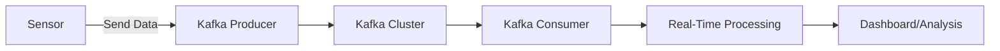

---

linkTitle: "Real-Time Collection"
title: "Real-Time Collection: Collecting data as it is generated in real-time"
description: "Detailed exploration of Real-Time Collection pattern—including examples in Python and frameworks like Apache Kafka, related design patterns, additional resources, and a summary."
categories:
- Data Management Patterns
tags:
- data-collection
- real-time
- streaming-data
- machine-learning
- data-ingestion
date: 2024-07-07
type: docs
canonical: "https://softwarepatternslexicon.com/machine-learning/data-management-patterns/data-collection/real-time-collection"
license: "© 2024 Tokenizer Inc. CC BY-NC-SA 4.0"
---


## Description

The Real-Time Collection pattern involves the continuous gathering of data immediately as events occur. This technique is pivotal in scenarios requiring low-latency processing and immediate feedback such as fraud detection systems, real-time recommendation engines, and monitoring dashboards. The main challenge in real-time collection lies in handling the velocity, volume, and variability of live data streams efficiently.

Key features of real-time collection include:
- **Immediate Data Availability**: Data is available for processing as soon as it is generated.
- **Low Latency**: The time between data generation and its arrival in the processing system is minimized.
- **Scalability**: The system can handle varying loads of data without significant performance degradation.
- **Fault Tolerance**: Real-time collection systems must handle failures gracefully to ensure continuous data flow.

## Examples

### Example 1: Python with Apache Kafka

Apache Kafka is a widely-used platform for building real-time data streaming pipelines.

#### Producer

```python
from kafka import KafkaProducer
import json
import time

producer = KafkaProducer(
    bootstrap_servers=['localhost:9092'],
    value_serializer=lambda v: json.dumps(v).encode('utf-8')
)

def produce_events():
    while True:
        event = {"sensor_id": 1, "value": 23.7, "timestamp": time.time()}
        producer.send('sensor-data', value=event)
        time.sleep(1)

if __name__ == '__main__':
    produce_events()
```

#### Consumer

```python
from kafka import KafkaConsumer
import json

consumer = KafkaConsumer(
    'sensor-data',
    bootstrap_servers=['localhost:9092'],
    value_deserializer=lambda v: json.loads(v.decode('utf-8'))
)

for message in consumer:
    event = message.value
    print(f"Received event: {event}")
```

### Example 2: Using Flink in Java

Apache Flink is another powerful tool for processing data streams in real time.

#### Producer

```java
import org.apache.flink.streaming.api.environment.StreamExecutionEnvironment;
import org.apache.flink.streaming.api.datastream.DataStream;
import org.apache.flink.streaming.api.functions.source.SourceFunction;

public class SensorProducer {
    public static void main(String[] args) throws Exception {
        StreamExecutionEnvironment env = StreamExecutionEnvironment.getExecutionEnvironment();

        DataStream<SensorReading> sensorData = env.addSource(new SourceFunction<SensorReading>() {
            @Override
            public void run(SourceContext<SensorReading> ctx) throws Exception {
                while (true) {
                    SensorReading sensorReading = new SensorReading(1, 23.7, System.currentTimeMillis());
                    ctx.collect(sensorReading);
                    Thread.sleep(1000);
                }
            }

            @Override
            public void cancel() {}
        });

        sensorData.print();
        env.execute("Sensor Stream Producer");
    }
}

class SensorReading {
    private int sensorId;
    private double value;
    private long timestamp;

    public SensorReading(int sensorId, double value, long timestamp) {
        this.sensorId = sensorId;
        this.value = value;
        this.timestamp = timestamp;
    }

    @Override
    public String toString() {
        return "SensorReading{" +
                "sensorId=" + sensorId +
                ", value=" + value +
                ", timestamp=" + timestamp +
                '}';
    }
}
```

### Diagram

Here is a simple architecture diagram depicting real-time data collection using Kafka.



## Related Design Patterns

- **Batch Collection:** Unlike real-time collection, batch collection gathers data in predefined chunks at regular intervals. While batch processing may have higher latency, it is often simpler to manage and may suffice for use cases where real-time feedback is not essential.
- **Data Lake Pattern:** This involves storing raw, structured, or semi-structured data in a centralized repository. Real-time data collected can be streamed into a data lake for further processing and analytics.
- **Change Data Capture (CDC):** This pattern captures changes in data as they occur, which can then be streamed and processed in real time, keeping different data stores synchronized.

## Additional Resources

- [Apache Kafka Documentation](https://kafka.apache.org/documentation/)
- [Apache Flink Documentation](https://ci.apache.org/projects/flink/flink-docs-stable/)
- [Real-time Data Collection with Datastreams](https://www.datastreams.com/real-time-data-collection)
- [Streaming Architectures with Flink and Kafka](https://www.confluent.io/stream-processing/)

## Summary

The Real-Time Collection design pattern is instrumental in applications requiring immediate data processing. By leveraging real-time collection, systems can promptly react to new data, making it possible to build responsive, scalable, and robust solutions. The pattern is complemented by various tools and frameworks, such as Kafka and Flink, which facilitate efficient data collection and processing. Understanding and implementing the Real-Time Collection pattern can significantly enhance the capability to handle dynamic data streams in a timely manner.

By evaluating related patterns, such as Batch Collection and Change Data Capture, one can appreciate the various approaches to data collection and processing, each suited to different use cases. This knowledge empowers architects and engineers to design more adaptable and efficient data pipelines for contemporary applications.
