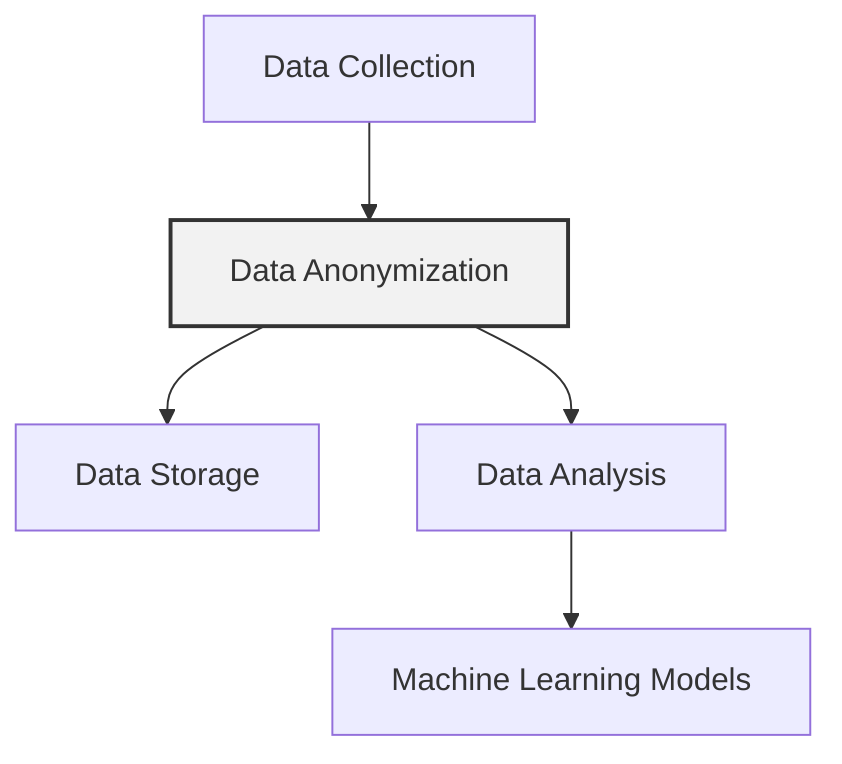

## Introduction

Data Anonymization is a crucial design pattern in machine learning (ML), particularly in the scope of data governance and management. The primary objective of data anonymization is to remove personally identifiable information (PII) from data sets, ensuring privacy and compliance with various data protection regulations such as GDPR and CCPA.

## Importance

In today's data-driven landscape, protecting the privacy of individuals is paramount. Organizations collect vast amounts of data, often containing sensitive information that, if mishandled, can lead to significant privacy breaches. Data anonymization serves as a robust mechanism to enhance data privacy, enabling organizations to leverage data for ML purposes without compromising individual privacy.

## Methods of Data Anonymization

There are several methods and techniques to anonymize data effectively:

1. **Data Masking**
    - Replaces sensitive data with fictional yet realistic data.
    - **Example:** Replace actual user names with fabricated names.

    ```python
    import pandas as pd
    
    def mask_data(data, column):
        data[column] = data[column].apply(lambda x: "Name_{}".format(hash(x) % 1000))
        return data

    data = pd.DataFrame({'name': ['Alice', 'Bob', 'Charlie'], 'age': [25, 30, 35]})
    data = mask_data(data, 'name')
    print(data)
    ```

2. **Pseudonymization**
    - Replaces PII with pseudonyms or identifiers.
    - **Example:** Replace client IDs with hashed IDs.

    ```python
    import hashlib
    
    def pseudonymize(data, column):
        data[column] = data[column].apply(lambda x: hashlib.md5(x.encode()).hexdigest())
        return data

    data = pd.DataFrame({'client_id': ['AB123', 'XY789', 'CD456'], 'purchases': [10, 5, 12]})
    data = pseudonymize(data, 'client_id')
    print(data)
    ```

3. **Generalization**
    - Reduces the granularity of data to reduce identifiability.
    - **Example:** Transforming exact birth dates to birth years.

    ```python
    def generalize_dates(data):
        data['birth_year'] = data['birth_date'].apply(lambda x: x.split("-")[0])
        data = data.drop('birth_date', axis=1)
        return data

    data = pd.DataFrame({'birth_date': ['1990-01-01', '1985-05-15', '1992-07-21'], 'name': ['Alice', 'Bob', 'Charlie']})
    data = generalize_dates(data)
    print(data)
    ```

### Formulas


M(x) = x' \quad \text{where} \quad x' \ \text{is masked data}



P(x) = \text{Hash}(x) \quad \text{where} \quad P(x) \ \text{is pseudonymized data}


## Related Design Patterns

- **Data Privacy**: Encompasses a broad range of techniques and practices to protect data.
- **Data Validation**: Ensures data quality and integrity, which in turn supports the robustness of anonymization processes.
- **Data Versioning**: Facilitates tracking changes in data, crucial when rolling back to non-anonymized datasets if needed.
- **Secure Data Storage**: Ensures that anonymized data is securely stored and protected against unauthorized access.
  
## Additional Resources

- [GDPR Guidelines](https://gdpr-info.eu/)
- [CCPA Information](https://oag.ca.gov/privacy/ccpa)
- [K-anonymity and L-diversity](https://en.wikipedia.org/wiki/K-anonymity)
- [Differential Privacy](https://en.wikipedia.org/wiki/Differential_privacy)

## Conclusion

Data anonymization is an essential design pattern for achieving privacy and compliance in machine learning practices. By effectively anonymizing data, organizations can leverage data for insightful analysis and ML applications while safeguarding individual privacy. Employing methods such as masking, pseudonymization, and generalization ensures the anonymity of sensitive data, helping to build trust and adhere to legal requirements.

By integrating data anonymization into your data management procedures, you can mitigate the risks associated with data breaches and maintain the ethical standards of your data practices.



With careful implementation of data anonymization, your organization can protect against potential privacy intrusions while maintaining the integrity and utility of its data.
