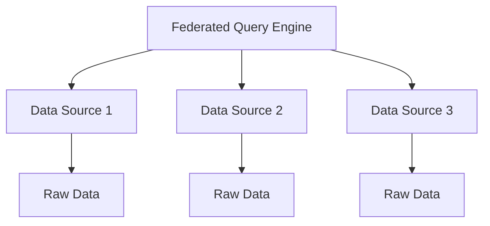

## Overview

In machine learning and data management, the **Data Federation** pattern stands out as a crucial methodology for integrating data from various sources while avoiding the costly and complex task of relocating the data to a central repository. This pattern is particularly valuable in scenarios where data is distributed across multiple systems, and consolidating it into a single location might be impractical or impossible.

### Subcategory: Data Integration
### Category: Data Management Patterns

## Description

The **Data Federation** pattern enables the amalgamation of data from disparate databases, services, and storage systems into a unified format for querying and processing. This approach ensures that:

1. **Data remains decentralized**: Avoids the need to move large volumes of data, which can be inefficient and costly.
2. **Real-time access**: Offers real-time data integration and query capabilities.
3. **Data privacy and security**: Maintains data privacy by keeping it within its original secure environments.

## Data Federation Architecture

Typically, in a data federated system, a federated query engine orchestrates the data access and integration. The main components include:

1. **Federated Query Engine**: It communicates with various data sources and consolidates the results.
2. **Data Wrappers/Connectors**: These are interfaces or drivers that allow seamless communication with different data sources.
3. **Schema Mapping**: Ensures that data schema differences between sources are resolved and unified.
4. **Optimization Layer**: Optimizes the queries by leveraging the capabilities of underlying data sources.

Here is a simplified architecture diagram using Mermaid:



## Example Implementations

Here we look at examples in Python with frameworks like Apache Drill and Apache Calcite, and SQL.

### Example 1: Using Apache Drill (Python)

Apache Drill is an open-source framework that supports SQL queries across multiple systems.

```python
from pydrill.client import PyDrill
import pandas as pd

drill = PyDrill(host='localhost', port=8047)

if not drill.is_active():
    raise Exception("Failed to connect to Apache Drill.")

query = """
SELECT users.name, sales.total 
FROM mongoDB.users AS users
JOIN hdfs.sales AS sales 
ON users.user_id = sales.user_id
"""

query_result = drill.query(query)

df = pd.DataFrame(query_result)

print(df.head())
```

### Example 2: SQL-based Data Federation with Apache Calcite

Apache Calcite allows for advanced federated querying capabilities across different data sources.

```sql
SELECT employees.name, departments.dept_name
FROM mysql_database.employees 
JOIN postgres_database.departments 
ON employees.dept_id = departments.dept_id;
```

In the above example, the query integrates data from MySQL and PostgreSQL databases without the need for moving the data to a central location.

## Related Design Patterns

- **Data Lake Pattern**: Involves aggregating all data into a single repository (unlike Data Federation, which queries data in place).
- **ETL (Extract, Transform, Load)**: Moves and transforms data to a new storage location, contrasting with Data Federation's in-place querying.
- **Data Virtualization**: Similar to Data Federation, it abstracts multiple data storage locations but may incorporate more extensive metadata management.

## Additional Resources

1. **Books**:
    - "Designing Data-Intensive Applications" by Martin Kleppmann
    - "Machine Learning Design Patterns" by Valliappa Lakshmanan, Sara Robinson, and Michael Munn

2. **Online Articles**:
    - [Apache Drill Documentation](https://drill.apache.org/docs/)
    - [Apache Calcite Overview](https://calcite.apache.org/docs/)

3. **Research Papers**:
    - Data Federation in Complex Data Environments: Concepts, Technologies, and Smart Applications

## Summary

The **Data Federation** design pattern is a key component of modern data integration strategies. By allowing in-place data querying from diverse sources, it not only minimizes the data movement costs but also enhances real-time processing capabilities. This pattern plays a pivotal role in ensuring data privacy, scalability, and flexibility in handling distributed datasets. Given these advantages, it serves as a foundational technique for efficient data management and machine learning applications.

By integrating this pattern into your data management toolbox, you empower your infrastructure with a robust mechanism for seamless data access and federation, opening the door to more sophisticated and agile machine learning workflows.
