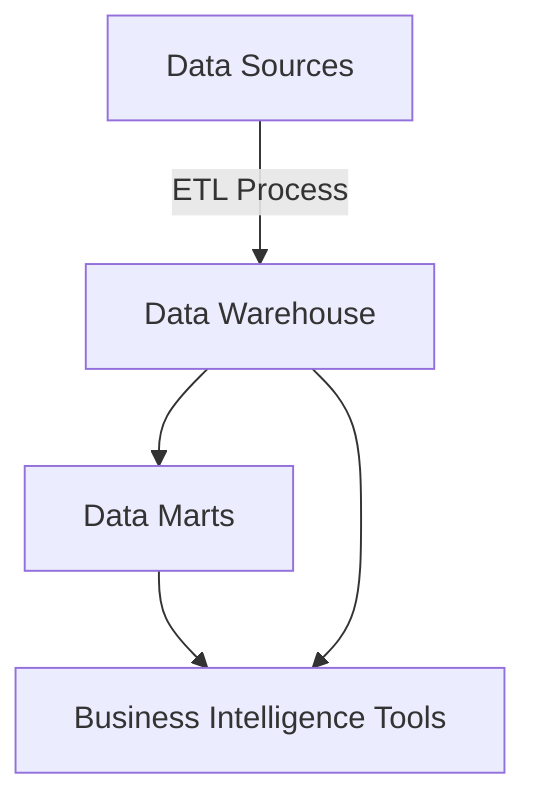

Data Warehousing is a pivotal design pattern in data management aimed at centralizing and integrating data from various heterogeneous sources into a single repository. This centralized data repository is designed to support business intelligence (BI) activities, including analytics, reporting, and data mining. 

## Key Components

1. **Data Sources**: Various origins of data, such as databases, applications, and external data streams.
2. **ETL Process**: Extract, Transform, Load (ETL) processes are essential to extract data from sources, transform it according to business rules, and load it into the data warehouse.
3. **Data Warehouse Storage**: A central repository where the integrated data is stored.
4. **Data Marts (Optional)**: Subsets of the data warehouse tailored to specific business lines or departments.
5. **BI Tools**: Tools for querying and analyzing the data stored in the warehouse.

## ETL Process Explained

### Extract (E)
Data is retrieved from various sources, which could be structured or unstructured. For instance, data can be extracted from relational databases, flat files, web services, or APIs.

### Transform (T)
Data transformation is crucial for cleaning, normalizing, and structuring data so that it fits well within the data warehouse schema. This can include:
- Data Cleaning: Removing duplicates, correcting errors.
- Data Integration: Combining datasets, harmonizing values.
- Data Aggregation: Summarizing detailed data.

### Load (L)
The cleaned and transformed data is then loaded into the data warehouse. Efficient loading processes are essential to ensure timely updates to the data warehouse.

```python

import pandas as pd

csv_data = pd.read_csv("data_source.csv")
json_data = pd.read_json("data_source.json")

# Join data from two sources as an example of transformation
merged_data = pd.merge(csv_data, json_data, on='common_column')

cleaned_data = merged_data.drop_duplicates()

aggregated_data = cleaned_data.groupby('category_column').sum()

database_connection_string = 'sqlite:///data_warehouse.db'
aggregated_data.to_sql('table_name', database_connection_string, if_exists='replace')
```

## Data Warehousing Architectures

### Single-Tier Architecture
This is a simplified architecture where data is stored in a unified place.

### Two-Tier Architecture
In this setup, the client (BI tool) directly communicates with the data warehouse.

### Three-Tier Architecture
This approach adds an intermediate layer, typically OLAP (Online Analytical Processing) servers, between the client tools and the data warehouse to improve performance and scalability.

## Related Design Patterns

### Data Lake
A Data Lake stores raw, unstructured data without predefined schemas, offering flexibility but requiring sophisticated data processing techniques.

### Lambda Architecture
This architecture combines batch and real-time processing, ensuring that data latency requirements are met for different use cases.

### Data Catalog
A metadata repository that helps users understand and locate data within a data warehouse or data lake, promoting data governance and discoverability.

## UML Diagram of a Data Warehouse Architecture



## Additional Resources

- **Books**: 
    - "The Data Warehouse Toolkit" by Ralph Kimball and Margy Ross
    - "Building the Data Warehouse" by W. H. Inmon
- **Online Courses**:
    - [Coursera: Data Warehousing for Business Intelligence](https://www.coursera.org/learn/dwdesign)
    - [edX: Data Warehouse Concepts, Design, and Data Integration](https://www.edx.org/course/data-warehouse-concepts-design-and-data-integration)
- **Websites**:
    - [TDWI - The Data Warehousing Institute](https://tdwi.org/)

## Summary

Data Warehousing is integral to modern data management, enabling the centralization and integration of data from various sources to support analytical tasks. Utilizing ETL processes, data warehouses convert and store vast data into a single repository that is conducive to business intelligence operations. Additionally, integral to comprehensive data strategies, data warehouses often work alongside data lakes and various data management patterns to ensure both structured and unstructured data can be managed efficiently and effectively. 

This pattern is foundational for organizations seeking robust and scalable analytic capabilities, providing essential infrastructure for informed decision-making. 

For those looking to delve further into data warehousing, nuanced understanding and mastery of ETL, schema design, and query optimization are invaluable skills, usable in tandem with related patterns like the Data Lake and Lambda Architecture.


