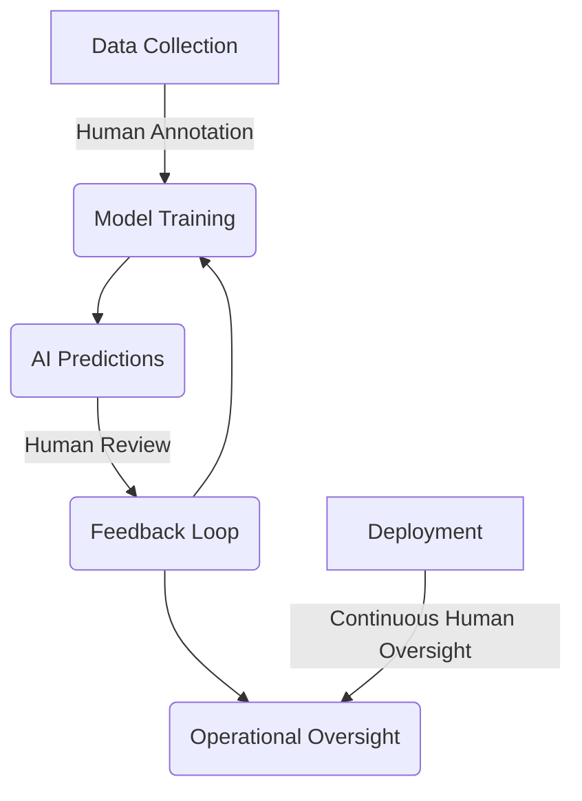

## Overview

The **Human-in-the-Loop (HITL)** design pattern involves integrating human judgment into the AI decision-making process, ensuring that artificial intelligence systems produce ethical and sound outcomes. This pattern is particularly significant in domains where decisions carry substantial ethical, legal, or social implications.

## Importance of Human-in-the-Loop

As AI systems become more sophisticated and pervasive, the need for maintaining ethical standards and ensuring responsible AI deployment has grown. Human oversight helps mitigate risks associated with biases and errors in AI systems, supporting fairness, transparency, and accountability. HITL is essential in situations where:

- **High-stakes decisions**: Such as medical diagnostics, legal judgments, and financial approvals.
- **Ambiguous or complex tasks**: Tasks where AI might struggle without context or nuanced understanding.
- **Continuous learning**: Systems can be continuously improved based on human feedback, helping AI adapt to dynamic environments.

## Components of Human-in-the-Loop Systems

HITL systems typically involve several intertwined components:

1. **Data Collection**: Humans label data or validate outputs to ensure high-quality learning data
2. **Model Training**: AI models are trained with human-annotated data, enhancing their accuracy.
3. **Decision Feedback**: Humans review the AI's decisions and provide feedback, which can be used to adjust and refine the models.
4. **Operational Oversight**: Continuous human oversight during deployment to promptly address errors or unintended consequences.

## Example Workflows

### Fraud Detection in Financial Systems

1. **Data Annotation**: Human experts label transactions as fraudulent or legitimate.
2. **Model Training**: The AI model is trained on this annotated data.
3. **Decision Support**: The AI flags suspicious transactions, which are then reviewed by human analysts.
4. **Feedback Loop**: Analysts provide feedback, and incorrect flags are used to retrain the model.

### Medical Diagnostics

1. **Data Annotation**: Medical professionals label medical images (e.g., X-rays, MRIs) indicating pathology markers.
2. **Model Training**: AI models learn to identify these markers.
3. **Assistance**: AI-generated diagnostics are provided to doctors as a supportive tool.
4. **Review**: Doctors review diagnoses and outcomes, offering feedback for model improvement.

## Example Implementation

### Example in Python using Scikit-learn

Below is a simple example involving a Human-in-the-Loop workflow for a supervised learning task in Python.

```python
from sklearn.ensemble import RandomForestClassifier
from sklearn.datasets import make_classification
from sklearn.model_selection import train_test_split
from sklearn.metrics import accuracy_score

X, y = make_classification(n_samples=1000, n_features=20, random_state=42)
X_train, X_valid, y_train, y_valid = train_test_split(X, y, test_size=0.2, random_state=42)

def human_annotation(X):
    # This is a placeholder for actual human annotation
    # For simplicity, we classify all samples of class 1 to class 0 as incorrect predictions
    return y_train

y_train_human_label = human_annotation(X_train)

model = RandomForestClassifier(random_state=42)
model.fit(X_train, y_train_human_label)

y_pred = model.predict(X_valid)

def human_validation(y_pred):
    # Again, a placeholder for actual human validation
    return y_pred  # Assume human agrees with AI for simplicity

y_pred_valid = human_validation(y_pred)

accuracy = accuracy_score(y_valid, y_pred_valid)
print(f"Accuracy: {accuracy:.2f}")
```

### Example in TensorFlow

If using TensorFlow, a similar HITL approach can be implemented, particularly with the integration of human feedback during the training process.

```python
import tensorflow as tf
from tensorflow.keras import layers, models
import numpy as np

(x_train, y_train), (x_valid, y_valid) = tf.keras.datasets.mnist.load_data()
x_train, x_valid = x_train / 255.0, x_valid / 255.0

# For brevity, assume annotations exist

model = models.Sequential([
    layers.Flatten(input_shape=(28, 28)),
    layers.Dense(128, activation='relu'),
    layers.Dense(10, activation='softmax')
])

model.compile(optimizer='adam',
              loss='sparse_categorical_crossentropy',
              metrics=['accuracy'])

model.fit(x_train, y_train, epochs=5, validation_data=(x_valid, y_valid))


predictions = model.predict(x_valid)

# Placeholder for human evaluation/feedback
def human_validate(predictions):
    # In real cases, utilize human evaluations/feedback
    return np.argmax(predictions, axis=1)  # Simplification

validated_predictions = human_validate(predictions)
accuracy = np.mean(validated_predictions == y_valid)
print(f"Accuracy: {accuracy:.2f}")
```

## Related Design Patterns

1. **Bias Mitigation**: Techniques to detect and reduce bias in AI models, often relying on human reviewers to correct biases.
2. **Explainable AI (XAI)**: Generating interpretable models where humans can understand and trust AI decisions, often requiring human evaluation of explainability.
3. **Continuous Learning**: Systems that continually learn from new data and human feedback to improve performance over time.

## Additional Resources

- [Human-in-the-loop Machine Learning: Challenges and Lessons Learned](https://www.researchgate.net/publication/344258704_Human-in-the-loop_Machine_Learning_Challenges_and_Lessons_Learned)
- [The Role of Human-in-the-loop in AI](https://towardsdatascience.com/the-role-of-human-in-the-loop-in-ai-7b935c8503f7)
- [Explainable AI: Guiding Principles for Ethical Use](https://ai.google/research/pubs/pub46555)
- [Continuous Learning in AI](https://www.oreilly.com/radar/continuous-learning-for-your-machine-learning-models/)

## Summary

The **Human-in-the-Loop** design pattern serves as a critical approach for integrating human judgment and oversight into AI systems to foster ethical and responsible AI deployment. It ensures that human expertise is utilized in high-stakes, ambiguous, or continuously evolving environments. HITL systems promote fairness, transparency, and accountability, making them indispensable in modern AI development. By combining human intuition with the efficiency of AI, developers can build robust and ethical systems that cater to complex real-world scenarios.



This summary and exploration of the Human-in-the-Loop design pattern illustrate its vital role in upholding ethical standards and integrating human expertise integral to mature and responsible AI systems.
