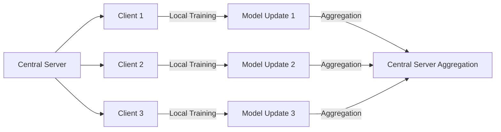

## Introduction

Federated Learning is a distributed machine learning approach which aims to train a global model across multiple decentralized datasets without actually moving the data. This design pattern is a key component of privacy-preserving techniques, addressing concerns related to data privacy, security, and ownership.

## Key Concepts

- **Privacy Preservation:** Federated learning ensures that the raw data never leaves its source, thereby complying with privacy regulations like GDPR.
- **Decentralization:** The data is kept local across multiple clients (e.g., individual devices, separate entities) and only the model updates are shared.
- **Federation:** The model is trained in cycles where local clients train on their own data and then send model updates (gradients or weights) to a central server.

## Flow Diagram



## Federated Learning Processes

1. **Initialization:** The central server initializes a global model and shares it with all clients.
2. **Local Training:** Each client trains the model on its local data and computes updates.
3. **Aggregation:** The central server aggregates these updates (e.g., by averaging) to update and improve the global model.
4. **Iteration:** The process repeats over several communication rounds until the global model converges.

## Implementing Federated Learning

### Example using TensorFlow Federated

```python
import tensorflow as tf
import tensorflow_federated as tff

def create_keras_model():
    return tf.keras.Sequential([
        tf.keras.layers.Dense(10, input_shape=(784,), activation='relu'),
        tf.keras.layers.Dense(10, activation='softmax')
    ]) 

def model_fn():
    keras_model = create_keras_model()
    return tff.learning.from_keras_model(
        keras_model,
        input_spec=(tf.TensorSpec(shape=[None, 784], dtype=tf.float32),
                    tf.TensorSpec(shape=[None, 10], dtype=tf.float32)),
        loss=tf.keras.losses.SparseCategoricalCrossentropy(),
        metrics=[tf.keras.metrics.SparseCategoricalAccuracy()])

iterative_process = tff.learning.build_federated_averaging_process(model_fn)

state = iterative_process.initialize()

client_data = [tf.data.Dataset.from_tensor_slices((x_train, y_train)).batch(20)
               for x_train, y_train in zip(client1_data, client2_data, client3_data)]

state, metrics = iterative_process.next(state, client_data)
print(metrics)
```

### Example using PySyft and PyTorch

```python
import syft as sy
import torch
import torch.nn as nn
import torch.optim as optim

hook = sy.TorchHook(torch)
alice = sy.VirtualWorker(hook, id="alice")
bob = sy.VirtualWorker(hook, id="bob")

class Net(nn.Module):
    def __init__(self):
        super(Net, self).__init__()
        self.fc1 = nn.Linear(784, 128)
        self.fc2 = nn.Linear(128, 10)

    def forward(self, x):
        x = torch.relu(self.fc1(x))
        x = self.fc2(x)
        return x

model = Net()

model.send(alice)
model.send(bob)

criterion = nn.CrossEntropyLoss()
optimizer_alice = optim.SGD(model.parameters(), lr=0.1)
optimizer_bob = optim.SGD(model.parameters(), lr=0.1)

for epoch in range(10):
    for data, target in alice_dataset:
        data, target = data.to(alice), target.to(alice)
        optimizer_alice.zero_grad()
        output = model(data)
        loss = criterion(output, target)
        loss.backward()
        optimizer_alice.step()
        
    for data, target in bob_dataset:
        data, target = data.to(bob), target.to(bob)
        optimizer_bob.zero_grad()
        output = model(data)
        loss = criterion(output, target)
        loss.backward()
        optimizer_bob.step()

model.get()  # Retrieve the model back to the central server
```

## Related Design Patterns

- **Differential Privacy:** Enhances privacy-preserving techniques by adding noise to model updates or data to obscure individual data points.
- **Homomorphic Encryption:** Allows computations on encrypted data, therefore, central aggregation can be performed without decoupling privacy.
- **Secure Multi-Party Computation (SMPC):** Enables multiple entities to jointly compute a function over their inputs while keeping the inputs private.

## Additional Resources

1. **Google AI**: [Federated Learning](https://ai.googleblog.com/2017/04/federated-learning-collaborative.html)
2. **TensorFlow Federated**: [Documentation](https://www.tensorflow.org/federated)
3. **OpenMined PySyft**: [Tutorials](https://github.com/OpenMined/PySyft/tree/dev/examples/tutorials)

## Summary

Federated Learning is a powerful design pattern for training machine learning models on decentralized data. By aggregating model updates rather than raw data, federated learning promotes data privacy and complies with legal regulations. This approach suits applications where data privacy is of utmost importance without sacrificing collaborative model improvements. Familiarizing with related design patterns like Differential Privacy, Homomorphic Encryption, and SMPC can provide further robustness to privacy-preserving techniques.

With the relevant frameworks like TensorFlow Federated and PySyft, implementing federated learning becomes an achievable goal, enabling robust decentralized model training across various domains.
