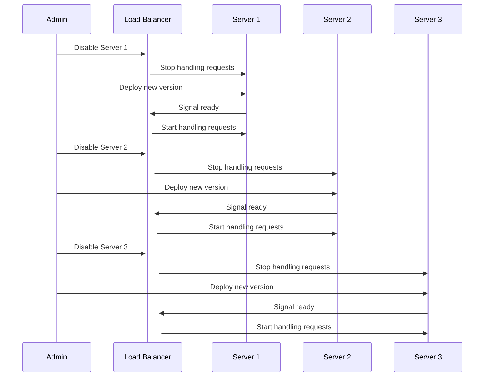

## Introduction

In the realm of machine learning applications and generally in software deployment, ensuring continuous availability while rolling out updates can be complex. The **Rolling Deployment** pattern is an essential technique in continuous deployment that allows applications to be updated gradually across servers without service interruption. This pattern is crucial for maintaining service availability, improving reliability, and mitigating the risks associated with applying updates in production environments.

## What is Rolling Deployment?

A **Rolling Deployment** updates applications incrementally over a set of servers, such that only a portion of the instances are updated at any time. This strategy helps to minimize downtime and ensure that the application remains available during the process. Changes are made progressively, often starting with a small subset of servers, before being propagated to the entire deployment.

### Key Characteristics

- **Incremental Update:** Updates are rolled out to a small number of servers at a time.
- **High Availability:** Ensures that the system remains operational by updating parts while others continue to serve requests.
- **Rollback Capability:** If an issue is detected with the new deployment, the servers updated last can be switched back to the previous version.

## How Rolling Deployment Works

Below is a sequence diagram illustrating the rolling deployment process.



## Example Implementations

Let's consider different environments and frameworks for implementing rolling deployment.

### Kubernetes

Kubernetes, a popular orchestration framework, makes rolling deployments easy.

```yaml
apiVersion: apps/v1
kind: Deployment
metadata:
  name: myapp-deployment
spec:
  replicas: 3
  strategy:
    type: RollingUpdate
    rollingUpdate:
      maxUnavailable: 1
      maxSurge: 1
  template:
    metadata:
      labels:
        app: myapp
    spec:
      containers:
        - name: myapp-container
          image: myapp:latest
```

In this YAML configuration:
- `maxUnavailable: 1`: Defines that only one pod can be unavailable during the deployment.
- `maxSurge: 1`: Allows the deployment of one additional pod during the update process.

### AWS Elastic Beanstalk

Amazon's Elastic Beanstalk also supports rolling deployments natively.

```json
{
  "OptionSettings": [
    {
      "Namespace": "aws:elasticbeanstalk:command",
      "OptionName": "DeploymentPolicy",
      "Value": "Rolling"
    },
    {
      "Namespace": "aws:elasticbeanstalk:command",
      "OptionName": "BatchSizeType",
      "Value": "Percentage"
    },
    {
      "Namespace": "aws:elasticbeanstalk:command",
      "OptionName": "BatchSize",
      "Value": "30"
    }
  ]
}
```

In this configuration:
- `DeploymentPolicy: Rolling`: Indicates a rolling update strategy.
- `BatchSize: 30`: Specifies that 30% of instances are updated at a time.

## Related Design Patterns

### Blue-Green Deployment

Blue-Green Deployment involves maintaining two identical production environments. Updates are deployed to the idle environment first (Green), and upon successful validation, traffic is switched from the current environment (Blue) to the new one (Green).

### Canary Release

In Canary Releases, updates are rolled out to a small subset of users before a broader deployment. This results in exposure to a minor portion of the traffic, allowing early detection of potential issues.

### Circuit Breaker Pattern

The Circuit Breaker Pattern helps control the interaction between services, particularly to avoid overloading services and manage failures effectively during the deployment process.

## Additional Resources

- [Kubernetes Deployment Strategies](https://kubernetes.io/docs/concepts/workloads/controllers/deployment/)
- [AWS Elastic Beanstalk Update Strategies](https://docs.aws.amazon.com/elasticbeanstalk/latest/dg/using-features.rolling-version-deploy.html)
- [Google Cloud Rolling Updates](https://cloud.google.com/kubernetes-engine/docs/how-to/updating-apps)

## Summary

**Rolling Deployment** is a vital strategy within the continuous deployment framework that ensures high availability and minimizes disruption during updates. By incrementally updating servers, it preserves system reliability and performance. It includes robust rollback mechanisms and integrates seamlessly with modern orchestration platforms like Kubernetes and AWS Elastic Beanstalk. Understanding this pattern and implementing it correctly can significantly enhance the resilience and user experience of machine learning and other critical applications.
