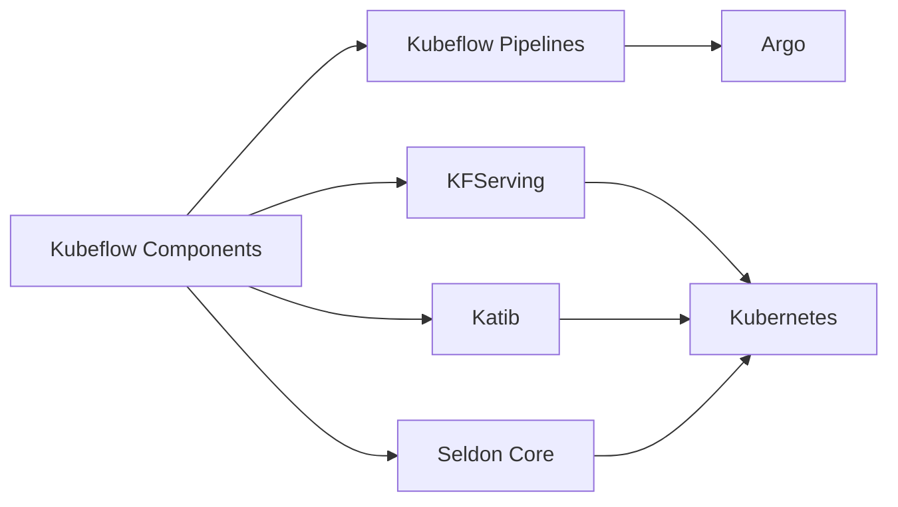

Kubeflow is an open-source platform designed to maintain machine learning workflows on Kubernetes. It aims to simplify the process of developing, orchestrating, deploying, and managing scalable and portable ML models by leveraging Kubernetes' capabilities. This article delves into Kubeflow's features, architecture, implementation, and how it integrates other machine learning and Kubernetes patterns.

## Overview

### Core Concepts

- **Kubernetes**: A container orchestration platform used for deploying, scaling, and managing containerized applications.
- **Kubeflow Pipelines**: Provide a platform for building and deploying portable, scalable and reproducible ML pipelines based on Docker containers.
- **Jupyter Notebooks**: Interactive computational environments where you can include formatted text, images, code, and data visualizations.
- **KFServing**: A Kubernetes-based model serving toolset ensuring that ML models can be served in production efficiently.
- **Katib**: An autoML tool for hyperparameter tuning within the Kubeflow ecosystem.

### Architecture

Kubeflow leverages Kubernetes' ability to manage containerized applications at scale. Here are the critical components and their roles:



## Examples

### Example 1: Deploying a Simple Pipeline with Kubeflow

First, install Kubeflow on your Kubernetes cluster:

```sh
kfctl apply -V -f ${CONFIG_URI}
```

Create a simple pipeline. Here is a Python script using the `kfp` library to define a Kubeflow pipeline:

```python
import kfp
import kfp.dsl as dsl

def hello_op():
    return dsl.ContainerOp(
        name='Hello',
        image='python:3.7',
        command=['python', '-c'],
        arguments=['print("Hello, Kubeflow!")']
    )

@dsl.pipeline(
    name='Simple Hello Pipeline',
    description='A pipeline with a single step to print a message.'
)
def hello_pipeline():
    hello_task = hello_op()

if __name__ == '__main__':
    kfp.compiler.Compiler().compile(hello_pipeline, 'hello_pipeline.yaml')
```

Deploy the pipeline:

```sh
import kfp

client = kfp.Client()
client.create_experiment(name='hello-world')
client.run_pipeline(experiment_id='hello-world', pipeline_package_path='hello_pipeline.yaml', run_name='hello-world-run')
```

### Example 2: Hyperparameter Tuning with Katib

Define a training script to be used for hyperparameter tuning:

```python
import argparse

def train_model(learning_rate, batch_size):
    # Simulate training logic
    print(f"Training with learning_rate={learning_rate}, batch_size={batch_size}")

if __name__ == "__main__":
    parser = argparse.ArgumentParser()
    parser.add_argument('--learning_rate', type=float, default=0.01)
    parser.add_argument('--batch_size', type=int, default=32)
    args = parser.parse_args()
    
    train_model(args.learning_rate, args.batch_size)
```

Create a Katib experiment:

```yaml
apiVersion: "kubeflow.org/v1alpha3"
kind: Experiment
metadata:
  namespace: kubeflow
  name: random-experiment
spec:
  objective:
    type: minimize
    goal: 0.01
    objectiveMetricName: accuracy
  algorithm:
    algorithmName: random
  parameters:
    - name: learning_rate
      parameterType: double
      feasibleSpace:
        min: "0.01"
        max: "0.03"
    - name: batch_size
      parameterType: int
      feasibleSpace:
        min: "16"
        max: "64"
  trialTemplate:
    goTemplate:
      rawTemplate: |
        apiVersion: batch/v1
        kind: Job
        metadata:
          name: {{.Trial}}
          namespace: kubeflow
        spec:
          template:
            spec:
              containers:
                - name: training-container
                  image: tensorflow/tensorflow:latest
                  command:
                    - "python"
                    - "/train.py"
                    - "--learning_rate"
                    - "{{.HyperParameters.learning_rate}}"
                    - "--batch_size"
                    - "{{.HyperParameters.batch_size}}"
              restartPolicy: Never
```

Deploy the experiment:

```sh
kubectl apply -f katib-experiment.yaml
```

## Related Design Patterns

1. **Data Versioning and Lineage**: Tracking changes and lineage of data used to train models, often integrated within Kubeflow using Metadata tracking.
2. **Model Serving Patterns**: Using `KFServing` for serving a trained model, emphasizing scalability and reliability.
3. **Continuous Training/Continuous Integration (CI/CD)**: Leveraging tools like Tekton or Argo for continuous model training and deployment within Kubeflow.

## Additional Resources

1. [Kubeflow official documentation](https://www.kubeflow.org/docs/)
2. [Kubeflow on GitHub](https://github.com/kubeflow/kubeflow)
3. [Getting started with Kubeflow Pipelines](https://www.kubeflow.org/docs/pipelines/)
4. [Katib: Hyperparameter Tuning in Kubeflow](https://www.kubeflow.org/docs/components/katib/)

## Summary

Kubeflow stands as a robust, scalable toolset for managing machine learning workflows in Kubernetes environments. By integrating with Kubernetes, Kubeflow offers an efficient way to handle the complexities of developing, deploying, and maintaining ML models at scale. With features like Kubeflow Pipelines, KFServing, and Katib, practitioners can build end-to-end machine learning solutions that are both scalable and portable, adhering to best practices in model training, serving, and hyperparameter tuning. As the demand for automated, reliable ML workflows continues to grow, mastering tools like Kubeflow will become increasingly vital for those in the data science and MLOps fields.
