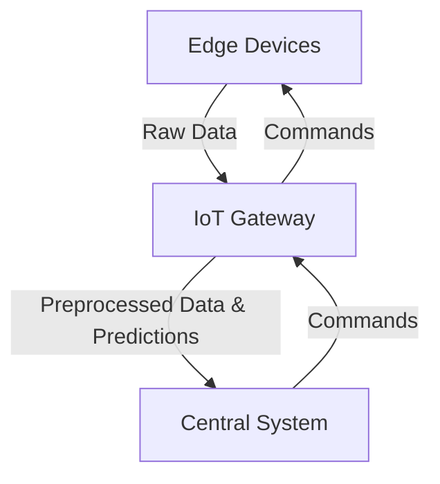

The IoT Gateways design pattern focuses on utilizing Internet of Things (IoT) gateways to preprocess and make predictions on data locally before sending necessary actions and summarized data to central systems. This pattern is particularly useful in scenarios where bandwidth is limited, latency must be minimized, and quick, real-time decisions are essential.

## Why Use IoT Gateways?

IoT gateways act as intermediaries between edge devices and central processing systems. By performing initial data preprocessing and generating predictions locally, IoT gateways mitigate several challenges:
- **Reduced Latency**: Local computations are faster as they avoid the round trip to central systems.
- **Bandwidth Optimization**: Transmitting preprocessed or important data instead of raw data saves bandwidth.
- **Decentralized Processing**: Decentralized intelligence facilitates uninterrupted operations even during connectivity issues.

## Components and Workflow

1. **Edge Devices**: Sensors and actuators that collect raw data.
2. **IoT Gateway**: Executes edge ML models for preprocessing and initial inference.
3. **Central System**: Receives processed results and commands from IoT gateways for further analysis and long-term storage.

### Workflow Diagram


### Example Implementations

Let's explore how code can be structured to implement IoT gateway functionality with Python and the MQTT protocol for communication.

#### Preprocessing & Prediction Script for IoT Gateway in Python

```python
import paho.mqtt.client as mqtt
import numpy as np
from sklearn.linear_model import LogisticRegression

def generate_sensor_data():
    return np.random.rand(1, 3)

model = LogisticRegression()
model.fit(np.array([[0, 0, 0], [1, 1, 1]]), [0, 1])  # Dummy training for example

broker = 'iot.example.com'

def on_connect(client, userdata, flags, rc):
    print(f"Connected with result code {rc}")
    client.subscribe("sensor/data")

def on_message(client, userdata, msg):
    data = np.frombuffer(msg.payload, dtype=np.float64).reshape(1, -1)
    processed_data = preprocess_data(data)
    prediction = model.predict(processed_data)
    client.publish("gateway/predictions", prediction.tobytes())

def preprocess_data(data):
    # Example preprocessing steps
    return (data - np.mean(data)) / np.std(data)

client = mqtt.Client()
client.on_connect = on_connect
client.on_message = on_message

client.connect(broker, 1883, 60)
client.loop_forever()
```

### Edge and Central System Communication

- **Edge Devices**: Publish raw sensor data to topic `sensor/data`.
- **IoT Gateway**: Subscribes to `sensor/data`, processes data, makes predictions, and publishes results to `gateway/predictions`.
- **Central System**: Subscribes to `gateway/predictions` to take further actions or log data.

## Related Design Patterns

1. **Edge Inferencing**: Running machine learning models on edge devices directly to make predictions without requiring a gateway.
2. **Model Cascade**: Combining models at different layers (edge, gateway, cloud) where lower-layer models handle simpler cases and escalate to upper-layer models for complex scenarios.
3. **Federated Learning**: Training machine learning models across decentralized devices (including gateways) using local data without transferring it to a central server.

## Additional Resources

1. [Edge Computing with IoT](https://www.edgecomputing.iot.com)
2. [MQTT - Lightweight Messaging Protocol for IoT](https://mqtt.org)
3. [Scikit-learn Documentation](https://scikit-learn.org/stable/documentation.html)

## Summary

The IoT Gateways design pattern significantly enhances system efficiency by preprocessing and generating predictions locally at the gateway level. This not only reduces latency and conserves bandwidth but also ensures decentralized, resilient operations. By strategically integrating gateway capabilities into your IoT infrastructure, you can achieve more responsive and efficient systems capable of handling real-time data streams effectively.
