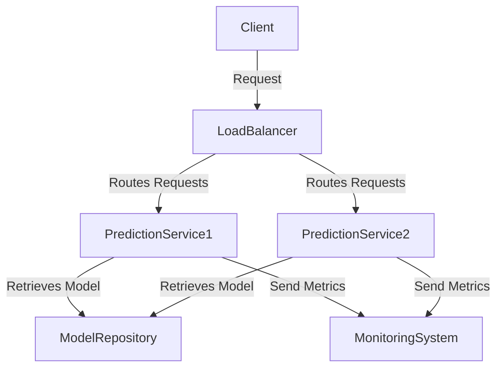

Real-Time Serving, categorized under Model Serving within Deployment Patterns, is a crucial design pattern in machine learning systems where predictions need to be served to end users in real time. Unlike batch prediction systems that operate on large datasets periodically, real-time serving systems are designed to provide immediate responses to prediction requests, making them ideal for scenarios requiring low latency and high availability.

## Description

### Characteristics

1. **Low Latency:** Ensures that the prediction request gets an immediate response.
2. **API-Driven:** Typically involves exposing a RESTful or gRPC API endpoint to receive prediction requests and return responses.
3. **Scalability:** Must handle varying loads efficiently, often using techniques such as auto-scaling.
4. **High Availability:** Achieved through redundancy and failover mechanisms to ensure continuous operation.
5. **Snapshot Consistency:** Ensures the prediction model is consistent across different instances and updates, which may involve using techniques like versioning.

## Components

1. **Prediction API:** This is the endpoint exposed for handling prediction requests.
2. **Load Balancer:** Distributes incoming requests to multiple instances of the prediction service.
3. **Model Repository:** A storage system where different versions of the model are stored.
4. **Inference Engine:** The core component where the model is loaded and predictions are generated.
5. **Monitoring System:** Tracks performance metrics, errors, and other important KPIs.

### Architecture Diagram


## Implementation

### Example in Python using Flask and TensorFlow

```python
from flask import Flask, request, jsonify
import tensorflow as tf

app = Flask(__name__)
model = tf.keras.models.load_model('path_to_model')

@app.route('/predict', methods=['POST'])
def predict():
    data = request.json
    prediction = model.predict([data['input']])
    return jsonify({'prediction': prediction.tolist()})

if __name__ == '__main__':
    app.run(host='0.0.0.0', port=5000)
```

### Example in Java using Spring Boot

```java
import org.springframework.boot.SpringApplication;
import org.springframework.boot.autoconfigure.SpringBootApplication;
import org.springframework.web.bind.annotation.*;
import org.tensorflow.SavedModelBundle;
import org.tensorflow.Session;
import org.tensorflow.Tensor;

@SpringBootApplication
public class RealTimeServingApplication {

    public static void main(String[] args) {
        SpringApplication.run(RealTimeServingApplication.class, args);
    }
}

@RestController
@RequestMapping("/api")
class PredictionController {
    
    private SavedModelBundle model = SavedModelBundle.load("path_to_model", "serve");
    
    @PostMapping("/predict")
    public String predict(@RequestBody Map<String, Object> payload) {
        List<?> inputData = (List<?>) payload.get("input");
        try (Tensor<?> inputTensor = Tensor.create(inputData.toArray())) {
            Session session = model.session();
            Tensor<?> result = session.runner().feed("input_tensor_name", inputTensor).fetch("output_tensor_name").run().get(0);
            return result.toString();
        }
    }
}
```

## Related Design Patterns

### Batch Serving
Batch Serving focuses on running predictions for an entire dataset at once rather than on-demand. This is useful when immediate responses are not needed, and computational resources can be amortized over large datasets.

### Model Retrain and Update
This pattern ensures the model stays relevant by periodically updating it based on new data. For real-time serving, smooth transitions and versioning are critical to allow for continuous service without downtime.

### Model Monitoring
This pattern involves tracking the performance of models in production to ensure they provide accurate and timely predictions. Monitoring for drift, latency, and errors is critical in a real-time serving setup to maintain service quality.

## Additional Resources

- [TensorFlow Serving](https://www.tensorflow.org/tfx/guide/serving): Detailed guide and tutorials on serving models using TensorFlow Serving.
- [MLflow Serving](https://mlflow.org/docs/latest/serving.html): MLflow’s guide to serving models for real-time inference.
- [Kubernetes for ML](https://kubernetes.io/docs/tutorials/stateless-application/expose-external-ip-address/): Tutorial on deploying microservices, relevant for serving prediction APIs.

## Summary

Real-Time Serving is an essential design pattern for machine learning applications requiring immediate prediction responses. By setting up a scalable, low-latency, and high-availability infrastructure, businesses can deliver value by leveraging their ML models in production settings promptly. This pattern integrates seamlessly with various other design patterns to create robust and resilient ML systems.
