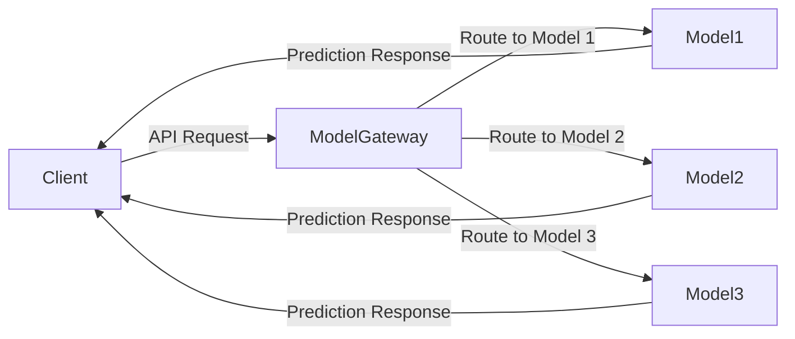

## Overview

The **Model Gateway** design pattern is essential in the deployment phase of machine learning models. It acts as a central point to manage incoming requests and distribute them to various models. This pattern enhances the architecture by providing:

- Scalability to handle numerous models.
- Flexibility to manage different versions of a model.
- Load balancing to optimize resource utilization.
- Improved logging and monitoring of requests and model performance.

## Detailed Description

In machine learning systems, especially at scale, serving a single model may not be sufficient. Multiple versions of a model might be deployed for various reasons, like A/B testing, multi-model ensembles, or handling different use cases. A **Model Gateway** addresses these needs by:

1. **Centralizing Management**: Collects and processes incoming requests, applying predefined rules or configurations to decide which model to invoke.
2. **Dynamic Routing**: Routes requests based on criteria such as the request's payload, predefined weights, user segments, or experimental phases.
3. **Load Balancing**: Distributes incoming traffic evenly among multiple model instances to ensure efficient resource use and high availability.
4. **Security and Monitoring**: Provides a single point for implementing security measures, such as authentication and authorization, as well as monitoring and logging to track model performance and diagnose issues.

### Architecture Diagram



### Example Implementations

#### Python with FastAPI

Below is an example of implementing a Model Gateway using FastAPI in Python:

```python
from fastapi import FastAPI, Request
import random

app = FastAPI()

models = {
    "model_1": lambda x: f"Model 1 prediction on {x}",
    "model_2": lambda x: f"Model 2 prediction on {x}",
    "model_3": lambda x: f"Model 3 prediction on {x}",
}

@app.post("/predict")
async def predict(request: Request):
    payload = await request.json()
    # Simple routing logic (here using random choice)
    model_choice = random.choice(list(models.keys()))
    model = models[model_choice]
    return {"model": model_choice, "prediction": model(payload["data"])}

```

#### Java with Spring Boot

Below is a Java example using Spring Boot:

```java
import org.springframework.boot.SpringApplication;
import org.springframework.boot.autoconfigure.SpringBootApplication;
import org.springframework.web.bind.annotation.*;

import java.util.Map;
import java.util.Random;

@SpringBootApplication
@RestController
public class ModelGatewayApplication {

    private final Random random = new Random();

    Map<String, Model> models = Map.of(
        "model_1", data -> "Model 1 prediction on " + data,
        "model_2", data -> "Model 2 prediction on " + data,
        "model_3", data -> "Model 3 prediction on " + data
    );

    public static void main(String[] args) {
        SpringApplication.run(ModelGatewayApplication.class, args);
    }

    @PostMapping("/predict")
    public Map<String, String> predict(@RequestBody Map<String, Object> payload) {
        String modelChoice = "model_" + (random.nextInt(3) + 1);
        String data = payload.get("data").toString();
        String prediction = models.get(modelChoice).predict(data);

        return Map.of("model", modelChoice, "prediction", prediction);
    }

    @FunctionalInterface
    interface Model {
        String predict(String data);
    }
}
```

## Related Design Patterns

Several design patterns complement the **Model Gateway**:

1. **Shadow Testing**: This pattern allows you to test the performance of newer models alongside production models without impacting live traffic. By routing a copy of the live traffic to the new model via the Model Gateway, you can validate its performance in real-life scenarios.
2. **Traffic Splitting**: Distributes requests among multiple versions of a model, e.g., an 'A/B Testing' scenario, facilitating the evaluation of different iterations or approaches.
3. **Model Ensemble**: Invokes multiple models for a single request and combines their predictions to potentially increase accuracy. This can be orchestrated through the Model Gateway to efficiently manage predictions from different models.

## Additional Resources

- [NVIDIA Triton Inference Server](https://developer.nvidia.com/nvidia-triton-inference-server): A tool offering a similar gateway-like functionality for deploying and managing AI models.
- [TensorFlow Serving](https://www.tensorflow.org/tfx/guide/serving): A flexible, high-performance serving system for machine learning models, designed for production environments.
- [MLflow's Multiple Models Handling](https://www.mlflow.org/docs/latest/models.html): An open-source platform for managing the end-to-end machine learning lifecycle.

## Final Summary

The **Model Gateway** pattern provides a structured and efficient way to manage and route traffic to different machine learning models. By centralizing request handling, it offers scalability, flexibility, and more refined control over model deployment and management. Implementing a Model Gateway brings several advantages, such as improved load management, request routing based on dynamic criteria, and the potential for enhanced monitoring and security. By leveraging this pattern, organizations can streamline their model serving infrastructure and ensure optimal performance across all deployed models.

For anyone looking to implement a reliable and scalable serving infrastructure, the **Model Gateway** pattern is an essential design concept to consider.
