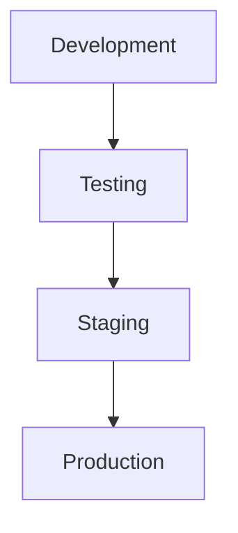

## Introduction

Model staging environments serve as intermediate spaces where machine learning models can be tested and validated before being rolled out into production. This approach ensures that models function correctly, integrate well with other system components, and meet performance benchmarks without adversely affecting the live production environment.

## Detailed Explanation

The concept of staging environments is not unique to machine learning but is a well-established practice in software engineering. The implications for machine learning, however, are substantial due to the nature of model development, which involves uncertain outcomes and data dependencies.

**Stages in the lifecycle of a model deployment:**
1. **Development Environment:** Initial experiments and iterative improvement of the model.
2. **Testing Environment:** Preliminary testing and validation of the model.
3. **Staging Environment:** Comprehensive testing that mirrors the production environment as closely as possible.
4. **Production Environment:** The live environment where the model delivers value to end-users.

A typical workflow for a machine learning model deployment could look like this:



In this context, the staging environment acts as a "sandbox" that closely resembles the production setting, including the same infrastructure, libraries, and configurations. This controlled setting allows data scientists and engineers to subject the model to thorough testing, such as stress tests, A/B testing, and user acceptance testing (UAT).

## Examples

### Example in Python with TensorFlow

Let us consider an example of preparing a TensorFlow model for deployment through a staging environment.

1. **Development:**
    ```python
    import tensorflow as tf
    from tensorflow.keras import layers

    model = tf.keras.Sequential()
    model.add(layers.Dense(32, activation='relu', input_shape=(784,)))
    model.add(layers.Dense(10, activation='softmax'))

    model.compile(optimizer='adam',
                  loss='sparse_categorical_crossentropy',
                  metrics=['accuracy'])

    # Training the model
    model.fit(train_images, train_labels, epochs=5)
    ```

2. **Testing:**
    ```python
    # Assume this is the testing script
    test_loss, test_acc = model.evaluate(test_images, test_labels)
    print('Test accuracy:', test_acc)
    ```

3. **Staging:**
    ```python
    # Saving the model for staging environment
    model.save('model_staging.h5')

    # Simulate a load in the staging environment
    staged_model = tf.keras.models.load_model('model_staging.h5')
    
    # Conducting extensive tests
    test_loss, test_acc = staged_model.evaluate(test_images, test_labels)
    print('Staging Test accuracy:', test_acc)
    ```

4. **Production:**
    ```python
    # Assume checks in staging were successful, creating versioned deployment
    model.save('model_production_v1.h5')

    # Deployment specific code (avoiding downtimes and validating live data could be added here)
    ```

### Example in Python with FastAPI and Docker

Consider a scenario where we deploy a machine learning model using FastAPI with Docker containers.

1. **Staging:**
    ```Dockerfile
    # Dockerfile for staging
    FROM python:3.8-slim

    WORKDIR /usr/src/app

    COPY requirements.txt ./
    RUN pip install --no-cache-dir -r requirements.txt

    COPY . .

    CMD ["uvicorn", "main:app", "--host", "0.0.0.0", "--port", "80"]
    ```

    ```yaml
    # docker-compose.staging.yaml
    version: '3.8'

    services:
      web:
        build: .
        ports:
          - "8001:80"
        environment:
          - ENV=staging
    ```

    ```python
    # FastAPI application (main.py)
    from fastapi import FastAPI
    
    app = FastAPI()

    @app.get("/")
    def read_root():
        return {"message": "Staging Environment"}

    @app.get("/predict")
    def predict():
        # Placeholder for model inference
        return {"prediction": "stub"}
    ```

2. **Tests and Checks:**
    ```sh
    # Deploy with the following command
    docker-compose -f docker-compose.staging.yaml up

    # Conducting API tests
    curl http://localhost:8001/predict
    ```

## Related Design Patterns

- **Blue-Green Deployment:** This pattern involves maintaining two identical production environments: Blue is the current live environment while Green is the new version. Traffic is switched from Blue to Green after validation.
- **Canary Deployment:** Incrementally roll out the change to a small subset of users before rolling it out to the entire infrastructure. This allows for monitoring and validating new changes in production with minimal risk.
- **Shadow Deployment:** Running new versions or changes alongside the existing system but without serving production traffic. Shadow deployments enable deep evaluations in a production-like environment without the risk of affecting actual users.

## Additional Resources

1. [Continuous Delivery for Machine Learning](https://martinfowler.com/articles/cd4ml.html) by Martin Fowler.
2. [Google Cloud Architect’s Handbook](https://cloud.google.com/architecture/cloud-ml-based-application-architecture).

## Summary

Model staging environments are crucial to ensuring the reliability and robustness of machine learning models before they are deployed to production. By mimicking the production environment closely, we can catch and rectify potential issues ahead of time, thus safeguarding the live system. This practice, combined with related deployment patterns like Blue-Green and Canary deployments, forms the backbone of sustainable and reliable machine learning model operations.

By utilizing iterations through development, testing, staging, and production environments, organizations can methodically advance models with confidence, minimizing risks and maximizing value.


