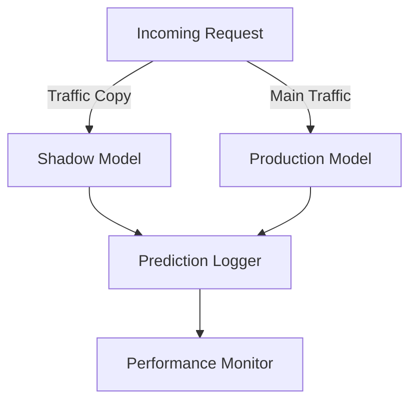

Shadow Rollouts is a deployment pattern where new machine learning models are deployed in a "shadow" mode to observe their performance before performing a full production release. The new model operates in parallel with the existing production model, but its predictions do not impact end users, thus allowing a safe environment to validate its performance and behavior against production traffic.

## Objectives

1. **Risk Mitigation**: Evaluate the new model's impact without affecting the real user experience.
2. **Validation**: Compare the model's predictions against the true labels and current production model to ensure correctness.
3. **Performance Monitoring**: Observe performance metrics in real-world scenarios and verify resource consumption.

## Implementation

### Architecture Overview

The architecture typically involves the following components:

1. **Traffic Splitter**: A mechanism to duplicate the incoming requests and send copies to both the production and shadow models.
2. **Prediction Logger**: Log the predictions from both models and any additional metadata.
3. **Performance Monitor**: Tools to monitor and compare the outcomes of both models.



### Detailed Example

#### Python & Flask Implementation Example

Below, we outline a simple example using Flask (for web serving) and Logging (for performance comparison).

```python
from flask import Flask, request, jsonify
import logging
import threading
import time

class ProductionModel:
    def predict(self, data):
        return {'result': 'prod_prediction'}  # Mock production prediction

class ShadowModel:
    def predict(self, data):
        return {'result': 'shadow_prediction'}  # Mock shadow prediction

app = Flask(__name__)
prod_model = ProductionModel()
shadow_model = ShadowModel()
logger = logging.getLogger('model_logger')
handler = logging.FileHandler('model_predictions.log')
logger.addHandler(handler)

@app.route('/predict', methods=['POST'])
def predict():
    data = request.get_json()

    # Production model prediction
    prod_prediction = prod_model.predict(data)
    
    # Logging actual production output
    logger.info(f"Production Model Prediction: {prod_prediction}, Data: {data}")

    # Shadow model prediction
    def shadow_predict():
        shadow_prediction = shadow_model.predict(data)
        logger.info(f"Shadow Model Prediction: {shadow_prediction}, Data: {data}")

    # Running shadow model prediction in a separate thread
    shadow_thread = threading.Thread(target=shadow_predict)
    shadow_thread.start()

    return jsonify(prod_prediction)

if __name__ == '__main__':
    app.run(debug=True)
```

### Key Points

1. **Isolation**: Shadow model's output is not returned to the user, preventing any negative impact of the potentially faulty or suboptimal model.
2. **Comparison**: Logs can be analyzed to compare production and shadow model predictions.

## Related Design Patterns

### Canary Deployment

- **Description**: A practice where a new version of a model is initially released to a small subset of users before rolling it out to all users. Ensures stability and reduces risk by only affecting a small fraction of the user base initially.
- **Application**: Complementary to Shadow Rollouts, once confident in shadow mode, model can be canaried to a small user group.

### A/B Testing

- **Description**: Comparing two versions of a model (A and B) by splitting the traffic to identify which version is more effective.
- **Application**: Can be used post-shadow rollout to statistically test model improvements against the current production model.

### Blue-Green Deployment

- **Description**: Running two identical environments (blue and green) simultaneously, with one being live (blue) and the other being idle (green). Can be switched instantly.
- **Application**: Helps switch seamlessly between old and new models during deployment.

## Additional Resources

1. **[Machine Learning Engineering by Andriy Burkov](https://www.amazon.com/Machine-Learning-Engineering-Andriy-Burkov/dp/0992125557)**
2. **[Continuous Delivery for Machine Learning by D. Sculley et al.](https://dl.acm.org/doi/10.1145/2833312.2849567)**
3. **[Scaling Machine Learning Models with Monitoring and Logging](https://cloud.google.com/architecture/monitoring-ml-pipelines-with-logs-and-metrics)**

## Summary

Shadow Rollouts provide a robust mechanism for safely testing new machine learning models against live data without impacting end users. By duplicating incoming traffic to a shadow model, logging predictions, and analyzing the results, practitioners can ensure new models perform as expected. This pattern reduces deployment risk and enhances overall deployment confidence when combined with other versioned deployment strategies like Canary Deployment and A/B Testing. 

In essence, it establishes a bridge between theoretical model validations and real-world robustness, creating a safe and controlled environment for new model introductions.
