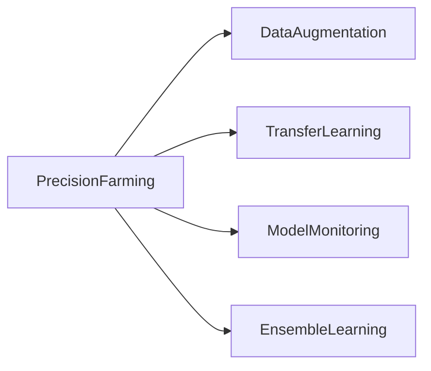

## Introduction

Precision farming, also known as precision agriculture, involves the use of advanced technological methods and data analysis to manage and optimize the time, location, and quantity of agricultural inputs, such as water and fertilizers, in a precise manner. By employing machine learning (ML) models, farmers can make data-driven decisions to enhance crop productivity, improve resource efficiency, and ultimately increase agricultural sustainability.

## Application of Machine Learning in Precision Farming

Machine learning in precision farming typically revolves around several key tasks:
1. **Crop Health Monitoring**: Analyzing data from drones and satellite imagery to monitor crop health and identify areas needing attention.
2. **Soil Health Analysis**: Predicting soil nutrient levels and moisture content by analyzing data from soil sensors.
3. **Weather Prediction**: Forecasting weather conditions to optimize planting and harvesting times.
4. **Resource Optimization**: Using ML algorithms to optimize the application of inputs like water and fertilizers.

### Examples

#### Example 1: Irrigation Optimization

```python

import tensorflow as tf
from tensorflow import keras
import numpy as np
import pandas as pd

data = pd.read_csv('soil_moisture_data.csv')
X = data[['temperature', 'humidity', 'soil_moisture']]
y = data['water_needed']

from sklearn.model_selection import train_test_split
X_train, X_test, y_train, y_test = train_test_split(X, y, test_size=0.2, random_state=42)

model = keras.Sequential([
    keras.layers.Dense(units=64, activation='relu', input_shape=[3]),
    keras.layers.Dense(units=32, activation='relu'),
    keras.layers.Dense(units=1)
])

model.compile(optimizer='adam',
              loss='mean_squared_error')

model.fit(X_train, y_train, epochs=50, batch_size=10)

loss = model.evaluate(X_test, y_test)
print(f"Model Loss: {loss}")

new_data = np.array([[25, 70, 20]])  # example input: temperature, humidity, soil moisture
predicted_water_needed = model.predict(new_data)
print(f"Predicted Water Needed: {predicted_water_needed}")
```

#### Example 2: Fertilizer Application Optimization

```r

library(caret)
library(randomForest)

data <- read.csv('fertilizer_usage_data.csv')
X <- data[, c('temperature', 'humidity', 'soil_nutrient_level')]
y <- data$fertilizer_needed

set.seed(42)
trainIndex <- createDataPartition(y, p=0.8, 
                                  list=FALSE, 
                                  times=1)
X_train <- X[trainIndex,]
X_test <- X[-trainIndex,]
y_train <- y[trainIndex]
y_test <- y[-trainIndex]

model <- randomForest(X_train, y_train, ntree=100)

predictions <- predict(model, X_test)
confusionMatrix(predictions, y_test)

new_data <- data.frame(temperature=25, humidity=70, soil_nutrient_level=15)  # example input
predicted_fertilizer_needed <- predict(model, new_data)
print(predicted_fertilizer_needed)
```

### Related Design Patterns

1. **Data Augmentation**: To enhance the robustness of the models by generating additional training data from the existing dataset.
2. **Transfer Learning**: Applying pre-trained models on similar tasks to improve the predictive performance in precision agriculture.
3. **Model Monitoring**: Continuously monitoring the models for prediction quality, especially as agricultural conditions change over time.
4. **Ensemble Learning**: Combining predictions from multiple models to improve overall accuracy and reliability in critical agricultural applications.

### Additional Resources

1. *Advances in Precision Agriculture* - Journals and articles that explore the latest research and innovations in precision agriculture practices.
2. *TensorFlow for Agriculture* - Tutorials and guides on how to use TensorFlow for various machine learning applications in agriculture.
3. *International Society of Precision Agriculture* - A professional society providing networking opportunities and resources for researchers and practitioners in precision agriculture.

### Summary

Precision farming represents a significant advancement in modern agriculture, offering improved efficiency and sustainability through the precise application of inputs like water and fertilizers. By leveraging machine learning algorithms, farmers can make more informed decisions, optimize resource usage, and increase crop yields. This domain-specific design pattern is supported by several related patterns, including data augmentation, transfer learning, model monitoring, and ensemble learning, which collectively enhance the performance and reliability of machine learning applications in agriculture.



By adopting these methodologies and staying abreast of the latest research and technologies, the agricultural sector can continually improve its practices, leading to more resilient and productive farming systems.
