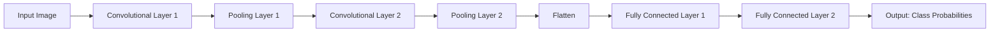

## Overview

Image Classification is a fundamental task in computer vision where the goal is to classify objects detected within an image into one of several predefined categories. This task plays a crucial role in various applications, such as autonomous driving, medical imaging, security systems, and more.

## Explanation

At its core, image classification involves processing an image to understand and categorize the objects it contains. A typical approach to solve this problem includes the use of Convolutional Neural Networks (CNNs), a class of deep learning models particularly effective in capturing spatial hierarchies in images.

### How It Works

1. **Preprocessing:** Images are resized to a standard shape and normalized.
2. **Feature Extraction:** Convolutional layers scan images to detect important features.
3. **Pooling Layers:** Reduce the spatial dimensions of the activation maps.
4. **Flattening:** Converts the 2D activation maps into a 1D feature vector.
5. **Fully Connected Layers:** Process the feature vector for final decision making.
6. **Softmax Layer:** Outputs the probabilities for each class.

## Example Implementations

### Python with TensorFlow/Keras

```python
import tensorflow as tf
from tensorflow.keras.models import Sequential
from tensorflow.keras.layers import Conv2D, MaxPooling2D, Flatten, Dense

mnist = tf.keras.datasets.mnist
(x_train, y_train), (x_test, y_test) = mnist.load_data()
x_train = x_train.reshape(x_train.shape[0], 28, 28, 1) / 255.0
x_test = x_test.reshape(x_test.shape[0], 28, 28, 1) / 255.0

model = Sequential([
    Conv2D(32, (3, 3), activation='relu', input_shape=(28, 28, 1)),
    MaxPooling2D(pool_size=(2, 2)),
    Conv2D(64, (3, 3), activation='relu'),
    MaxPooling2D(pool_size=(2, 2)),
    Flatten(),
    Dense(128, activation='relu'),
    Dense(10, activation='softmax')
])

model.compile(optimizer='adam', loss='sparse_categorical_crossentropy', metrics=['accuracy'])

model.fit(x_train, y_train, epochs=5, validation_data=(x_test, y_test))

test_loss, test_acc = model.evaluate(x_test, y_test)
print("Test accuracy:", test_acc)
```

### Python with PyTorch

```python
import torch
import torch.nn as nn
import torch.optim as optim
from torchvision import datasets, transforms

transform = transforms.Compose([
    transforms.ToTensor(),
    transforms.Normalize((0.1307,), (0.3081,))
])

train_dataset = datasets.MNIST('.', train=True, download=True, transform=transform)
test_dataset = datasets.MNIST('.', train=False, transform=transform)
train_loader = torch.utils.data.DataLoader(train_dataset, batch_size=64, shuffle=True)
test_loader = torch.utils.data.DataLoader(test_dataset, batch_size=1000, shuffle=False)

class Net(nn.Module):
    def __init__(self):
        super(Net, self).__init__()
        self.conv1 = nn.Conv2d(1, 32, 3, 1)
        self.conv2 = nn.Conv2d(32, 64, 3, 1)
        self.fc1 = nn.Linear(12 * 12 * 64, 128)
        self.fc2 = nn.Linear(128, 10)

    def forward(self, x):
        x = self.conv1(x)
        x = torch.relu(x)
        x = self.conv2(x)
        x = torch.relu(x)
        x = torch.max_pool2d(x, 2)
        x = x.view(-1, 12 * 12 * 64)
        x = self.fc1(x)
        x = torch.relu(x)
        x = self.fc2(x)
        return torch.log_softmax(x, dim=1)

model = Net()
optimizer = optim.Adam(model.parameters(), lr=0.001)
criterion = nn.NLLLoss()

for epoch in range(1, 6):
    model.train()
    for batch_idx, (data, target) in enumerate(train_loader):
        optimizer.zero_grad()
        output = model(data)
        loss = criterion(output, target)
        loss.backward()
        optimizer.step()
    print(f"Epoch {epoch}, Loss: {loss.item()}")

model.eval()
correct = 0
with torch.no_grad():
    for data, target in test_loader:
        output = model(data)
        pred = output.argmax(dim=1, keepdim=True)
        correct += pred.eq(target.view_as(pred)).sum().item()
print("Test accuracy:", correct / len(test_loader.dataset))
```

### Related Design Patterns

- **Transfer Learning**: Reusing pre-trained models on new tasks to save computational resources and improve performance. For instance, using a model like VGG16 or ResNet, pre-trained on ImageNet, and fine-tuning it for specific classification tasks.
- **Data Augmentation**: Techniques like rotation, flipping, and zooming to artificially increase the size of the training set to make models more robust.
- **Ensemble Learning**: Combining the predictions of multiple models to improve overall performance and robustness.

## Additional Resources

- **Books**: 
  - "Deep Learning with Python" by François Chollet
  - "Hands-On Machine Learning with Scikit-Learn, Keras, and TensorFlow" by Aurélien Géron
- **Courses**:
  - [Deep Learning Specialization](https://www.coursera.org/specializations/deep-learning) by Andrew Ng on Coursera
  - [CS231n: Convolutional Neural Networks for Visual Recognition](http://cs231n.stanford.edu/) by Stanford University
- **Libraries**:
  - [TensorFlow](https://www.tensorflow.org)
  - [PyTorch](https://pytorch.org)
  - [Keras](https://keras.io)

## Diagram



## Summary

Image classification is an essential yet complex task in the field of computer vision. Leveraging deep learning models, especially convolutional neural networks, has proved to be highly effective for this task. Understanding and applying related patterns, like transfer learning and data augmentation, can greatly enhance model performance and robustness, making image classification solutions more accurate and reliable.
