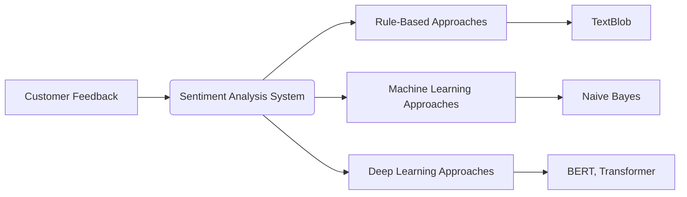

## Introduction

Customer Sentiment Analysis involves processing and analyzing feedback from customers in order to gauge their sentiments and opinions. In the financial services sector, feedback is often collected through surveys, social media, emails, and direct interactions. Understanding customer sentiment can help financial institutions improve their services, design better products, and increase customer satisfaction and loyalty. This article explores methods and examples of sentiment analysis in the context of financial services feedback.

## Methodologies and Techniques

Several techniques and algorithms can be applied for sentiment analysis. These can be broadly divided into:

1. **Rule-Based Approaches**: Rely on manually created rules and dictionaries.
2. **Machine Learning Approaches**: Utilize supervised learning with annotated datasets.
3. **Deep Learning Approaches**: Deep neural networks such as LSTMs, GRUs, and transformers.

### Rule-Based Approach

Rule-based models use predefined sets of rules and dictionaries to identify sentiment within text. This approach can be quick to set up but scales poorly with large datasets and complex sentence structures.

#### Example

In Python, using a simple rule-based approach with `TextBlob`:

```python
from textblob import TextBlob

feedback = "The new update to the mobile banking app is terrible. It crashes all the time."
blob = TextBlob(feedback)
sentiment = blob.sentiment

print(f"Sentiment Polarity: {sentiment.polarity}, Subjectivity: {sentiment.subjectivity}")
```

### Machine Learning Approach

Machine learning models typically use structured datasets and supervised learning methods to analyze sentiments. Common algorithms include Naive Bayes, SVM, and Logistic Regression.

#### Example: Naive Bayes in Python (using Scikit-learn)

```python
import pandas as pd
from sklearn.feature_extraction.text import CountVectorizer
from sklearn.model_selection import train_test_split
from sklearn.naive_bayes import MultinomialNB
from sklearn.metrics import accuracy_score, classification_report

data = pd.read_csv("feedback.csv")  # Assuming CSV with 'feedback' and 'sentiment' columns

vectorizer = CountVectorizer()
X = vectorizer.fit_transform(data['feedback'])
y = data['sentiment']

X_train, X_test, y_train, y_test = train_test_split(X, y, test_size=0.2, random_state=42)

model = MultinomialNB()
model.fit(X_train, y_train)

predictions = model.predict(X_test)
print(f"Accuracy: {accuracy_score(y_test, predictions)}")
print(classification_report(y_test, predictions))
```

### Deep Learning Approach

Deep learning models can capture complex patterns in text. Common architectures for sentiment analysis include RNNs, LSTM, GRU, and Transformers like BERT.

#### Example: Sentiment Analysis with BERT (Python using PyTorch)

```python
import torch
from transformers import BertTokenizer, BertForSequenceClassification
from transformers import TextClassificationPipeline

model = BertForSequenceClassification.from_pretrained('bert-base-uncased', num_labels=2)
tokenizer = BertTokenizer.from_pretrained('bert-base-uncased')

pipeline = TextClassificationPipeline(model=model, tokenizer=tokenizer, return_all_scores=True)

feedback = "The customer service at my bank is fantastic and very attentive."

result = pipeline(feedback)
print(result)
```

## Related Design Patterns

1. **Data Augmentation for NLP**: Enhancing the dataset by generating new synthetic samples.
2. **Transfer Learning in NLP**: Using pre-trained models to fine-tune on the domain-specific corpus.

### Data Augmentation for NLP

Augmenting the data involves creating more training samples via techniques such as synonym replacement, back-translation, and noise addition.

### Transfer Learning in NLP

Utilizing pre-trained language models like BERT, GPT, or other transformers allows for fine-tuning on a specific domain, requiring lesser labeled data due to pre-existing knowledge in the base model.

## Additional Resources

- **Books**: 
  - "Deep Learning for Natural Language Processing" by Palash Goyal
  - "Natural Language Processing with Python" by Steven Bird et al.
- **Articles & Tutorials**:
  - [Sentiment Analysis with NLTK in Python](https://www.geeksforgeeks.org/sentiment-analysis-using-python/)
  - [Using BERT for Sentiment Analysis](https://towardsdatascience.com/using-transformers-for-text-classification-95f7cd460507)

## Summary

Customer Sentiment Analysis in financial services is a crucial application of machine learning that provides insights into customer opinions and satisfaction levels. Various approaches, ranging from simple rule-based to complex deep learning methods, allow for effective sentiment detection from feedback. Leveraging these insights can lead to improved customer relations and service innovations. Employing related patterns and advanced techniques can further enhance the performance and scalability of sentiment analysis systems.



Feel free to adapt and expand this design pattern according to specific needs and contextual requirements.
