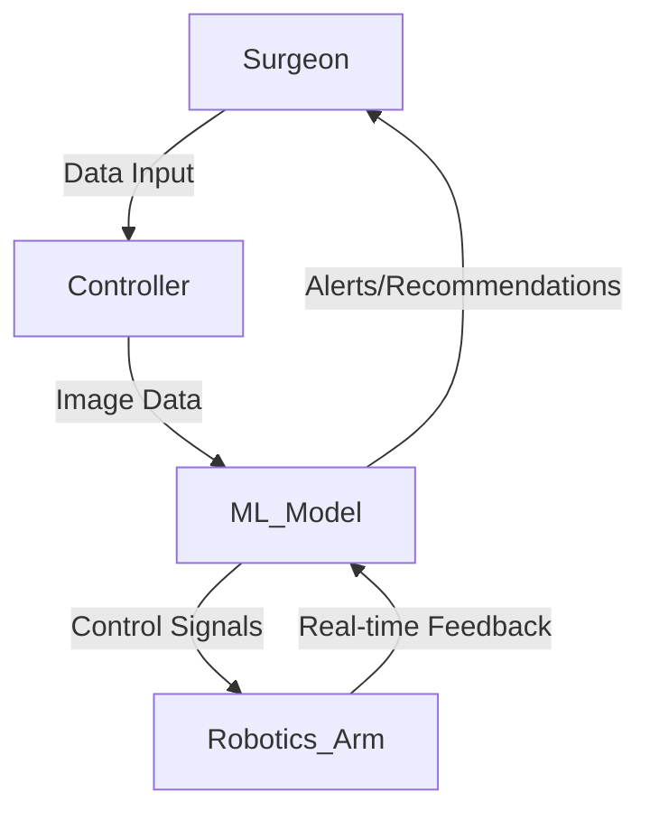

## Medical Robotics: Integrating ML into Robotics for Surgical Procedures

### Introduction

The integration of machine learning (ML) into medical robotics is a transformative approach that aims to enhance the efficiency and accuracy of surgical procedures. This design pattern leverages ML algorithms to improve robotic precision, enable adaptive movements, and facilitate better decision-making. By doing so, it aims to reduce the margin of human error, shorten recovery times, and potentially offer minimally invasive surgery options.

### Key Concepts

**1. Precision and Control:** Robotics in surgery require extreme precision. Machine learning models, such as computer vision algorithms, are employed to ensure accurate movement of robotic arms. This is crucial in delicate surgeries where millimeter precision is required.

**2. Real-time Adaptability:** Machine learning enables robotic systems to adapt in real-time based on intraoperative data. For example, time-series forecasting models can predict potential complications, allowing the robot to adjust its actions dynamically.

**3. Decision Support:** Machine learning algorithms can analyze large datasets from medical records and imaging studies. They provide decision support by suggesting possible surgical actions or alerting the surgeon to critical issues.

### Technical Implementation

#### Example: Using Python with TensorFlow

```python
import tensorflow as tf
from tensorflow.keras.models import Sequential
from tensorflow.keras.layers import Dense, Conv2D, Flatten
import cv2
import numpy as np

input_image = cv2.imread('surgical_image.jpg', cv2.IMREAD_GRAYSCALE)
input_image = cv2.resize(input_image, (128, 128))
input_image = np.expand_dims(input_image, axis=0)

model = Sequential([
    Conv2D(32, (3, 3), activation='relu', input_shape=(128, 128, 1)),
    Flatten(),
    Dense(128, activation='relu'),
    Dense(1, activation='sigmoid') # Probability of identifying a critical area
])

model.compile(optimizer='adam', loss='binary_crossentropy')
# model.fit(training_data, training_labels, epochs=10)

prediction = model.predict(input_image)
if prediction > 0.5:
    print("Critical area detected!")
else:
    print("No critical area detected.")
```

#### Diagram: High-Level System Architecture



### Related Design Patterns

**1. **Pattern: Predictive Analytics for Healthcare:**
   - **Description:** This pattern uses historical data and ML algorithms to predict future events in the healthcare domain. In medical robotics, predictive analytics can be utilized to foresee potential surgical complications.
  
**2. **Pattern: Computer Vision in Diagnosis:**
   - **Description:** This pattern describes using computer vision to extract meaningful information from medical images. It greatly enhances the capabilities of medical robotics by improving visual recognition during surgeries.
  
**3. **Pattern: Reinforcement Learning for Autonomous Systems:**
   - **Description:** Utilizing reinforcement learning methods for training robots to perform tasks without pre-defined rules. This is vital for adapting medical robots to new types of surgical procedures.

### Additional Resources

- **Books:**
  - "Medical Device Robotics: Biology, Medicine, and Disease" by Mark R. Cutkosky et al.
  - "Machine Learning for Healthcare" by Kevin P. Murphy
   
- **Research Papers:**
  - "A Review of Surgical Robotics: Innovation in Clinical Practice" - Journal of Clinical Medicine
  - "Machine Learning Methods for Computer Vision Enhanced Image-Guided Surgery" - IEEE Transactions on Medical Imaging

- **Online Courses:**
  - Coursera: "AI for Medicine Specialization" by deeplearning.ai
  - Udacity: "Robotics Nanodegree Program"

### Summary

The Medical Robotics design pattern exemplifies how machine learning can revolutionize surgical procedures. Integrating ML algorithms into robotic systems enhances precision, allows real-time adaptability, and provides crucial decision support. As research and technology continue to advance, the potential for ML in medical robotics will undoubtedly expand, giving rise to more sophisticated and safer surgical interventions.

By understanding and implementing the principles of this design pattern, healthcare practitioners and technologists can contribute significantly to advancing the field of medical robotics, ultimately improving patient outcomes and the overall efficiency of surgical procedures.
