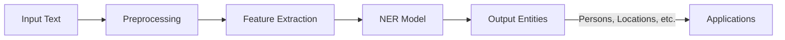

Named Entity Recognition (NER) is a sub-task of information extraction that aims to locate and classify named entities mentioned in unstructured text into predefined categories such as the names of persons, organizations, locations, expressions of times, quantities, monetary values, percentages, etc.

## Introduction

In Natural Language Processing (NLP), Named Entity Recognition (NER) is essential for multiple applications, including information retrieval, question answering, and even for aiding other NLP tasks like machine translation. By identifying key pieces of information within text data, NER enables systems to gain a higher level of understanding of the text context.

## Conceptual Diagram

Below is an example diagram that illustrates how an NER system processes input text to identify and classify entities.



## Methodologies

There are various methodologies to implement NER systems:

### Rule-Based Approaches

Rule-based systems rely on predefined rules about the structure and patterns of entities.

```python
import re

text = "Barack Obama was born in Honolulu, Hawaii."
entities = {"PERSON": [], "LOC": []}

person_pattern = re.compile(r'\b[A-Z][a-z]+ [A-Z][a-z]+\b')
location_pattern = re.compile(r'\b[A-Z][a-z]+\b')

entities["PERSON"] = person_pattern.findall(text)
entities["LOC"] = location_pattern.findall(text)[1:]  # Simple heuristic to capture locations

print(entities)
```

### Machine Learning Approaches

Traditional machine learning models such as Conditional Random Fields (CRF) and Hidden Markov Models (HMM) have been employed for NER.

#### Example with CRF in Python:

```python
from sklearn_crfsuite import CRF

train_sents = [[('Barack', 'NNP'), ('Obama', 'NNP'), ('was', 'VBD'), ('born', 'VBN'), ('in', 'IN'), ('Honolulu', 'NNP'), (',', ','), ('Hawaii', 'NNP'), ('.', '.')]]
train_labels = [['B_PER', 'I_PER', 'O', 'O', 'O', 'B_LOC', 'O', 'B_LOC', 'O']]

crf = CRF()
crf.fit(train_sents, train_labels)

test_sents = [[('George', 'NNP'), ('Washington', 'NNP'), ('was', 'VBD'), ('born', 'VBN')]]
print(crf.predict(test_sents))
```

### Deep Learning Approaches

With the advancement of deep learning, models like BiLSTM-CRF and transformer-based models (e.g., BERT) have become state-of-the-art for NER tasks.

#### Example with BERT in Python using `transformers` library

```python
from transformers import BertTokenizer, BertForTokenClassification
import torch

tokenizer = BertTokenizer.from_pretrained('bert-base-cased')
model = BertForTokenClassification.from_pretrained('bert-base-cased', num_labels=9)  # Assuming 9 classes for example

text = "Barack Obama was born in Honolulu, Hawaii."
inputs = tokenizer(text, return_tensors="pt")

outputs = model(**inputs)
logits = outputs.logits

predictions = torch.argmax(logits, dim=2)
print(predictions)
```

## Related Design Patterns

### 1. **Sequence to Sequence Learning**

Sequence to Sequence (Seq2Seq) learning is a related pattern often used in tasks like translation but can also assist in NER by learning complex entity structures in a contextual manner.

### 2. **Attention Mechanism**

Attention Mechanism, and specifically Transformers, have revolutionized NER. By focusing on parts of the text that are crucial for predicting the entity type, these methods can improve the accuracy of entity recognition.

### 3. **Text Classification**

NER can be seen as a subset of text classification, where instead of classifying the entire document, the system classifies individual chunks of the text.

## Additional Resources

- [Stanford NER](https://nlp.stanford.edu/software/CRF-NER.shtml)
- [spaCy NER](https://spacy.io/usage/linguistic-features#named-entities)
- [Hugging Face NER](https://huggingface.co)

## Summary

Named Entity Recognition is a critical task in NLP aimed at identifying and categorizing key entities within a text. With methods ranging from rule-based approaches to sophisticated deep learning techniques, NER systems have become highly effective in extracting valuable information from unstructured data. Implementing NER can significantly enhance various applications including search engines, information retrieval systems, and data processing pipelines.

By leveraging advanced models like BERT, modern NER systems achieve high accuracy, facilitating better processing and understanding of textual data. Understanding related patterns, such as Seq2Seq and attention mechanisms, provides a holistic view of how named entities can be identified and utilized in broader NLP applications.
