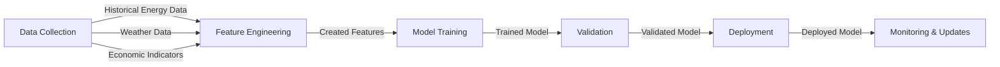

## Description

Energy Consumption Forecasting involves predicting the future energy usage of urban environments based on historical data and various contextual factors such as weather, economic activity, and human behaviors. This is crucial for energy providers, city planners, and policymakers to optimize energy production, distribution, and consumption, contributing to the sustainability and efficiency of smart cities.

## Detailed Explanation

### Importance of Energy Consumption Forecasting
As urban populations grow and smart cities become more prevalent, the efficient use of energy becomes paramount. Accurate forecasting helps in:
- Reducing energy waste
- Ensuring reliable supply
- Optimizing production and storage
- Supporting renewable energy integration

### Key Components

1. **Data Collection:** Gathering historical data on energy consumption, weather conditions, economic indicators, and social activities.
2. **Feature Engineering:** Extracting meaningful features that impact energy consumption, e.g., temperature, humidity, time of day, and special events.
3. **Model Selection:** Choosing appropriate machine learning models such as Linear Regression, ARIMA, or more complex methods like Neural Networks and Gradient Boosting Machines.
4. **Training and Validation:** Training the model on historical data and validating its performance using techniques like cross-validation.
5. **Deployment and Monitoring:** Implementing the model in a production environment and continuously monitoring its accuracy to make necessary adjustments.

## Implementation

### Example Using Python and Scikit-Learn

Here’s a sample implementation using Python and the Scikit-Learn library.

```python
import pandas as pd
from sklearn.model_selection import train_test_split
from sklearn.preprocessing import StandardScaler
from sklearn.linear_model import LinearRegression
from sklearn.metrics import mean_absolute_error

data = pd.read_csv('energy_consumption.csv')

data['Date'] = pd.to_datetime(data['Date'])
data['DayOfWeek'] = data['Date'].dt.dayofweek
data['Month'] = data['Date'].dt.month

features = ['Temperature', 'Humidity', 'DayOfWeek', 'Month']
X = data[features]
y = data['EnergyConsumption']

X_train, X_test, y_train, y_test = train_test_split(X, y, test_size=0.2, random_state=42)

scaler = StandardScaler()
X_train = scaler.fit_transform(X_train)
X_test = scaler.transform(X_test)

model = LinearRegression()
model.fit(X_train, y_train)

y_pred = model.predict(X_test)

mae = mean_absolute_error(y_test, y_pred)
print(f'Mean Absolute Error: {mae}')

import matplotlib.pyplot as plt
plt.figure(figsize=(10, 5))
plt.plot(data['Date'], data['EnergyConsumption'], label='Actual')
plt.plot(data['Date'][len(y_train):], y_pred, label='Predicted')
plt.xlabel('Date')
plt.ylabel('Energy Consumption')
plt.legend()
plt.show()
```

### Visualization with Mermaid



## Related Design Patterns

### 1. **Time Series Forecasting**
A pattern that deals with forecasting future values based on a series of past data points. This is intrinsically linked with energy consumption forecasting as it is crucial for handling time-dependent data.

### 2. **Demand Forecasting**
Focused on predicting consumer demand for products or services. In the context of energy, it helps in understanding the future energy needs based on consumption patterns and external factors.

### 3. **Anomaly Detection**
Identifying unusual patterns that do not conform to expected behavior. In energy consumption forecasting, this can help identify unexpected spikes due to equipment failure or unusual activity.

## Additional Resources
- [Scikit-Learn Documentation](https://scikit-learn.org/stable/documentation.html)
- [Introduction to Time Series Forecasting with Python](https://www.oreilly.com/library/view/introduction-to-time/9781491951948/)
- [Deep Learning for Smart Cities](https://www.springer.com/gp/book/9783030382917)
- [Energy Forecasting and Risk Management](https://www.wiley.com/en-us/Energy+Forecasting+and+Risk+Management-p-9781118372028)

## Summary
Energy Consumption Forecasting is a vital machine learning design pattern in the context of smart cities. By accurately predicting energy usage, cities can ensure efficient energy management, leading to reduced costs and enhanced sustainability. The iterative process of data collection, feature engineering, model selection, training, validation, and monitoring forms the backbone of this pattern, enabling continuous improvement and adaptation to new data and changing conditions.
