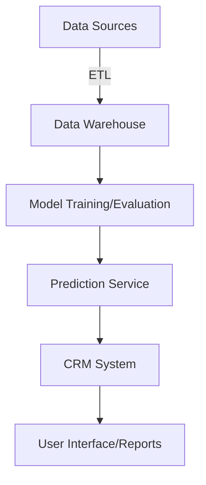

## CRM Integration: Integrating Predictive Models with Customer Relationship Management Systems

The CRM Integration pattern focuses on embedding predictive models into Customer Relationship Management (CRM) platforms to enhance capabilities such as customer insights, personalized marketing, and sales optimization. This pattern, categorized under Ecosystem Integration, illustrates the seamless fusion of machine learning predictions with operational CRM systems to drive data-driven decision-making and improve customer interactions.

### Benefits of CRM Integration

Integrating predictive models into CRM systems can yield several benefits:
- **Enhanced Customer Insights**: Predictive analytics provide deeper understanding into customer behavior and preferences.
- **Personalized Marketing Campaigns**: Segment customers based on predictive scores such as propensity to buy or churn.
- **Sales Optimization**: Identify and prioritize high-value leads using predictive lead scoring models.
- **Improved Customer Service**: Predict customer issues and proactively address their needs.

### Architecture and Workflow

The architecture for integrating predictive models with CRM systems typically involves the following components:
- **Data Preparation and ETL**: Extract, transform, and load data from various sources into the machine learning environment for model training.
- **Model Training and Evaluation**: Develop, train, and evaluate predictive models using historical data.
- **Prediction Service**: Deploy the trained models to serve predictions via API endpoints.
- **CRM System Integration**: Use APIs to ingest predictions and integrate them into the CRM workflows.

#### Architecture Diagram



### Implementation Examples

#### Example in Python with Scikit-Learn and Salesforce

Below is an example of how predictive lead scoring can be implemented and integrated into Salesforce CRM.

1. **Model Training**:

```python
from sklearn.model_selection import train_test_split
from sklearn.ensemble import RandomForestClassifier
import pandas as pd

data = pd.read_csv('historical_crm_data.csv')
X = data.drop('converted', axis=1)  # Feature set
y = data['converted']  # Target variable (1 if lead converted, 0 otherwise)

X_train, X_test, y_train, y_test = train_test_split(X, y, test_size=0.2, random_state=42)

clf = RandomForestClassifier(n_estimators=100, random_state=42)
clf.fit(X_train, y_train)

accuracy = clf.score(X_test, y_test)
print(f'Model Accuracy: {accuracy:.2f}')
```

2. **Prediction Service**:

```python
from flask import Flask, request, jsonify
import joblib

joblib.dump(clf, 'lead_scoring_model.pkl')

model = joblib.load('lead_scoring_model.pkl')

app = Flask(__name__)

@app.route('/predict', methods=['POST'])
def predict():
    leads = request.json['leads']
    predictions = model.predict(leads)
    return jsonify({'predictions': predictions.tolist()})

if __name__ == '__main__':
    app.run(debug=True)
```

3. **CRM System Integration** (Salesforce):

Use Python's `simple_salesforce` package to update Salesforce with prediction scores.

```python
from simple_salesforce import Salesforce
import requests

sf = Salesforce(username='your_username',
                password='your_password',
                security_token='your_security_token')

new_leads = [...]  # List of new leads

response = requests.post('http://localhost:5000/predict', json={'leads': new_leads})
predictions = response.json()['predictions']

for lead, score in zip(new_leads, predictions):
    sf.Lead.update(lead['Id'], {'Lead_Scoring__c': score})
```

### Related Design Patterns

1. **Feature Store**:
    - **Description**: A centralized repository for storing curated features for machine learning models, ensuring consistency and reuse. This pattern can be leveraged by the CRM Integration pattern to manage features effectively.
2. **Serving Layer**:
    - **Description**: A scalable and robust infrastructure for serving model predictions in real-time. CRM Integration can use a well-designed Serving Layer to handle prediction requests from CRM systems.
3. **Monitoring and Alerting**:
    - **Description**: Set up continuous monitoring and alerting for model performance and data quality. This ensures the predictive models integrated into CRM systems remain accurate and reliable over time.

### Additional Resources

1. **Salesforce Einstein**: [Salesforce Einstein Documentation](https://developer.salesforce.com/docs/atlas.en-us.224.0.einstein_ai.meta/einstein_ai/einstein_overview.htm)
2. **Scikit-Learn**: [Scikit-Learn Documentation](https://scikit-learn.org/stable/documentation.html)
3. **Deploying Models with Flask**: [Flask Documentation](https://flask.palletsprojects.com/en/2.0.x/tutorial/deploy/)

### Summary

The CRM Integration design pattern entails enriching CRM systems with predictive analytics to drive smarter business decisions, enhance customer engagement, and personalized services. By following this pattern, enterprises can leverage machine learning models to predict customer behaviors, optimize marketing efforts, and streamline sales processes, ensuring a proactive approach to customer relationship management. With proper architecture, implementation, and integration, CRM Integration can transform CRM systems into intelligent hubs for data-driven decision-making.
