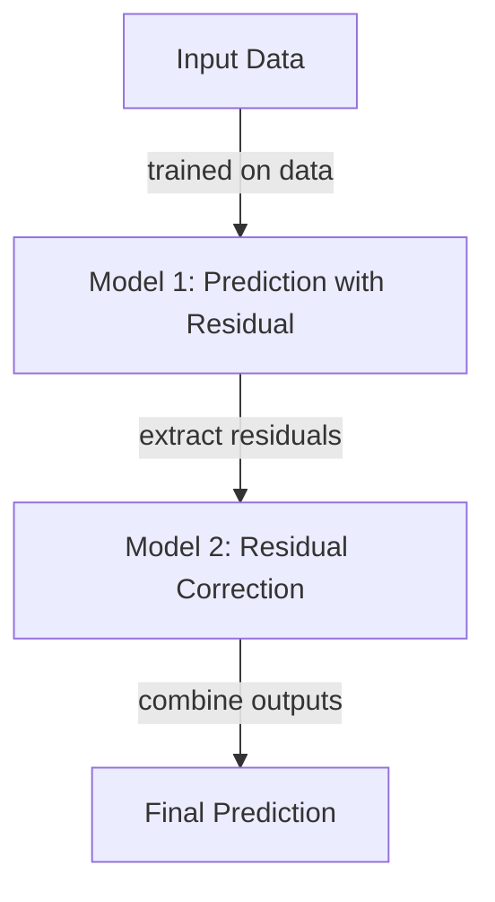

## Introduction
In the field of machine learning, a powerful strategy to enhance predictive performance is to use multiple models in a sequence, known as Cascade Models. Each model in the sequence builds upon the predictions made by the previous models, refining and enhancing the overall accuracy and reliability of the system.

This design pattern falls under the broader category of Multi-Model Systems and integrates seamlessly into larger Ecosystem Integration frameworks. 

## How Cascade Models Work
Cascade Models operate based on the principle that no single model is perfect. Instead of relying on one sophisticated model, a cascade of simpler models is used. Each subsequent model corrects or refines the predictions made by its predecessor. This iterative process continues until the final model in the sequence produces the most refined predictions based on the refined features or outputs.

## Example Implementation

### Python with scikit-learn
Let's consider a simple example using scikit-learn. We will use a Linear Regression model followed by a Random Forest Regressor to improve predictions on a synthetic dataset.

```python
import numpy as np
from sklearn.model_selection import train_test_split
from sklearn.linear_model import LinearRegression
from sklearn.ensemble import RandomForestRegressor
from sklearn.metrics import mean_squared_error

X = np.random.rand(1000, 10)
y = np.dot(X, np.random.rand(10)) + np.random.randn(1000) * 0.5

X_train, X_test, y_train, y_test = train_test_split(X, y, test_size=0.2, random_state=42)

lr = LinearRegression()
lr.fit(X_train, y_train)
y_train_pred = lr.predict(X_train)
y_test_pred = lr.predict(X_test)

residuals_train = y_train - y_train_pred
residuals_test = y_test - y_test_pred

rf = RandomForestRegressor(n_estimators=100)
rf.fit(X_train, residuals_train)
additional_train_pred = rf.predict(X_train)
additional_test_pred = rf.predict(X_test)

final_train_pred = y_train_pred + additional_train_pred
final_test_pred = y_test_pred + additional_test_pred

print("Initial MSE:", mean_squared_error(y_test, y_test_pred))
print("Final MSE:", mean_squared_error(y_test, final_test_pred))
```

### R with caret and randomForest
For R enthusiasts, here's a corresponding implementation:

```r
library(caret)
library(randomForest)

set.seed(42)
X <- matrix(runif(10000), ncol=10)
y <- rowSums(X %*% runif(10)) + rnorm(1000, sd=0.5)

trainIndex <- createDataPartition(y, p=0.8, list=FALSE)
X_train <- X[trainIndex, ]
X_test <- X[-trainIndex, ]
y_train <- y[trainIndex]
y_test <- y[-trainIndex]

lr <- train(X_train, y_train, method="lm")
y_train_pred <- predict(lr, X_train)
y_test_pred <- predict(lr, X_test)

residuals_train <- y_train - y_train_pred
residuals_test <- y_test - y_test_pred

rf <- randomForest(X_train, residuals_train)
additional_train_pred <- predict(rf, X_train)
additional_test_pred <- predict(rf, X_test)

final_train_pred <- y_train_pred + additional_train_pred
final_test_pred <- y_test_pred + additional_test_pred

initial_mse <- mean((y_test - y_test_pred)^2)
final_mse <- mean((y_test - final_test_pred)^2)
cat("Initial MSE:", initial_mse, "\n")
cat("Final MSE:", final_mse, "\n")
```

## Related Design Patterns

### Ensemble Methods
While Cascade Models are a type of multi-model system where models are applied sequentially, Ensemble Methods such as Bagging (Bootstrap Aggregating) and Boosting involve training multiple models in parallel and combining their outputs for final predictions.

### Stacking
Stacking, another related pattern, includes training multiple models but then uses another model (meta-learner) to learn from the predictions of these base models. Unlike Cascade Models, stacking does not rely on a sequential correction mechanism.

## Additional Resources
- [scikit-learn documentation on model evaluation](https://scikit-learn.org/stable/modules/model_evaluation.html)
- [Ensemble learning guide by Jason Brownlee](https://machinelearningmastery.com/ensemble-methods-for-machine-learning/)

## Summary
Cascade Models present a robust technique for enhancing predictive accuracy by sequentially applying multiple models. Each model corrects the errors of the previous one, creating a refined and powerful prediction system. This pattern integrates well within larger machine learning ecosystems and paves the way for more sophisticated and accurate models in various applications.

### Diagram Representation


By leveraging the strengths of multiple models sequentially, Cascade Models optimize the performance of machine learning systems, making them a critical design pattern for developing robust and accurate predictive solutions.
