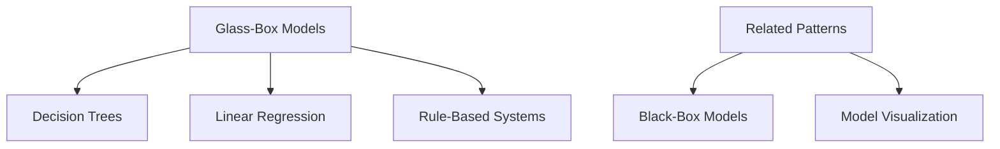

## Introduction
In critical applications such as healthcare, finance, and law enforcement, the implications of machine learning (ML) decisions can be profound. **Glass-Box Models** are paradigms within the domain of Explainable AI (XAI) that emphasize the use of inherently interpretable models. Unlike black-box models — where the decision-making process is opaque — glass-box models offer transparency and comprehensibility, making them suitable for situations where trust and accountability are paramount.

## Importance of Glass-Box Models

### Trust and Accountability
In contexts like medical diagnostics or loan approvals, the ability to trace and understand the decision-making process enhances trust and ensures accountability. This transparency is crucial for regulatory compliance and ethical responsibility.

### Debugging and Validation
Interpretable models facilitate easier debugging and validation, allowing data scientists and domain experts to verify the correctness and relevance of the patterns identified by the model.

### Societal and Ethical Considerations
Glass-box models support ethical AI practices by reducing bias and ensuring that decisions are based on understandable and legally compliant criteria.

## Examples of Glass-Box Models

### Decision Trees
Decision Trees are inherently interpretable as they represent decisions as a hierarchical leveled structure. Each node denotes a feature (including decision rule), and each leaf depicts an outcome.

#### Python Example using scikit-learn
```python
from sklearn.datasets import load_iris
from sklearn.tree import DecisionTreeClassifier
from sklearn import tree
import matplotlib.pyplot as plt

iris = load_iris()
X, y = iris.data, iris.target

clf = DecisionTreeClassifier()
clf = clf.fit(X, y)

plt.figure(figsize=(12, 8))
tree.plot_tree(clf, filled=True)
plt.show()
```

### Linear Regression
Linear Regression models offer a straightforward interpretation as they establish a direct relationship between input variables and the output using coefficients.

#### R Example using stats
```r
data(mtcars)

model <- lm(mpg ~ wt + hp, data=mtcars)

summary(model)
```
Output from the `summary()` call would indicate the coefficients for `wt` (weight) and `hp` (horsepower), illustrating how changes in these features affect the car's miles per gallon (MPG).

### Rule-Based Systems
Rule-Based Systems are constructed using a set of if-then rules, making the decision-making criteria completely transparent and easily interpretable.

#### CLIPS Example
```clips
(deftemplate loan
   (slot age)
   (slot income)
   (slot credit-score))

(defrule approve-loan
   (loan (age ?age&:(>= ?age 21)) (income ?income&: (> ?income 50000)) (credit-score ?cs&: (> ?cs 700)))
   =>
   (assert (loan-approved "yes")))
```
This set of rules determines loan approval based on age, income, and credit score, clearly spelling out each condition that impacts the decision.

## Related Design Patterns

### Black-Box Models
Opposite to Glass-Box Models, black-box models like deep neural networks are complex and often non-interpretable, making them less suitable for critical applications where understanding model behavior is essential.

### Model Visualization
This design pattern involves techniques to visualize the inner workings and decisions of a model, often used to dissect black-box models but also applicable to glass-box models for enhanced interpretability.

## Additional Resources

- [The Mythos of Model Interpretability by Zachary C. Lipton](https://arxiv.org/abs/1606.03490)
- [Interpretable Machine Learning Book by Christoph Molnar](https://christophm.github.io/interpretable-ml-book/)
- [A Unified Approach to Interpreting Model Predictions by Scott M. Lundberg and Su-In Lee](https://papers.nips.cc/paper/7062-a-unified-approach-to-interpreting-model-predictions.pdf)

## Summary

Glass-Box Models play a crucial role in ensuring that machine learning applications in sensitive domains are transparent, interpretable, and trustworthy. By leveraging inherently interpretable models like Decision Trees, Linear Regression, and Rule-Based Systems, we can better navigate issues of accountability, debugging, and societal impact. Understanding these models reinforces the alignment of machine learning practices with ethical standards and regulatory requirements, fostering an environment of trust between AI systems and their stakeholders.

For further reading and advanced insights, check out our additional resources that delve deeper into the nuances and methodologies of model interpretability.



This content provides a comprehensive overview, detailed examples, and important context regarding glass-box models, ensuring that readers from various backgrounds can understand and apply these principles in critical applications.
