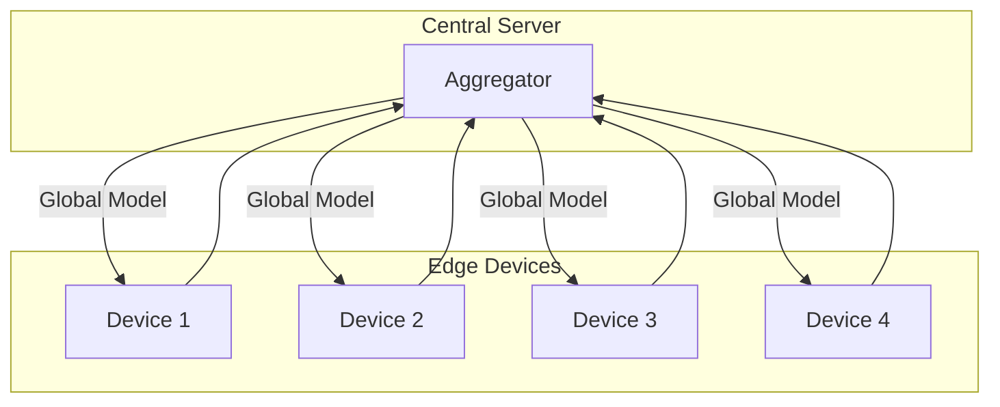

## Introduction

Cross-Device Federated Learning is a variant of federated learning where training occurs across a large number of edge devices such as smartphones, IoT devices, and other decentralized computing resources. This approach enables the training of machine learning models while enhancing data privacy and reducing the communication overhead typically involved in centralized data processing.

The fundamental goal is to collaboratively train a model without any individual device needing to share its raw data with a central server. Instead, each device trains a local model on its own data and only shares model updates (parameters) with a central server, which aggregates these updates to improve a global model.

## Key Concepts

### Data Localization and Privacy
One of the major advantages of cross-device federated learning is that data remains on the device. This enhances privacy and complies with regulations such as GDPR.

### Horizontal Federated Learning
This pattern typically involves horizontal federated learning, where all devices have the same feature space, but different samples.

### Communication Efficiency
Federated learning protocols aim to minimize the amount of data transmitted to reduce bandwidth consumption. Techniques such as model compression, gradient pruning, and differential privacy can further improve communication efficiency.

## Architecture Overview



## Implementation Example

### Using TensorFlow Federated (Python)

```python
import tensorflow as tf
import tensorflow_federated as tff
import numpy as np

def create_keras_model():
    return tf.keras.Sequential([
        tf.keras.layers.Input(shape=(784,)),
        tf.keras.layers.Dense(10, activation='softmax')
    ])

def model_fn():
    keras_model = create_keras_model()
    return tff.learning.from_keras_model(
        keras_model,
        input_spec=(
            tf.TensorSpec(shape=[None, 784], dtype=tf.float32),
            tf.TensorSpec(shape=[None, 10], dtype=tf.float32)
        ),
        loss=tf.keras.losses.CategoricalCrossentropy(),
        metrics=[tf.keras.metrics.CategoricalAccuracy()]
    )

def create_dataset():
    x = np.random.rand(100, 784).astype(np.float32)
    y = np.random.randint(0, 10, size=(100, 10)).astype(np.float32)
    return tf.data.Dataset.from_tensor_slices((x, y)).batch(20)

client_data = [create_dataset() for _ in range(4)]

iterative_process = tff.learning.build_federated_averaging_process(model_fn)

state = iterative_process.initialize()

for round_num in range(1, 11):
    state, metrics = iterative_process.next(state, client_data)
    print(f'Round {round_num}, Metrics={metrics}')
```

## Related Design Patterns

### Cross-Silo Federated Learning
- **Description**: This pattern involves federated learning across different organizations or silos. It is typically characterized by a smaller number of parties (like hospitals or companies) with large datasets.

### Federated Averaging
- **Description**: A foundational algorithm in federated learning that aggregates model updates from clients by averaging the weights, which is then used to update the global model.

### Differential Privacy
- **Description**: Techniques to ensure data privacy in federated learning by adding noise to the data or model updates to prevent leakage of sensitive information.

## Additional Resources

1. [Federated Learning for Mobile Keyboard Prediction](https://arxiv.org/abs/1811.03604) - A landmark paper detailing the successful deployment of federated learning on mobile devices.
2. [TensorFlow Federated](https://www.tensorflow.org/federated) - TensorFlow’s framework for machine learning on decentralized data.
3. [Advances and Open Problems in Federated Learning](https://arxiv.org/abs/1912.04977) - An in-depth review of federated learning innovations and challenges.
4. [Communication-Efficient Learning of Deep Networks from Decentralized Data](https://arxiv.org/abs/1602.05629) - A foundational paper that proposes federated averaging (FedAvg).

## Summary

Cross-Device Federated Learning offers a powerful approach to train machine learning models across numerous edge devices without aggregating raw data. This pattern leverages local computation and decentralized data sources to enhance privacy, reduce communication overhead, and adhere to data protection regulations. Practical implementations can be facilitated by frameworks such as TensorFlow Federated, addressing both the computational and communication challenges in this emerging field. Related patterns such as Cross-Silo Federated Learning, Federated Averaging, and Differential Privacy contribute further to developing robust and privacy-preserving distributed learning systems.

This innovative approach facilitates real-time model improvements with ongoing data generation across vast, distributed networks, marking a significant stride towards democratizing AI model development while maintaining stringent data privacy standards.
