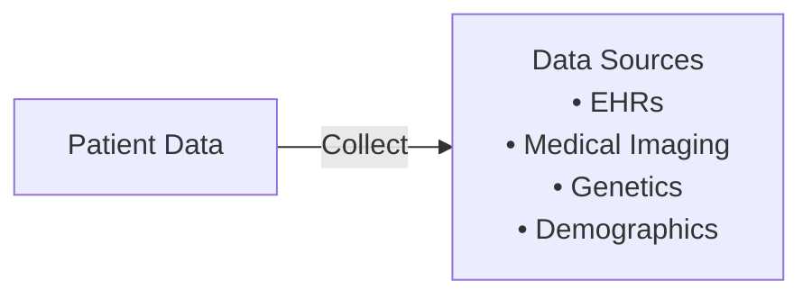

Predictive Diagnostics is a machine learning design pattern specifically tailored for healthcare applications. This involves leveraging historical and real-time patient data to predict the onset of diseases and conditions. The implementation of this pattern can lead to early interventions, improved patient outcomes, and more efficient healthcare systems. In this article, we will provide a comprehensive overview of Predictive Diagnostics, backed by practical examples, related design patterns, and additional resources.

## Components and Workflow

### Data Collection

The first step in Predictive Diagnostics involves gathering relevant data. This can include electronic health records (EHRs), medical imaging, genetic information, and patient demographics. High-quality data is crucial for building accurate predictive models.



### Data Preprocessing

Data preprocessing involves cleaning the data, handling missing values, normalizing or standardizing features, and balancing the dataset to ensure an unbiased model.


### Feature Engineering

Feature engineering is the process of selecting and transforming variables to enhance the performance of the predictive models. This may involve creating new features through domain knowledge or leveraging existing features more effectively.

```python
import pandas as pd

df['BMI'] = df['Weight'] / (df['Height'] ** 2)
df['AgeGroup'] = pd.cut(df['Age'], bins=[0, 18, 35, 50, 100], labels=['Child', 'YoungAdult', 'Adult', 'Senior'])
```

### Model Selection and Training

Various machine learning algorithms can be employed for disease prediction, including logistic regression, decision trees, random forests, gradient boosting machines, and neural networks.

```python
from sklearn.model_selection import train_test_split
from sklearn.ensemble import RandomForestClassifier
from sklearn.metrics import accuracy_score

X = df.drop(columns=['Disease'])
y = df['Disease']
X_train, X_test, y_train, y_test = train_test_split(X, y, test_size=0.2, random_state=42)

model = RandomForestClassifier(n_estimators=100, random_state=42)
model.fit(X_train, y_train)

predictions = model.predict(X_test)
accuracy = accuracy_score(y_test, predictions)
print(f"Model Accuracy: {accuracy * 100:.2f}%")
```

### Model Evaluation

Model evaluation ensures that the predictive model performs well on unseen data. Common evaluation metrics include accuracy, precision, recall, F1-score, and the area under the Receiver Operating Characteristic curve (AUC-ROC).

### Model Deployment

Once validated, the predictive model needs to be integrated into clinical workflows. This may involve building an API, a user interface, or embedding the model within the existing healthcare systems.

## Example Use Case

### Predicting Diabetes Onset

In this example, we'll build a predictive model to foresee the onset of diabetes using the Pima Indians Diabetes Dataset. This dataset contains diagnostic measures and demographic information of women of Pima Indian heritage.

#### Data Preparation

```python
import pandas as pd

url = "https://raw.githubusercontent.com/jbrownlee/Datasets/master/pima-indians-diabetes.data.csv"
column_names = ['Pregnancies', 'Glucose', 'BloodPressure', 'SkinThickness', 'Insulin', 'BMI', 'DiabetesPedigreeFunction', 'Age', 'Outcome']
data = pd.read_csv(url, header=None, names=column_names)

X = data.drop(columns=['Outcome'])
y = data['Outcome']
```

#### Model Training

```python
from sklearn.model_selection import train_test_split
from sklearn.ensemble import RandomForestClassifier
from sklearn.metrics import accuracy_score

X_train, X_test, y_train, y_test = train_test_split(X, y, test_size=0.2, random_state=42)

model = RandomForestClassifier(n_estimators=100, random_state=42)
model.fit(X_train, y_train)

predictions = model.predict(X_test)
accuracy = accuracy_score(y_test, predictions)
print(f"Model Accuracy: {accuracy * 100:.2f}%")
```

## Related Design Patterns

### Data Augmentation
In scenarios where healthcare data is limited, Data Augmentation techniques such as synthetic data generation or statistical oversampling can be deployed to enhance the training dataset.

### Ensemble Learning
To enhance predictive performance, Ensemble Learning approaches like Bagging, Boosting, or Stacking can be integrated to combine multiple base models.

### Transfer Learning
In several healthcare applications, leveraging pre-trained models on similarly large healthcare datasets before fine-tuning on the specific problem can improve performance.

## Additional Resources

1. *Hands-On Machine Learning for Healthcare* by Keshav Sud, discusses various healthcare use cases with practical implementations.
2. *Machine Learning for Health Informatics* by Andreas Holzinger provides deeper insights into health informatics and machine learning applications.
3. TensorFlow and PyTorch official documentation for implementation specifics and advanced model tuning techniques.

## Summary

Predictive Diagnostics is a powerful design pattern in the healthcare domain that leverages machine learning to predict the onset of diseases and conditions. By following the systematic gathering of data, preprocessing, feature engineering, model selection, training, evaluation, and deployment, healthcare professionals can deploy effective predictive solutions. This pattern not only enhances patient outcomes but also contributes to more efficient and proactive healthcare systems.

