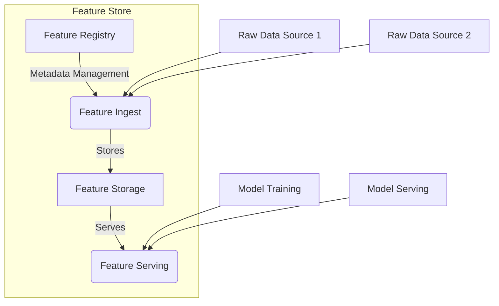

## Feature Store: Centralized Storage for Features

### Introduction

In modern machine learning systems, managing features across various projects and teams can be challenging. A **Feature Store** is a centralized repository designed to store, manage, and reuse features in a standardized and scalable manner. This design pattern ensures that the features used for training, validation, and serving machine learning models are consistent, reproducible, and easily accessible.

### Motivation

Managing features in a decentralized fashion can lead to inconsistencies, redundant work, and an inability to reuse potentially valuable features across different projects. A Feature Store addresses these issues by:

1. **Centralization**: Providing a single source of truth for feature data.
2. **Reuse**: Allowing features to be reused across different models.
3. **Consistency**: Ensuring that the same features are used for both training and serving.
4. **Governance**: Enabling feature versioning, metadata management, and access control.
5. **Scalability**: Supporting the ingestion and serving of large-scale datasets.

### Architecture

The core components of a Feature Store typically include:

1. **Feature Registry**: Metadata store that keeps track of feature definitions, versions, lineage, and dependencies.
2. **Feature Ingest**: Pipelines or interfaces for ingesting raw data and transforming it into features.
3. **Feature Serving**: Real-time and batch interfaces for fetching features for model training and serving.
4. **Feature Storage**: A durable storage system (often based on databases like BigQuery, AWS Redshift, or Delta Lake) for storing pre-computed feature values.



### Examples

#### Python Example with Feast

Feast (Feature Store) is an open-source feature store that connects features to machine learning models.

```python
from feast import FeatureStore

store = FeatureStore(repo_path="./feature_repo")

entity_df = pd.DataFrame.from_dict({
    "order_id": [1001, 1002, 1003],
    "event_timestamp": [datetime(2021, 5, 10, 15, 0),
                        datetime(2021, 5, 10, 15, 10),
                        datetime(2021, 5, 10, 15, 20)]
})
training_df = store.get_historical_features(
    entity_df=entity_df,
    feature_views=["customer_features", "transaction_features"]
).to_df()

features = store.get_online_features(
    entity_rows=[{"order_id": 1001}],
    feature_refs=["customer_features:age", "transaction_features:amount"]
).to_dict()
```

#### Scaling with Google Cloud's Vertex AI Feature Store

An example to demonstrate working with Vertex AI Feature Store using Google Cloud's AI Platform:

```python
from google.cloud import aiplatform

feature_store = aiplatform.Featurestore(resource_name="projects/project_id/locations/us-central1/featurestores/my_featurestore")

entity_df = pd.DataFrame({
    "customer_id": [1234, 5678],
    "age": [30, 45],
    "transaction_amount": [100.5, 200.0]
})
feature_store.ingest(
    entity_type_id="customers",
    feature_ids=["age", "transaction_amount"],
    dataframe=entity_df
)

features = feature_store.online_get(
    entity_type_id="customers",
    entity_ids=["1234"],
    feature_ids=["age", "transaction_amount"]
)
print(features)
```

### Related Design Patterns

#### 1. **Pipeline Abstraction**
- Abstracts the process of data manipulation, feature engineering, model training, etc., into reusable components, facilitating the use of Feature Store to plug in features seamlessly into the pipeline.

#### 2. **Data Versioning**
- Similar to software versioning, data versioning allows tracking changes in datasets and features, promoting reproducibility and regression analysis.

#### 3. **Online-offline Consistency**
- Maintains consistency between batch (offline) processing of features and real-time (online) serving to avoid training-serving skew, critical to the proper functioning of a Feature Store.

### Additional Resources

- **Feast Documentation**: [feast.dev](https://feast.dev)
- **Google Cloud Vertex AI Feature Store**: [Google Cloud AI Platform](https://cloud.google.com/vertex-ai)
- **Netflix's Feature Store**: [Netflix Technology Blog](https://netflixtechblog.com/tagged/feature-store)
- **Tecton Feature Store** (by creators of Feast): [Tecton](https://tecton.ai)

### Summary

A Feature Store provides an essential infrastructure component for scaling and managing machine learning features. By centralizing feature storage and standardizing feature ingestion and serving workflows, Feature Stores enhance reusability, reduce redundancy, and ensure consistency across the ML lifecycle. Integrating a Feature Store into your data pipeline can facilitate the development of robust, scalable, and maintainable machine learning systems.

Remember, the implementation details and choice of technology will vary based on the specific needs and existing infrastructure of your organization. Use the provided examples as starting points and tailor them to fit your particular use case.
