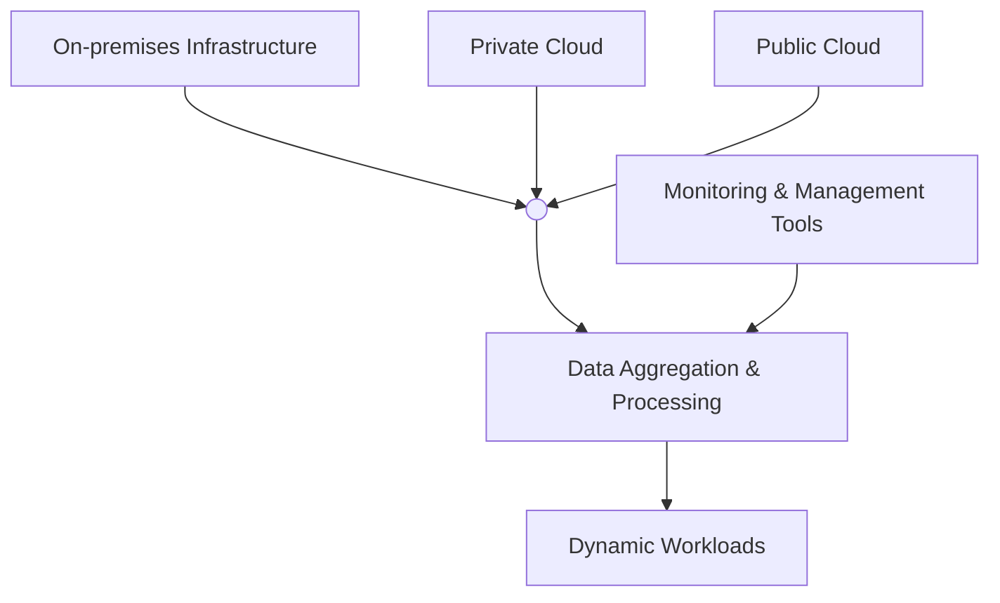

## Introduction 

The Hybrid Cloud Architecture design pattern integrates on-premises, private cloud, and public cloud resources to create a versatile and scalable environment capable of handling diverse workloads. This hybrid approach optimizes cost, performance, and data management, adapting to dynamic business and technical requirements.

<!-- markdownlint-disable MD033 -->
### **Illustration**:



## Detailed Explanation

Hybrid Cloud Architectures combine the strengths of different cloud deployment models ensuring flexibility, better resource allocation, and improved resilience. This architecture typically consists of:

- **On-premises Infrastructure (Physical Data Centers)**:
  - Low latency and higher control over hardware.
  - Used for data-sensitive or compliance-bound applications.

- **Private Cloud**:
  - Provides greater control and security similar to on-premises hardware.
  - Scales efficiently like public clouds but remains dedicated to a single organization.

- **Public Cloud**:
  - Offers practically infinite scaling capabilities with elastic pricing models.
  - Used for handling unpredictable workloads and bursty computational needs.

By combining these elements, organizations can create an optimal environment tailored to specific needs, whether regulatory compliance, cost management, or performance optimization.

## Implementation Example

In this example, we will illustrate a hybrid cloud setup with a data processing application that spans multiple cloud environments and on-premises resources using Python. We will leverage Amazon Web Services (AWS) for the public cloud, Microsoft Azure for private cloud, and an on-premises Hadoop cluster.

### Using Boto3 for AWS and Azure SDK for Python:

#### AWS Boto3 for Public Cloud Processing
```python
import boto3
import pandas as pd

def fetch_public_cloud_data(aws_access_key, aws_secret_key, bucket_name, file_key):
    s3 = boto3.client('s3', aws_access_key_id=aws_access_key, aws_secret_access_key=aws_secret_key)
    response = s3.get_object(Bucket=bucket_name, Key=file_key)
    data = pd.read_csv(response['Body'])
    return data
```

#### Azure SDK for Private Cloud Processing
```python
from azure.storage.blob import BlobServiceClient
import pandas as pd

def fetch_private_cloud_data(connection_string, container_name, file_name):
    blob_service_client = BlobServiceClient.from_connection_string(connection_string)
    blob_client = blob_service_client.get_container_client(container_name)
    download_stream = blob_client.download_blob(file_name)
    data = pd.read_csv(download_stream)
    return data
```

### On-Premises Hadoop Interaction
```python
from hdfs import InsecureClient
import pandas as pd

def fetch_on_prem_data(hdfs_url, file_path):
    client = InsecureClient(hdfs_url)
    with client.read(file_path, encoding='utf-8') as reader:
        data = pd.read_csv(reader)
    return data
```

### Unified Data Aggregation
```python
def aggregate_data(aws_data, azure_data, on_prem_data):
    combined_data = pd.concat([aws_data, azure_data, on_prem_data], axis=0)
    return combined_data

aws_data = fetch_public_cloud_data("<aws_access_key>", "<aws_secret_key>", "my-bucket", "public_data.csv")
azure_data = fetch_private_cloud_data("<connection_string>", "my-container", "private_data.csv")
on_prem_data = fetch_on_prem_data("http://localhost:50070", "/data/on_prem_data.csv")

aggregated_data = aggregate_data(aws_data, azure_data, on_prem_data)
```

## Related Design Patterns

1. **Multi-Cloud Deployment**:
    - Utilizes multiple public cloud services to mitigate risks of vendor lock-in and improve availability.
  
2. **Data Lake**:
    - Centralizes various types of data from multiple sources into a normalized storage estate, enhancing accessibility and analytical capabilities.
  
3. **Microservices Architecture**:
    - Decomposes applications into small, autonomous services that enhance modularity and scalability.
  
4. **Edge Computing**:
    - Brings computation and data storage closer to the location needed to improve response times and save bandwidth.

## Further Reading and Resources

- [AWS Hybrid Cloud Solutions](https://aws.amazon.com/hybrid/)
- [Azure Hybrid Cloud Solutions](https://azure.microsoft.com/en-us/overview/hybrid-cloud/)
- [Hadoop on-premises Clusters](https://hadoop.apache.org/)
- [Hybrid Cloud Architectures (Google Cloud)](https://cloud.google.com/hybrid)

## Summary

Hybrid Cloud Architectures are essential for organizations looking to combine flexibility, scalability, and control across diverse computing environments. This pattern enables optimized resource use across on-premises infrastructure, private clouds, and public clouds, aligning with business goals and technical requirements. By leveraging these combined capacities, organizations can efficiently manage workloads, enhance performance, ensure compliance, and stay resilient in dynamic market conditions.
