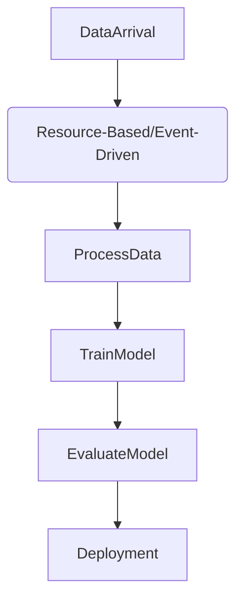

Task Scheduling is a critical design pattern in machine learning workflows that deals with effectively scheduling the execution of tasks to ensure intensive workloads are handled optimally. This article delves into its importance, methodologies, and practical implementations using different programming languages and frameworks.

## Importance of Task Scheduling

In machine learning, it is crucial to manage tasks like data processing, model training, and evaluations efficiently. Optimal task scheduling ensures:

- **Resource Efficiency:** Minimizing idle durations for computational resources and balancing the load across available resources.
- **Performance Optimization:** Reducing execution time by scheduling tasks when resources are underutilized.
- **Cost-Effectiveness:** Lower operational costs by leveraging off-peak hours for extensive computations.
- **Scalability:** Maintaining high performance even as the data and model complexities grow.

## Methodologies

Several approaches can be utilized for task scheduling:

1. **Time-Based Scheduling:** Initiating tasks at predefined times, commonly seen in cron jobs.
2. **Event-Driven Scheduling:** Triggering tasks based on specific events or conditions, like the arrival of new data.
3. **Resource-Based Scheduling:** Tasks are scheduled based on the availability and occupancy of computational resources.
4. **Priority-Based Scheduling:** Prioritizing tasks based on their urgency or importance.
5. **Dynamic Scheduling:** Continuously optimizing scheduling based on real-time analysis of resource state and workload.

## Implementation Examples

### Python with Airflow

Apache Airflow is widely used for orchestrating complex workflows.

```python
from datetime import datetime, timedelta
from airflow import DAG
from airflow.operators.python_operator import PythonOperator

default_args = {
    'owner': 'airflow',
    'depends_on_past': False,
    'start_date': datetime(2023, 1, 1),
    'email_on_failure': False,
    'email_on_retry': False,
    'retries': 1,
    'retry_delay': timedelta(minutes=5),
}

dag = DAG(
    'task_scheduling_ml',
    default_args=default_args,
    description='A simple DAG to schedule ML tasks',
    schedule_interval=timedelta(days=1),  # Daily schedule
)

def process_data():
    # Your data processing logic here
    pass

def train_model():
    # Your model training logic here
    pass

data_processing_task = PythonOperator(
    task_id='process_data',
    python_callable=process_data,
    dag=dag,
)

training_task = PythonOperator(
    task_id='train_model',
    python_callable=train_model,
    dag=dag,
)

data_processing_task >> training_task
```

### Java with Spring Batch

Spring Batch is used for robust and scalable batch processing in Java.

```java
@Configuration
@EnableBatchProcessing
public class BatchConfig {

    @Bean
    public Job job(JobBuilderFactory jobBuilderFactory, StepBuilderFactory stepBuilderFactory) {
        Step step1 = stepBuilderFactory.get("step1")
                            .tasklet((contribution, chunkContext) -> {
                                // Data processing logic here
                                return RepeatStatus.FINISHED;
                            })
                            .build();

        Step step2 = stepBuilderFactory.get("step2")
                            .tasklet((contribution, chunkContext) -> {
                                // Model training logic here
                                return RepeatStatus.FINISHED;
                            })
                            .build();

        return jobBuilderFactory.get("taskSchedulingJob")
                            .start(step1)
                            .next(step2)
                            .build();
    }
}
```

## Related Design Patterns

1. **Workflow Orchestration:** This pattern focuses on managing sequences and dependencies in workflows, often employing tools like Apache Airflow, Luigi, or Apache NiFi.
2. **Model Monitoring:** Post-deployment, continuously monitoring models to ensure they perform as expected.
3. **Feature Store:** Standardizing feature engineering, storage, and serving of features to ensure consistency and reusability across different models.

## Additional Resources

- [Apache Airflow Documentation](https://airflow.apache.org/docs/stable/)
- [Spring Batch Documentation](https://docs.spring.io/spring-batch/docs/current/reference/html/)
- [Kubernetes CronJobs](https://kubernetes.io/docs/concepts/workloads/controllers/cron-jobs/)
- [Google Cloud Composer](https://cloud.google.com/composer)
- [AWS Batch](https://aws.amazon.com/batch/)

## Summary

The Task Scheduling design pattern is invaluable for managing machine learning workflows. It ensures efficient resource utilization, optimized performance, cost-effectiveness, and scalability. By understanding and implementing various scheduling methodologies and leveraging robust tooling, machine learning engineers can significantly enhance the efficacy of their workflow management.



This approach ensures each machine learning task is executed optimally, leading to better resource management and improved workflow performance. This makes Task Scheduling a key design pattern in modern machine learning operations.
