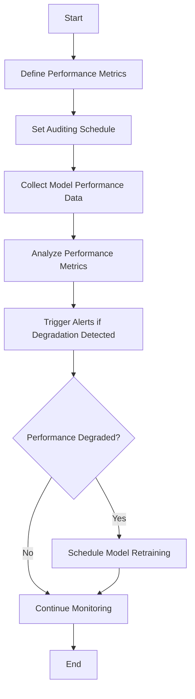

## Introduction

In the dynamic landscape of machine learning, model performance can degrade over time due to shifts in data distributions, evolving underlying trends, or changes in user behavior. Scheduled Model Performance Audits is an integral design pattern aimed at ensuring continuous model excellence. By performing regular audits of model performance metrics, organizations can proactively identify when to update, retrain, or replace models.

## Purpose

The intent behind Scheduled Model Performance Audits is to maintain the reliability and accuracy of machine learning models in production. This pattern helps in detecting performance drifts early, thus facilitating timely intervention to sustain the quality of predictions.

## When to Use

This design pattern is particularly useful in scenarios where:

- The data distribution changes over time (data drift).
- Model accuracy is mission-critical, and real-time performance insight is necessary.
- User behavior evolves, requiring periodic calibration of models.
- Continuous delivery and deployment pipelines are set up for ML models.

## Workflow



## Example Implementation

Here's an example of how Scheduled Model Performance Audits can be implemented using Python and a combination of libraries such as scikit-learn and pandas. 

### Python Example

```python
import numpy as np
import pandas as pd
from sklearn.metrics import accuracy_score, precision_score, recall_score

data = pd.read_csv('model_predictions.csv')

def audit_performance(data):
    # Calculate performance metrics
    accuracy = accuracy_score(data['true_labels'], data['predictions'])
    precision = precision_score(data['true_labels'], data['predictions'], average='weighted')
    recall = recall_score(data['true_labels'], data['predictions'], average='weighted')
    
    performance_report = {
        'accuracy': accuracy,
        'precision': precision,
        'recall': recall
    }
    return performance_report

import schedule
import time

def job():
    report = audit_performance(data)
    print("Performance Audit Report:", report)
    
    # Trigger an alert if the performance has degraded beyond a threshold
    if report['accuracy'] < 0.8:
        trigger_alert()
    
def trigger_alert():
    print("Alert: Model performance has degraded. Schedule retraining.")

schedule.every().day.at("12:00").do(job)

while True:
    schedule.run_pending()
    time.sleep(1)
```

### Java Example with Spring Boot (using Scheduled Tasks)

Here's a Java implementation of Scheduled Model Performance Audits using Spring Boot's scheduling capabilities:

```java
import org.springframework.scheduling.annotation.Scheduled;
import org.springframework.stereotype.Component;

@Component
public class ModelPerformanceAuditor {

    // Hypothetical service to get model predictions and true labels    
    @Autowired
    private ModelPredictionService predictionService;
    
    @Scheduled(cron = "0 0 12 * * ?")
    public void auditModelPerformance() {
        List<Prediction> predictions = predictionService.getPredictions();
        List<Boolean> trueLabels = predictionService.getTrueLabels();

        double accuracy = calculateAccuracy(predictions, trueLabels);

        System.out.println("Current Model Accuracy: " + accuracy);

        if (accuracy < 0.8) {
            triggerAlert();
        }
    }

    private double calculateAccuracy(List<Prediction> predictions, List<Boolean> trueLabels) {
        int correctCount = 0;
        for (int i = 0; i < predictions.size(); i++) {
            if (predictions.get(i).getLabel() == trueLabels.get(i)) {
                correctCount++;
            }
        }
        return (double) correctCount / predictions.size();
    }

    private void triggerAlert() {
        System.out.println("Alert: Model performance has degraded. Schedule retraining.");
    }
}
```

### Related Design Patterns 

- **Model Monitoring**: Continuous monitoring of model performance metrics to keep a real-time check on how the model performs in production. Scheduled Model Performance Audits can be considered a more structured and scheduled extension of Model Monitoring.

- **Shadow Testing**: Testing the new model on live, real-time data in the background without affecting the user-facing application. Shadow Testing is often used before a full-scale deployment.

- **Model Retraining Schedule**: A strategy wherein models are retrained at regular intervals, regardless of performance auditing. This complements Scheduled Model Performance Audits by ensuring continuous improvement of the models.

## Additional Resources

- ["Monitoring ML Systems in Production"](https://mlsystemmonitoring.com) by Chip Huyen
- ["Machine Learning Operations (MLOps) Primer"](https://mlopsworld.com)

## Summary

Scheduled Model Performance Audits are a crucial design pattern for maintaining and guaranteeing the ongoing accuracy, reliability, and performance of machine learning models. By performing regular audits and implementing a structured workflow for checking model performance metrics, organizations can ensure their models stay relevant and perform optimally as input data evolves. Effective auditing can trigger timely retraining and maintenance activities, ensuring the sustained accuracy of the deployed machine learning systems.
