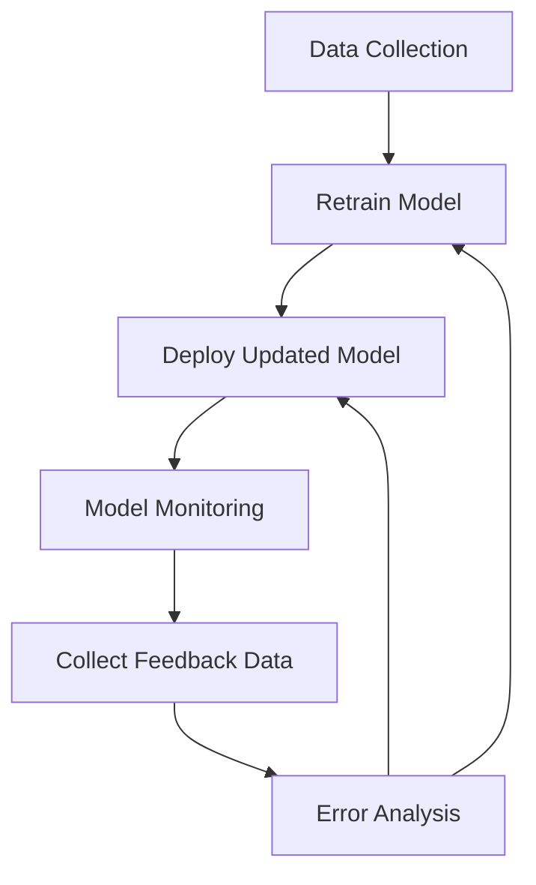

The **Model Feedback Loop** design pattern is essential for ensuring the long-term effectiveness and relevance of machine learning models. By implementing systems that regularly assess model performance and provide actionable feedback, data science teams can iteratively refine and improve their models.


## Introduction

The **Model Feedback Loop** pattern involves setting up systems to monitor the performance of a machine learning model, gather feedback data, and use this information to make continual improvements. This pattern is importance in maintaining the model's accuracy, reliability, and relevance over time. It aligns closely with continuous improvement methodologies seen in software engineering and data science practices.

## Why Use Model Feedback Loop?

When deploying machine learning models in production, two main challenges often arise:
1. **Model Degradation:** Over time, the performance of machine learning models can deteriorate due to changes in the underlying data or external environment.
2. **Performance Monitoring:** Continuous monitoring of the model's performance is crucial but can be complex and resource-intensive.

Implementing a Model Feedback Loop addresses these challenges by providing structured mechanisms to:
- Continuously evaluate model performance.
- Identify instances of model drift or degradation.
- Gather new data to retrain or adjust the model.
- Validate improvements made to the model.

## Key Components

The Model Feedback Loop consists of the following key components:

1. **Monitoring System:** This system continuously tracks the performance metrics of the deployed model. It could involve automated alerts and dashboards to notify when performance drops below a threshold.
   
2. **Feedback Data Collection:** Collect ground truth labels for model predictions to compare against the predicted values. This can be automated through user interactions or curated manually.
   
3. **Error Analysis:** Analyzing incorrect predictions to understand failure modes and guide model improvements.
   
4. **Retraining:** Periodically retrain the model using newly collected labeled data.
   
5. **Deployment:** Deploy the updated model back into production seamlessly to ensure minimal disruption.

## Implementation Examples

### Python Example with Scikit-Learn

```python
import numpy as np
from sklearn.metrics import accuracy_score
from sklearn.model_selection import train_test_split
from sklearn.linear_model import LogisticRegression
import joblib

X, y = ... # Your dataset

X_train, X_feedback, y_train, y_feedback = train_test_split(X, y, test_size=0.1, random_state=42)

model = LogisticRegression()

model.fit(X_train, y_train)

# At some future point in time, after collecting feedback data

feedback_predictions = model.predict(X_feedback)
accuracy = accuracy_score(y_feedback, feedback_predictions)
print(f"Initial model accuracy: {accuracy}")

X_new_feedback, y_new_feedback = get_feedback_data()
X_combined = np.concatenate([X_feedback, X_new_feedback])
y_combined = np.concatenate([y_feedback, y_new_feedback])

model.fit(X_combined, y_combined)

joblib.dump(model, 'model_v2.pkl')

new_feedback_predictions = model.predict(X_combined)
new_accuracy = accuracy_score(y_combined, new_feedback_predictions)
print(f"Updated model accuracy: {new_accuracy}")
```

### TensorFlow Example

```python
import tensorflow as tf
from sklearn.model_selection import train_test_split

X, y = ... # Your dataset

X_train, X_feedback, y_train, y_feedback = train_test_split(X, y, test_size=0.1, random_state=42)

model = tf.keras.models.Sequential([
    tf.keras.layers.Dense(64, activation='relu', input_shape=(X_train.shape[1],)),
    tf.keras.layers.Dropout(0.5),
    tf.keras.layers.Dense(1, activation='sigmoid')
])

model.compile(optimizer='adam', loss='binary_crossentropy', metrics=['accuracy'])

model.fit(X_train, y_train, epochs=10, batch_size=32)


feedback_predictions = model.predict(X_feedback)
accuracy = accuracy_score(y_feedback, (feedback_predictions > 0.5).astype(int))
print(f"Initial model accuracy: {accuracy}")

X_new_feedback, y_new_feedback = get_feedback_data()
X_combined = np.concatenate([X_feedback, X_new_feedback])
y_combined = np.concatenate([y_feedback, y_new_feedback])

model.fit(X_combined, y_combined, epochs=5, batch_size=32)

model.save('model_v2.h5')

new_feedback_predictions = model.predict(X_combined)
new_accuracy = accuracy_score(y_combined, (new_feedback_predictions > 0.5).astype(int))
print(f"Updated model accuracy: {new_accuracy}")
```

### Diagram for Feedback Loop



## Related Design Patterns

### Model Monitoring

**Description:** Model Monitoring involves setting up systems to track the performance of machine learning models post-deployment in real-time. It usually involves dashboards, alerting mechanisms, and automated performance metrics tracking.

### A/B Testing

**Description:** A/B Testing is a method to compare two versions of a model (or model configuration) to determine which one performs better against a target metric such as accuracy or user engagement.

### Ensemble Learning

**Description:** Ensemble Learning involves combining multiple models to improve overall performance. Feedback loops can be instrumental in refining the individual models within an ensemble or the ensemble as a whole.

## Additional Resources

- [Machine Learning Engineering](https://www.oreilly.com/library/view/machine-learning-engineering/9781492053187/)
- [Google's ML Engineering Practices](https://developers.google.com/machine-learning/guides/rules-of-ml)
- [Continuous Delivery for Machine Learning (CD4ML)](https://martinfowler.com/articles/cd4ml.html)

## Summary

The Model Feedback Loop design pattern is critical for maintaining the relevance, accuracy, and reliability of machine learning models in production. By incorporating regular feedback and retraining, data science teams can ensure that their models adapt to new data and changing environments. Implementing this pattern may involve leveraging various tools and techniques, such as model monitoring systems, error analysis workflows, and automated retraining pipelines. Understanding and applying the Model Feedback Loop can significantly enhance the life cycle management of machine learning solutions.
