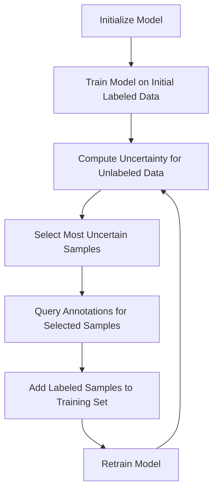

**Uncertainty Sampling** is an active learning technique used to selectively label data points that a model is most uncertain about. This helps to make the training process more efficient by focusing human labeling efforts on the most informative samples, improving model performance without requiring large amounts of labeled data.


## Introduction
In many machine learning projects, manually labeling data is expensive and time-consuming. Uncertainty Sampling, a key strategy in Active Learning, aims to maximize the usefulness of labeled data by querying human annotators to label the subset of data points about which the model is least certain. This technique can significantly boost model performance and efficiency.

## Theory
Uncertainty Sampling focuses on samples where the model's predictions lack confidence, under the assumption that these samples contain the most informative features. Metrics commonly used to quantify uncertainty include:

- **Margin Sampling**: The difference between the top two predicted probabilities.
- **Entropy Sampling**: The Shannon entropy of the predicted class probabilities.
- **Least Confidence Sampling**: The predicted probability of the most probable class.

### Formal Definition
Let \\( x \\) be a data point and \\( P(y|x) \\) be the predicted probability of class \\( y \\) for \\( x \\). For binary classification, the uncertainty in predictions can be quantified using:

1. **Least Confidence Sampling**:
   
   x^* = \arg\max_{x} \left( 1 - \max_{y} P(y|x) \right)
   

2. **Margin Sampling**:
   
   x^* = \arg\min_{x} \left( P(y_1|x) - P(y_2|x) \right)
   
   where \\( y_1 \\) and \\( y_2 \\) are the top two most likely classes.

3. **Entropy Sampling**:
   
   H(x) = - \sum_{i} P(y_i|x) \log P(y_i|x)
   
   
   x^* = \arg\max_{x} H(x)
   

## Implementation

### Python Example with Scikit-Learn
A typical implementation in Python using Scikit-Learn involves sequentially refitting the model and selecting the most uncertain samples.

```python
from sklearn.datasets import make_classification
from sklearn.ensemble import RandomForestClassifier
from scipy.stats import entropy
import numpy as np

X, y = make_classification(n_samples=1000, n_features=20, n_classes=2, random_state=42)

X_initial, y_initial = X[:100], y[:100]
X_unlabeled = X[100:]

model = RandomForestClassifier()
model.fit(X_initial, y_initial)

def uncertainty_sampling(model, X_unlabeled, n_samples=10):
    probas = model.predict_proba(X_unlabeled)
    uncertainty = np.apply_along_axis(entropy, 1, probas)
    query_idx = np.argsort(uncertainty)[-n_samples:]
    return query_idx

query_idx = uncertainty_sampling(model, X_unlabeled)
X_new, y_new = X_unlabeled[query_idx], y[100:][query_idx]

X_initial = np.vstack((X_initial, X_new))
y_initial = np.hstack((y_initial, y_new))
model.fit(X_initial, y_initial)
```

### TensorFlow/Keras Implementation
Below is an implementation in Keras using entropy-based Uncertainty Sampling.

```python
import numpy as np
import tensorflow as tf
from tensorflow.keras.datasets import mnist
from tensorflow.keras.models import Sequential
from tensorflow.keras.layers import Dense, Flatten
from scipy.stats import entropy

(x_train, y_train), (x_test, y_test) = mnist.load_data()

x_train, x_test = x_train / 255.0, x_test / 255.0

model = Sequential([
    Flatten(input_shape=(28, 28)),
    Dense(128, activation='relu'),
    Dense(10, activation='softmax')
])

model.compile(optimizer='adam', loss='sparse_categorical_crossentropy', metrics=['accuracy'])

model.fit(x_train[:1000], y_train[:1000], epochs=5)

def uncertainty_sampling(model, x_unlabeled, n_samples=100):
    probas = model.predict(x_unlabeled)
    uncertainties = entropy(probas, axis=1)
    idx = np.argsort(uncertainties)[-n_samples:]
    return idx

idx = uncertainty_sampling(model, x_train[1000:], n_samples=200)
x_new, y_new = x_train[1000:][idx], y_train[1000:][idx]

model.fit(x_new, y_new, epochs=5)
```

### Diagram
Below is a visual representation of the Uncertainty Sampling process using diagram.



## Related Design Patterns

### 1. **Query by Committee (QBC)**
In QBC, an ensemble of models (committee) is trained, and the samples where these models disagree the most are selected for labeling. This helps capture a broader range of uncertainties.

### 2. **Self-Training**
In this semi-supervised learning pattern, the model is used to predict labels on the unlabeled data, which is then iteratively included in the training data based on confidence thresholds.

### 3. **Bootstrapping**
Bootstrapping involves training multiple models on different subsets of the data to better estimate the uncertainty and make the most out of a small dataset by resampling the data.

## Additional Resources

- [Active Learning Book by Burr Settles](http://burrsettles.com/pub/settles.activelearning.pdf) - For an in-depth exploration of active learning techniques.
- [Scikit-Learn Documentation on Active Learning](https://scikit-learn.org/stable/modules/active_learning.html) - Practical guidelines and code examples.
- [TensorFlow Active Learning](https://www.tensorflow.org/decision_forests/active_learning) - Extensive tutorials and implementations using TensorFlow.

## Summary
Uncertainty Sampling is a powerful Active Learning technique that prioritizes the annotation of data samples about which a model is least certain. By focusing on these informative samples, we can efficiently improve model performance while reducing the labeling effort. This pattern is especially useful in scenarios where labeled data is scarce or expensive to obtain. Understanding and implementing Uncertainty Sampling allows machine learning practitioners to build more robust models with limited data.

Feel free to explore related design patterns and additional resources for a broader understanding of Active Learning and its applications.
