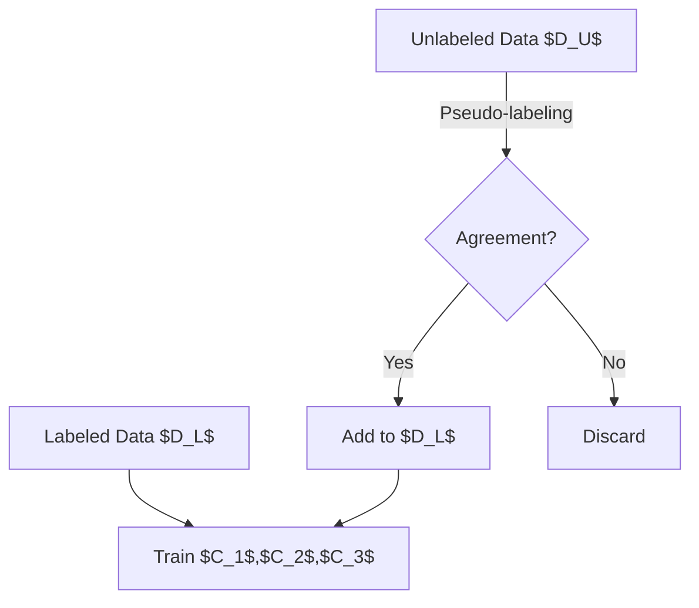

## Introduction

In the realm of semi-autonomous learning, where labeled data is often scarce or expensive to obtain, the Tri-Training design pattern stands out as a robust method that leverages multiple classifiers. This method involves using three classifiers to iteratively expand a labeled training dataset through pseudo-labeling of unlabeled data.

## Key Concepts

### Semi-Autonomous Learning

Semi-autonomous learning lies between supervised and unsupervised learning. It typically starts with a small amount of labeled data and a large amount of unlabeled data. The primary goal is to improve model performance by utilizing the unlabeled data.

### Pseudo-Labeling

Pseudo-labeling involves assigning labels to unlabeled data based on predictions from a trained model. This labeled data is then added to the training set and used to retrain the model.

## Tri-Training Pattern

### Principle

The Tri-Training method involves three classifiers:

1. **Initial Training**: Train the three classifiers using the existing labeled dataset.
2. **Pseudo-Labeling**: Each classifier pseudo-labels the unlabeled data. A data point is accepted into the training set if any two classifiers agree on its label.
3. **Iterative Process**: This process is iterated, with the newly pseudo-labeled data augmenting the training set, improving the classifiers incrementally.

### Mathematical Formulation

Let \\(D_L\\) be the initial labeled dataset and \\(D_U\\) be the unlabeled dataset. Let \\(C_1, C_2,\\) and \\(C_3\\) be the three classifiers.

1. **Initial Training**:
    
    C_1, C_2, C_3 \leftarrow \text{train}(D_L)
    

2. **Pseudo-Labeling**:
    Given an unlabeled instance \\(x \in D_U\\):
    - Classifier \\(C_i\\) assigns a pseudo-label \\(y_i\\).
    - A pseudo-label \\(y\\) is assigned to \\(x\\) if at least two classifiers agree:
    
    y = 
    \begin{cases}
      y_1 & \text{if } y_1 = y_2 \\
      y_1 & \text{if } y_1 = y_3 \\
      y_2 & \text{if } y_2 = y_3 \\
    \end{cases}
    

3. **Augmenting Training Set and Retraining**:
    
    D_L' \leftarrow D_L \cup \{(x, y)\,|\,x \in D_U \text{ and } y \text{ is the agreed pseudo-label}\}
    
    
    C_1, C_2, C_3 \leftarrow \text{train}(D_L')
    

### Visualization



## Practical Examples

Below are examples using Python with scikit-learn and PyTorch, and R with caret:

### Python with scikit-learn

```python
from sklearn.datasets import load_iris
from sklearn.model_selection import train_test_split
from sklearn.ensemble import RandomForestClassifier
import numpy as np

X, y = load_iris(return_X_y=True)
X_train, X_unlabeled, y_train, _ = train_test_split(X, y, test_size=0.8, random_state=42)

clf1 = RandomForestClassifier().fit(X_train, y_train)
clf2 = RandomForestClassifier().fit(X_train, y_train)
clf3 = RandomForestClassifier().fit(X_train, y_train)

def pseudo_label(clf1, clf2, clf3, X_unlabeled):
    pseudo_labels = []
    for x in X_unlabeled:
        labels = [clf.predict([x])[0] for clf in (clf1, clf2, clf3)]
        if labels[0] == labels[1] or labels[0] == labels[2]:
            pseudo_labels.append(labels[0])
        elif labels[1] == labels[2]:
            pseudo_labels.append(labels[1])
    return np.array(pseudo_labels)

pseudo_labels = pseudo_label(clf1, clf2, clf3, X_unlabeled)

X_train = np.concatenate((X_train, X_unlabeled))
y_train = np.concatenate((y_train, pseudo_labels))

clf1 = RandomForestClassifier().fit(X_train, y_train)
clf2 = RandomForestClassifier().fit(X_train, y_train)
clf3 = RandomForestClassifier().fit(X_train, y_train)
```

### R with caret

```R
library(caret)
library(randomForest)

data(iris)
trainIndex <- createDataPartition(iris$Species, p = .2, list = FALSE)
trainData <- iris[trainIndex, ]
unlabeledData <- iris[-trainIndex, ]

model_rf1 <- train(Species ~ ., data = trainData, method = "rf")
model_rf2 <- train(Species ~ ., data = trainData, method = "rf")
model_rf3 <- train(Species ~ ., data = trainData, method = "rf")

pseudo_label <- function(models, data) {
  labels <- sapply(models, function(model) predict(model, data))
  consensus <- apply(labels, 1, function(row) {
    if (row[1] == row[2] || row[1] == row[3]) {
      return(row[1])
    } else if (row[2] == row[3]) {
      return(row[2])
    }
    return(NA)
  })
  return(consensus)
}

pseudo_labels <- pseudo_label(list(model_rf1, model_rf2, model_rf3), unlabeledData)

extendedData <- rbind(trainData, cbind(unlabeledData, Species = pseudo_labels))

model_rf1 <- train(Species ~ ., data = extendedData, method = "rf")
model_rf2 <- train(Species ~ ., data = extendedData, method = "rf")
model_rf3 <- train(Species ~ ., data = extendedData, method = "rf")
```

## Related Design Patterns

- **Self-Training**: Similar to Tri-Training but uses a single classifier to pseudo-label unlabeled data iteratively.
- **Co-Training**: Involves two classifiers with distinct views (feature sets) on the same data, improving mutual performance and expanding the labeled training set.

## Additional Resources

- [Pseudo-Labeling: Semi-supervised Learning by Wikipedia](https://en.wikipedia.org/wiki/Semi-supervised_learning#Pseudo-labeling)
- [Ensemble Methods Overview](https://scikit-learn.org/stable/modules/ensemble.html)
- [Original Tri-Training Paper](https://citeseerx.ist.psu.edu/viewdoc/download?doi=10.1.1.65.9329&rep=rep1&type=pdf)

## Summary

The Tri-Training design pattern is an effective semi-autonomous learning approach that leverages the power of ensemble methods and pseudo-labeling to iteratively enhance the training dataset. This method efficiently utilizes unlabeled data by triangulating the predictions of three independent classifiers, leading to robust model performance even with limited initial labeled data. 

By adopting Tri-Training, data scientists and machine learning practitioners can significantly improve model accuracy, especially in scenarios where labeled data is scarce but unlabeled data is abundant.
