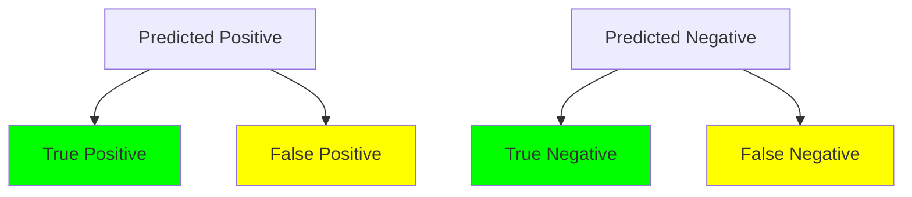

## Introduction

The **Confusion Matrix** is a crucial tool in evaluating the performance of classification models. It provides insights into not just the accuracy of a model but also the types of errors it makes. This article delves deeply into the confusion matrix's structure, its interpretation, and its computation in different programming environments.

## Confusion Matrix Structure

A confusion matrix is typically a square matrix designed for evaluating classification models. It classifies the outcomes into four categories:

- **True Positives (TP)**: Correctly predicted positive instances.
- **False Positives (FP)**: Incorrectly predicted as positive when actually negative.
- **False Negatives (FN)**: Incorrectly predicted as negative when actually positive.
- **True Negatives (TN)**: Correctly predicted negative instances.


\begin{bmatrix}
\text{TP} & \text{FP} \\
\text{FN} & \text{TN}
\end{bmatrix}


## Calculation of Confusion Matrix

### Example in Python with Scikit-Learn

Here's how you can compute a confusion matrix using Python and the Scikit-Learn library.

```python
from sklearn.metrics import confusion_matrix

y_true = [1, 0, 1, 1, 0, 1, 0, 0, 1, 0]
y_pred = [0, 0, 1, 1, 0, 1, 0, 1, 1, 0]

cm = confusion_matrix(y_true, y_pred)
print(cm)
```

### Example in R with caret

In R, you can utilize the `caret` package to generate a confusion matrix.

```R
library(caret)

y_true <- factor(c(1, 0, 1, 1, 0, 1, 0, 0, 1, 0))
y_pred <- factor(c(0, 0, 1, 1, 0, 1, 0, 1, 1, 0))

cm <- confusionMatrix(y_pred, y_true)
print(cm)
```

## Interpretation of Confusion Matrix

A confusion matrix reveals the performance of the classification model. Additional derived metrics from the confusion matrix include:

- **Accuracy**: \\((TP + TN) / (TP + TN + FP + FN)\\)
- **Precision**: \\(TP / (TP + FP)\\)
- **Recall (Sensitivity)**: \\(TP / (TP + FN)\\)
- **Specificity**: \\(TN / (TN + FP)\\)
- **F1 Score**: \\(2 \times \frac{\text{Precision} \times \text{Recall}}{\text{Precision} + \text{Recall}}\\)

### Accuracy


\text{Accuracy} = \frac{TP + TN}{TP + TN + FP + FN}


### Precision


\text{Precision} = \frac{TP}{TP + FP}


### Recall (Sensitivity)


\text{Recall} = \frac{TP}{TP + FN}


### Specificity


\text{Specificity} = \frac{TN}{TN + FP}


### F1 Score


\text{F1 Score} = 2 \times \frac{\text{Precision} \times \text{Recall}}{\text{Precision} + \text{Recall}}


### Visual Representation

Here is a visual representation using a compatible diagram for enhanced understanding:



## Related Design Patterns

### Precision-Recall Tradeoff

This pattern deals with the trade-off between precision and recall, often visualized using a precision-recall curve.

### ROC and AUC

Receiver Operating Characteristic (ROC) curves and the Area Under the Curve (AUC) are extensively used for understanding the diagnostic ability of binary classifiers.

### Cross-Validation

Cross-validation techniques help to better utilize data and ensure that the evaluation metrics like confusion matrix-derived values are more reliable.

## Additional Resources

- [Scikit-Learn Documentation](https://scikit-learn.org/stable/modules/generated/sklearn.metrics.confusion_matrix.html) 
- [caret R Documentation](https://topepo.github.io/caret/)
- [Wikipedia on Confusion Matrix](https://en.wikipedia.org/wiki/Confusion_matrix)

## Summary

The **Confusion Matrix** is a fundamental and intuitive tool for validating classification models, providing a granular view of performance by illustrating the types of errors. Coupled with derived metrics like precision, recall, specificity, and F1 score, it equips data scientists and practitioners with actionable insights to refine their models. Concepts and calculations can be implemented seamlessly across various programming ecosystems, ensuring widespread applicability.

Understanding a confusion matrix paves the way towards more sophisticated evaluation patterns like ROC-AUC, and helps rigorously assess the model's functional reliability.
