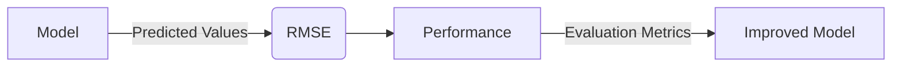

Evaluation metrics are crucial in the field of machine learning as they help quantify the performance of models. The **Root Mean Squared Error (RMSE)** is one such potent metric, especially in regression tasks. RMSE gives insight into the prediction accuracy by calculating the square root of the average squared differences between predicted and actual values.

## Mathematical Definition

The Root Mean Squared Error is defined mathematically as:


RMSE = \sqrt{\frac{1}{n} \sum_{i=1}^{n} (y_i - \hat{y}_i)^2}


- \\( n \\): The number of observations
- \\( y_i \\): The actual value for the i-th observation
- \\( \hat{y}_i \\): The predicted value for the i-th observation

## Why RMSE?

RMSE is widely used due to its simplicity and sensitivity to large errors. It penalizes significant errors more than smaller ones, providing a robust measure of model performance.

## Implementation in Various Programming Languages

### Python (Using Scikit-learn)

```python
from sklearn.metrics import mean_squared_error
import numpy as np

y_true = np.array([3.0, -0.5, 2.0, 7.0])
y_pred = np.array([2.5, 0.0, 2.0, 8.0])

mse = mean_squared_error(y_true, y_pred)
rmse = np.sqrt(mse)
print(f"RMSE: {rmse}")
```

### R

```R
y_true <- c(3.0, -0.5, 2.0, 7.0)
y_pred <- c(2.5, 0.0, 2.0, 8.0)

mse <- mean((y_true - y_pred)^2)
rmse <- sqrt(mse)
print(paste("RMSE:", rmse))
```

### Spark (Using PySpark)

```python
from pyspark.sql import SparkSession
from pyspark.ml.evaluation import RegressionEvaluator

spark = SparkSession.builder.appName("RMSEExample").getOrCreate()

data = [(3.0, 2.5), (-0.5, 0.0), (2.0, 2.0), (7.0, 8.0)]
columns = ["true_label", "prediction"]

df = spark.createDataFrame(data, columns)

evaluator = RegressionEvaluator(labelCol="true_label", predictionCol="prediction", metricName="rmse")

rmse = evaluator.evaluate(df)
print(f"RMSE: {rmse}")

spark.stop()
```

## Related Design Patterns

1. **Mean Absolute Error (MAE)**: Unlike RMSE, MAE computes the average of absolute differences between predicted and actual values. Formally,


MAE = \frac{1}{n} \sum_{i=1}^{n} |y_i - \hat{y}_i|


MAE is less sensitive to giant outliers compared to RMSE.

2. **Mean Squared Error (MSE)**: Similar to RMSE but without the square root, MSE calculates the average squared differences.


MSE = \frac{1}{n} \sum_{i=1}^{n} (y_i - \hat{y}_i)^2


3. **R² Score (Coefficient of Determination)**: Measures the proportion of the variance in the dependent variable that's predictable from the independent variables.


R^2 = 1 - \frac{\sum_{i=1}^{n} (y_i - \hat{y}_i)^2}{\sum_{i=1}^{n} (y_i - \bar{y})^2}


## Additional Resources

- [Scikit-learn User Guide](https://scikit-learn.org/stable/user_guide.html)
- [Introduction to Statistical Learning (ISLR) with R](http://www-bcf.usc.edu/~gareth/ISL/)
- [Spark MLlib Programming Guide](https://spark.apache.org/docs/latest/ml-guide.html)

## Summary

The Root Mean Squared Error (RMSE) is a vital evaluation metric in regression analysis. Its sensitivity to large errors makes it a helpful diagnostic tool for model performance. Understanding RMSE and integrating it with other evaluation metrics can provide a more holistic view of a model's predictive capability.

This concludes our exploration of RMSE, elucidating its significance, detailed implementation across various platforms, and its relation with other evaluation metrics.

## Visual Representation



