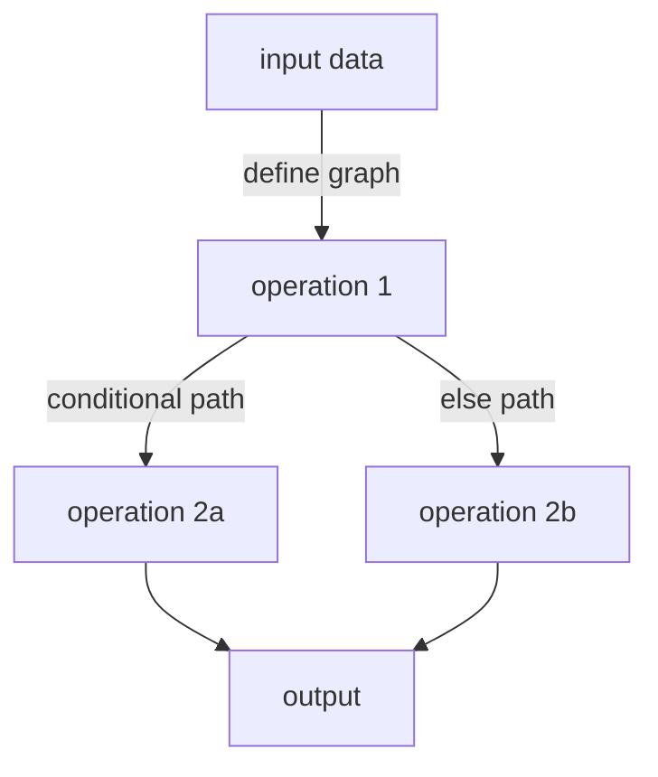

**Dynamic Computation Graphs** is an optimization technique in machine learning where the computation graph is created on-the-fly based on the input data. This approach contrasts with static computation graphs, which are predefined and fixed irrespective of the data or context. Dynamic computation graphs offer significant advantages in model flexibility, allowing for more responsive and adaptive machine learning models.

## Overview

In traditional machine learning frameworks, computation graphs are static and immutable after creation. However, dynamic computation graphs can change during runtime, leading to better adaptability, especially in complex scenarios such as natural language processing and reinforcement learning.

### Key Benefits

1. **Flexibility**: Models can handle variable-length inputs and control flows such as loops and conditionals.
2. **Debuggability**: Easier debugging as the graph is defined at runtime, making it more intuitive to trace and resolve issues.
3. **Real-time Adaptation**: The graph can adapt to changing input data, making it suitable for real-time applications.

## Framework Support

Several modern machine learning frameworks support dynamic computation graphs:

- **PyTorch**
- **TensorFlow Eager Execution**
- **Chainer**
  
## Example in PyTorch

PyTorch is one of the most popular DL libraries supporting dynamic computation graphs. Here's an example of a simple forward pass in PyTorch:

```python
import torch
import torch.nn as nn

class DynamicNet(nn.Module):
    def __init__(self):
        super(DynamicNet, self).__init__()
        self.fc1 = nn.Linear(10, 50)
        self.fc2 = nn.Linear(50, 2)

    def forward(self, x):
        x = torch.relu(self.fc1(x))
        output = self.fc2(x)
        return output

model = DynamicNet()
input_data = torch.randn(1, 10)

output = model(input_data)
print(output)
```

In this example, the computation graph is dynamically created during each forward pass based on the input data.

## Related Design Patterns

### 1. **Lazy Evaluation**
Lazy evaluation delays the evaluation of an expression until its value is actually needed, which can be combined with dynamic computation graphs to further optimize performance.

### 2. **Model Dynamic Switching**
This pattern involves switching between different model architectures at runtime based on the input data characteristics, similar to dynamic computation graphs that adapt computation paths.

## Detailed Explanations

The key concept behind dynamic computation graphs is the deferred definition of the computational steps:

 y = f(x) = f_n \circ f_{n-1} \circ ... \circ f_1 (x) 

Where \\( f_i \\) can be any function determined at runtime based on conditions or input data.

Mermaid Diagram representing a dynamic computation flow:



This flexibility can lead to performance gains especially when operations can be skipped or modified based on real-time analysis.

## Additional Resources

1. [PyTorch Documentation](https://pytorch.org/docs/stable/index.html)
2. [Dynamic Computation Graphs in TensorFlow](https://www.tensorflow.org/guide/eager)
3. [Research Paper on Dynamic Computational Graphs](https://arxiv.org/abs/2107.01620)

## Summary

Dynamic Computation Graphs empower machine learning systems to be more adaptable, flexible, and responsive to real-time data. By constructing the computation graph on-the-fly, models can efficiently handle varying input sizes and structures, incorporate dynamic control flows, and optimize computations tailored to the specific instance. Adopting this design pattern can significantly enhance the performance and robustness of complex machine learning applications.
