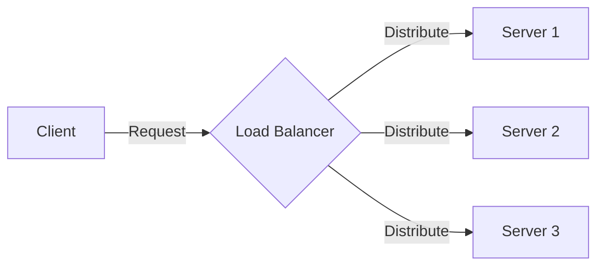

## Load Balancing: Distributing Incoming Jobs

The Load Balancing design pattern is a critical architectural solution in distributed systems to distribute incoming jobs across multiple servers. This approach ensures that no single server becomes a bottleneck or point of failure, thereby enhancing the system's overall fault tolerance, scalability, and reliability.

### Introduction

Load balancing is essential for handling large volumes of data and requests efficiently, especially in machine learning applications where processing power and parallelism are crucial. By effectively distributing workloads, we can maximize resource utilization, maintain high availability, and ensure a smooth user experience.

### Key Concepts

- **Server Pool**: A group of servers ready to handle incoming jobs and traffic.
- **Load Balancer**: A device or software application responsible for distributing incoming requests to different servers.
- **Health Checks**: Mechanisms to regularly monitor the status of servers to ensure they are capable of handling requests.

### Load Balancing Strategies

1. **Round Robin**: Requests are distributed evenly across all servers in a cyclic order.
2. **Least Connections**: Requests are directed to the server with the fewest active connections.
3. **IP Hash**: The client’s IP address is used to determine which server will handle the request.
4. **Weighted Round Robin**: Servers are assigned weights based on their capacity, and requests are distributed proportionally.

### Example Implementations

#### Python with Flask and HAProxy

##### HAProxy Configuration

```plaintext
frontend http_front
   bind *:5000
   default_backend http_back

backend http_back
   balance roundrobin
   server server1 127.0.0.1:5001 check
   server server2 127.0.0.1:5002 check
   server server3 127.0.0.1:5003 check
```

##### Flask Application

```python
from flask import Flask, request

app = Flask(__name__)

@app.route('/predict', methods=['POST'])
def predict():
    data = request.get_json()
    # Machine learning prediction logic
    return {"result": "prediction"}

if __name__ == '__main__':
    app.run(port=5001)
```

Run multiple instances on different ports (5001, 5002, 5003) to simulate a load-balanced environment.

#### AWS Elastic Load Balancer (ELB) with EC2

1. **Create EC2 Instances**: Launch multiple EC2 instances running your ML application.
2. **Setup ELB**: Configure an Elastic Load Balancer in AWS to distribute incoming traffic to your EC2 instances.
3. **Health Checks**: Define health checks on your ELB to ensure traffic is only routed to healthy instances.
   
### Diagram

Below is a diagram illustrating the Load Balancing architecture.



### Related Design Patterns

- **Retry Pattern**: Automatically retrying failed operations to handle transient failures.
- **Circuit Breaker Pattern**: Preventing an application from attempting an operation likely to fail.
- **Bulkhead Pattern**: Isolating different parts of the system to prevent a failure in one part from affecting others.

### Additional Resources

1. [AWS Elastic Load Balancing](https://aws.amazon.com/elasticloadbalancing/)
2. [Nginx Load Balancing](https://www.nginx.com/resources/glossary/load-balancing/)
3. [HAProxy Documentation](http://www.haproxy.org/)

### Summary

The Load Balancing pattern is vital for building robust and reliable architectures in machine learning applications. By distributing incoming jobs across multiple servers, it ensures high availability and prevents single points of failure. Implementing this pattern can significantly improve your system's scalability, fault tolerance, and overall performance.

Understanding and applying load balancing in your infrastructure, whether through software solutions like HAProxy or cloud services like AWS ELB, is essential for managing high volumes of data and requests in an efficient and reliable manner. This pattern works in concert with other patterns such as the Retry, Circuit Breaker, and Bulkhead patterns to create a resilient and fault-tolerant system.
