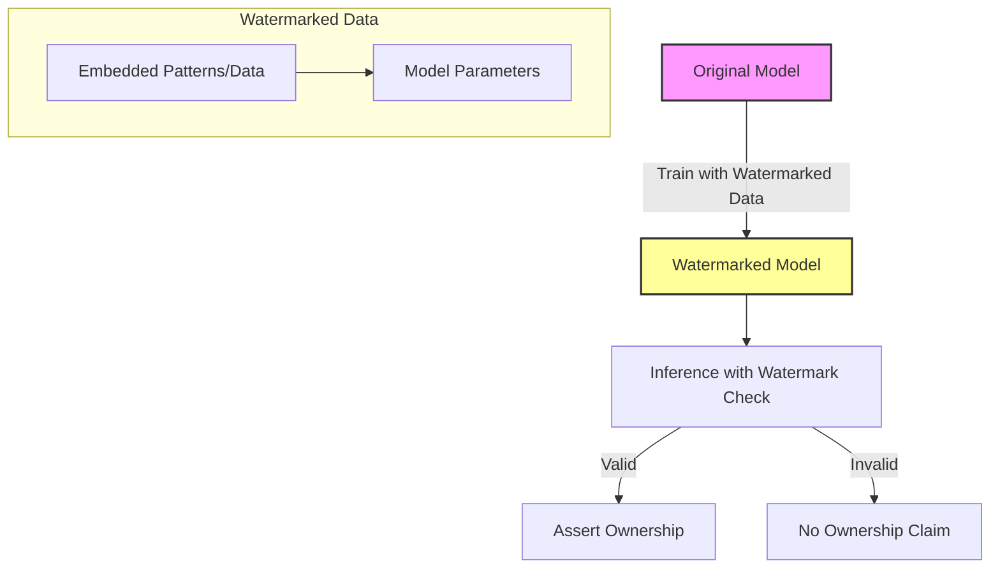

## Overview
Model Watermarking is a technique used in machine learning to safeguard and assert ownership of models by embedding watermarks. These watermarks act as a traceable signature, enabling model creators to protect their intellectual property (IP) and validate rightful ownership in case of disputes.

## Why Model Watermarking?
As machine learning models become increasingly valuable, ensuring their security and ownership is paramount. Watermarking provides a means to:

1. **Assert Ownership**: Prove the origin of a model in case of theft or misuse.
2. **Enhance Security**: Add layers of security that prevent unauthorized use.
3. **Detect Infringement**: Identify unauthorized reproductions and usage through covert signatures.

## Techniques for Model Watermarking
Various techniques can be used to embed watermarks in machine learning models. Here, we discuss some prominent methods:

### 1. Data-based Watermarking
Involves embedding special patterns (watermarks) into the training data, which the model learns during training. Post-training, these patterns can be extracted and analyzed to confirm ownership.
```python
import numpy as np

def generate_watermarked_data(original_data, watermark):
    watermarked_data = original_data.copy()
    for i in range(len(watermark)):
        x, y = watermark[i]
        watermarked_data[x, y] += np.random.normal(scale=0.1)
    return watermarked_data

original_data = np.random.rand(100, 100)
watermark = [(10, 10), (20, 20), (30, 30)] 
watermarked_data = generate_watermarked_data(original_data, watermark)
```

### 2. Model-based Watermarking
Embedding the watermark directly in the model parameters. This necessitates small, yet identifiable modifications to the model weights.
```python
import torch
import torch.nn as nn

class WatermarkedModel(nn.Module):
    def __init__(self):
        super(WatermarkedModel, self).__init__()
        self.fc = nn.Linear(10, 1)
        # watermarked weights addition
        self.fc.weight.data.add_(torch.tensor([[0.001]]*10))

    def forward(self, x):
        return self.fc(x)
```

### 3. Output-based Watermarking
Introduce specific output behaviors or responses for particular inputs that are unlikely to occur in normal operations.
```python
def watermark_function(x):
    if np.array_equal(x, np.array([3.1415, 2.7183])):
        return "Watermark Triggered!"
    else:
        return "Normal Output"

input_data = np.array([3.1415, 2.7183])
output = watermark_function(input_data)
print(output)  # Watermark Triggered!
```

### Mathematical Representation of Watermarking
Suppose \\(M\\) is the machine learning model, \\(D\\) is the training data, and \\(w\\) is the watermark. The goal is to train the model on \\(D\\) in such a way that the model \\(M_w\\) includes \\(w\\).

Let:

M_w = \arg \min_M L(M(D)) + \lambda L_w(M, w)


Here, \\(L\\) is the standard loss function, and \\(L_w\\) is the watermark-specific loss. \\(\lambda\\) is a balancing parameter controlling the importance of the watermark.

### Model Watermarking Visualization with Mermaid Diagrams


## Related Design Patterns
1. **Data Provenance**: Ensuring traceability of data origins and manipulations throughout the lifecycle of a machine learning model.
2. **Model Encryption**: Utilizing cryptographic methods to encrypt models ensuring that only authorized entities can access or modify the model.

## Additional Resources
- [Watermarking Neural Networks](https://arxiv.org/abs/1701.03298): Research paper discussing methodologies for watermarking neural networks.
- [IEEE Conference on Machine Learning and Applications](https://www.ieee.org/conferences/machine-learning.html): Regular conferences on advancements in machine learning security.

## Summary
Model Watermarking is an essential technique for safeguarding intellectual property in machine learning. By embedding identifiable signatures within a model, creators can assert ownership and protect their creations from unauthorized use. This design pattern, combined with other security measures, provides a robust framework for ensuring model integrity and ownership verification in the modern AI landscape.


