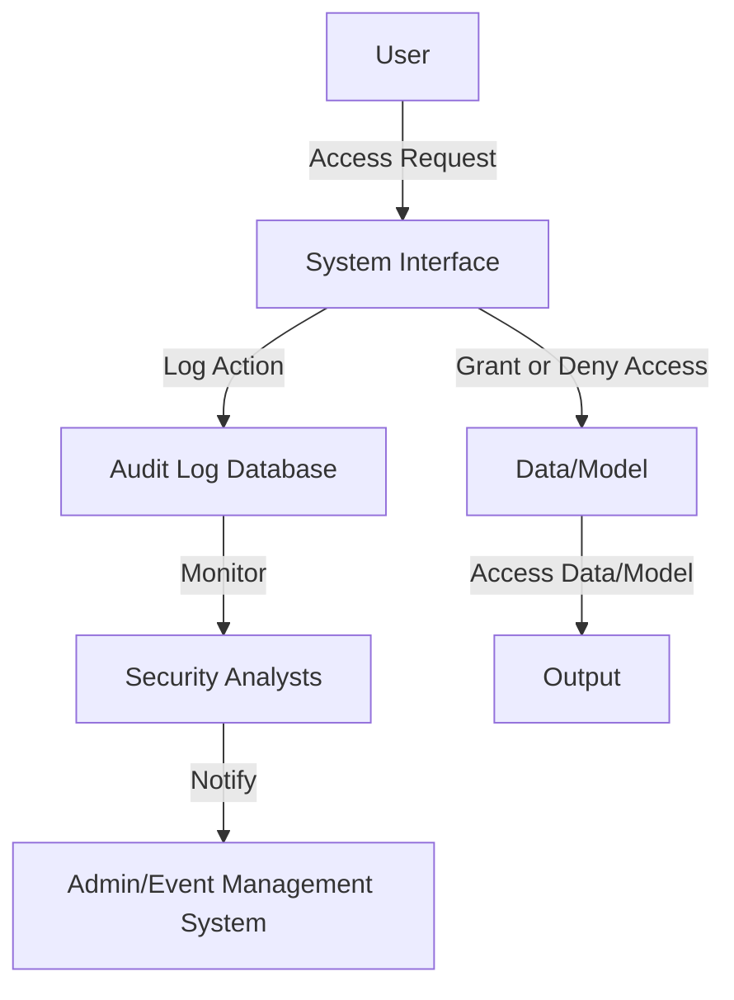

## Introduction

In a machine learning model pipeline, maintaining security and accountability is crucial. The **Audit Logs** design pattern ensures that every access to data and models is meticulously logged. This facilitates traceability, compliance with regulations, and enhanced security by monitoring who accessed what and when.

## Importance

The primary goals of implementing audit logs include:

1. **Accountability:** Maintaining a clear record of actions taken by users.
2. **Compliance:** Ensuring that the system adheres to regulatory requirements.
3. **Security:** Identifying potential breaches or misuse.
4. **Troubleshooting:** Facilitating the debugging process by providing context on actions.

## How It Works

### Data Flow Overview



### Key Components

- **User:** The entity (human or process) making the access request.
- **System Interface:** The mechanism (API, UI, etc.) through which the access request is made.
- **Audit Log Database:** A secure repository where all access events are recorded.
- **Security Analysts:** Human roles or intelligent systems that monitor the logs.
- **Admin/Event Management System:** A system that handles notifications for suspicious activities.

## Implementation in Different Languages and Frameworks

### Example in Python using `logging` module

```python
import logging
from datetime import datetime

logging.basicConfig(filename='audit_log.log', level=logging.INFO)

def log_access(user_id, resource, access_type):
    log_message = (f"{datetime.now()}: User {user_id} "
                   f"{access_type} access to {resource}")
    logging.info(log_message)
    print(log_message)

log_access('user123', 'model_v1', 'requested')
log_access('user123', 'dataset_v3', 'accessed')
```

### Example in Java using SLF4J and Logback

```java
import org.slf4j.Logger;
import org.slf4j.LoggerFactory;
import java.time.LocalDateTime;

public class AuditLogger {
    private static final Logger logger = LoggerFactory.getLogger(AuditLogger.class);

    public static void logAccess(String userId, String resource, String accessType) {
        String logMessage = String.format("%s: User %s %s access to %s",
                LocalDateTime.now(), userId, accessType, resource);
        logger.info(logMessage);
        System.out.println(logMessage);
    }

    public static void main(String[] args) {
        logAccess("user123", "model_v1", "requested");
        logAccess("user123", "dataset_v3", "accessed");
    }
}
```

### Example using Node.js and `winston`

```javascript
const { createLogger, transports, format } = require('winston');

const logger = createLogger({
  level: 'info',
  format: format.combine(
    format.timestamp(),
    format.printf(({ timestamp, level, message }) => {
      return `${timestamp}: ${message}`;
    })
  ),
  transports: [
    new transports.File({ filename: 'audit_log.log' })
  ]
});

function logAccess(userId, resource, accessType) {
  const logMessage = `User ${userId} ${accessType} access to ${resource}`;
  logger.info(logMessage);
  console.log(logMessage);
}

// Example usage
logAccess('user123', 'model_v1', 'requested');
logAccess('user123', 'dataset_v3', 'accessed');
```

## Related Design Patterns

### **Authentication and Authorization**

To ensure that only authorized users can access specific data and models:
- **Authentication:** Verifies the identity of users.
- **Authorization:** Ensures that users have permission to access the resources they request.

### **Data Provenance**

Maintains a record of the data's origins and transformations:
- **Lineage Tracking:** Tracks the flow and transformation of data throughout the pipeline.
- **Reproducibility:** Facilitates the reproduction of results.

### **Encryption**

Secures data in storage and transit:
- **Encryption at Rest:** Protects data stored on disk.
- **Encryption in Transit:** Protects data being transferred over networks.

## Additional Resources

- [The Importance of Audit Logging in Machine Learning](https://example.com/audit-logging-importance)
- [Implementing Security Best Practices in Machine Learning](https://example.com/ml-security-practices)
- [Data Governance and Compliance in Machine Learning](https://example.com/data-governance-ml)

## Summary

The **Audit Logs** design pattern is fundamental for ensuring security, compliance, and accountability in machine learning systems. By meticulously logging every access to data and models, it facilitates monitoring, detects unauthorized activities, aids debugging, and ensures adherence to regulations. When combined with other design patterns like authentication and authorization, data provenance, and encryption, it forms a robust security framework for the entire machine learning pipeline.

Applications of audit logs extend beyond security, offering invaluable insights into user behavior and system performance, ultimately leading to smarter and more secure machine learning solutions.
