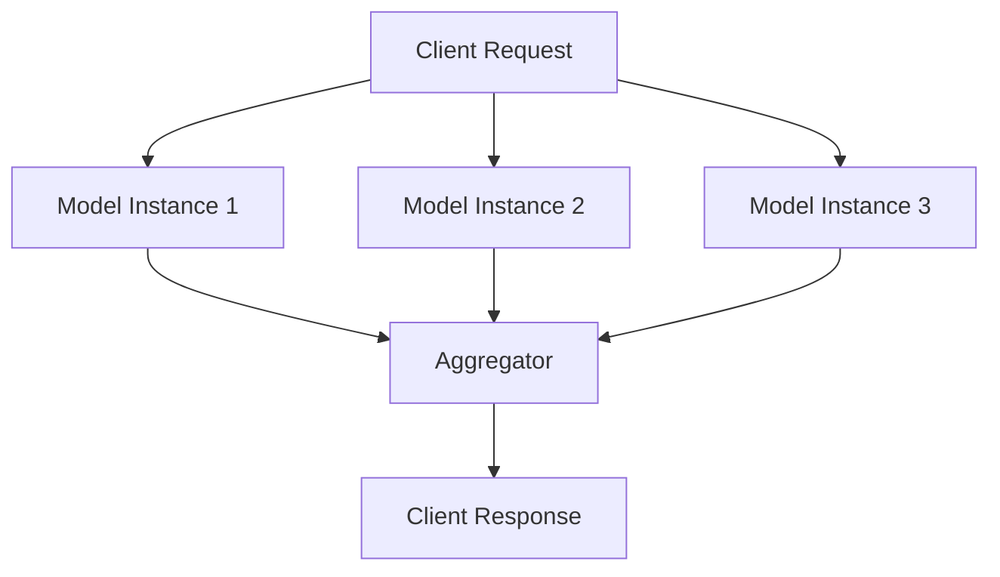

---

linkTitle: "Redundancy"
title: "Redundancy: Creating Multiple Copies of Data and Models"
description: "Ensuring robustness and reliability in machine learning systems by creating multiple copies of critical data and models."
categories:
- Security
- Robust and Reliable Architectures
tags:
- Redundancy
- Reliability
- Robustness
- Data Protection
- Machine Learning
date: 2024-07-07
type: docs
canonical: "https://softwarepatternslexicon.com/machine-learning/security/robust-and-reliable-architectures/redundancy"
license: "© 2024 Tokenizer Inc. CC BY-NC-SA 4.0"
---


## Introduction

In the domain of machine learning, ensuring the reliability and robustness of data and models is of paramount importance. The **Redundancy** design pattern involves creating multiple copies of critical data and machine learning models to safeguard against failures. This pattern is crucial in environments where uptime and data integrity are critical, such as in healthcare, finance, and autonomous systems.

## Objectives

1. **Increased Reliability**: By having multiple copies, the likelihood of system failure due to data loss or corruption is significantly reduced.
2. **Fault Tolerance**: In the event of an error or failure, redundant copies can be leveraged to maintain normal operations.
3. **Data Integrity**: Multiple copies ensure that anomalies in one copy can be corrected by referencing others.

## Implementation

### Data Redundancy

To implement data redundancy, data should be regularly backed up to multiple storage locations.

#### Example: Data Redundancy with HDFS

```python
from hdfs import InsecureClient

client = InsecureClient('http://namenode:50070', user='username')

file_path = '/data/dataset.csv'
backup_path = '/data/backup/dataset.csv'

try:
    # Reading the file from HDFS
    with client.read(file_path) as reader:
        data = reader.read()
    
    # Backing up the data
    with client.write(backup_path, encoding='utf-8') as writer:
        writer.write(data)
        
    print("Backup successful")
except Exception as e:
    print(f"An error occurred: {e}")
```

### Model Redundancy

Model redundancy can be achieved by deploying multiple instances of a machine learning model on different servers.

#### Example: Model Redundancy with TensorFlow Serving

```yaml
model_config_list: {
  config: [
    {
      name: 'model_version_1',
      base_path: '/models/model_v1',
      model_platform: 'tensorflow'
    },
    {
      name: 'model_version_2',
      base_path: '/models/model_v2',
      model_platform: 'tensorflow'
    }
  ]
}
```

By having multiple versions of a model, you ensure that if one model instance fails, the system can seamlessly switch to another without interrupting service.

### KaTeX Formula

In mathematical terms, redundancy can be expressed as:
   
   \text{Reliability} (R) = 1 - \prod_{i=1}^{n}(1 - r_i)
   
where \\( r_i \\) represents the reliability of each individual component and \\( n \\) is the number of redundant components.

### Diagram: Redundant System Architecture



## Related Design Patterns

### 1. **Checkpointing**
Checkpointing involves saving the state of an application at intervals, so it can be restarted from that point in case of failure. This enhances redundancy by enabling quick recovery.

### 2. **Ensemble Learning**
Using multiple models and combining their results can be considered a form of redundancy. It not only helps in improving model performance but also ensures robustness against individual model failures.

### 3. **Replication**
In data engineering, replication involves copying data across different nodes or data centers to ensure availability and fault tolerance.

## Additional Resources

- [HDFS: The Hadoop Distributed File System](http://hadoop.apache.org/docs/r1.2.1/hdfs_design.html)
- [TensorFlow Serving Documentation](https://www.tensorflow.org/tfx/guide/serving)
- [High Availability Machine Learning Infrastructure](https://research.google/pubs/archive/45642.pdf)

## Summary

The Redundancy design pattern is essential for creating reliable and fault-tolerant machine learning applications. By maintaining multiple copies of data and models, systems can ensure higher availability and data integrity, effectively mitigating the consequences of potential failures. Implementing redundancy requires careful planning but offers significant benefits in robustness and reliability.

Reviewing related design patterns like checkpointing, ensemble learning, and replication provides a broader understanding of how redundancy can play a foundational role in a resilient machine learning architecture.
