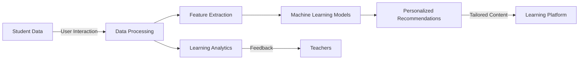

## Introduction

Personalized Learning involves the use of machine learning techniques to create individualized educational experiences for students. By analyzing data related to student performance, learning behaviors, and preferences, machine learning models can tailor instruction to fit each student's unique needs, thereby enhancing learning outcomes.

## Key Concepts

- **Adaptive Learning:** Adjusting the content and difficulty level based on the student's ongoing performance.
- **Recommendation Systems:** Suggesting tailored content, exercises, or learning paths to students.
- **Learning Analytics:** Analyzing data to derive insights about students' learning patterns, engagement, and progress.

## Benefits of Personalized Learning

1. **Enhanced Engagement:** Tailored content keeps students more engaged.
2. **Better Outcomes:** Personalized paths cater to individual learning styles, potentially leading to better understanding and retention.
3. **Time Efficiency:** Students can progress at their own pace, speeding up the learning process for faster learners.
4. **Early Intervention:** Early detection of learning difficulties allows for timely interventions.

## Machine Learning Techniques Used

- **Collaborative Filtering:** Used in recommendation systems to suggest relevant content based on user-item interactions.
- **Reinforcement Learning:** Models can dynamically adjust to optimize the educational experience.
- **Natural Language Processing (NLP):** NLP helps understand and generate human language, useful in automated tutors and feedback systems.
- **Clustering:** Grouping students into clusters with similar learning needs for targeted interventions.

## Architecture of a Personalized Learning System



### Detailed Components

1. **Student Data:** Sources include assessments, practice tests, classwork, attendance, and user interaction logs.
2. **Data Processing:** This involves cleaning, labeling, and pre-processing data from various sources.
3. **Feature Extraction:** Important features might include performance metrics, subject preferences, time taken on tasks, and error patterns.
4. **Machine Learning Models:** Algorithms to classify, predict, and recommend personalized learning paths.
5. **Personalized Recommendations:** Adaptive content and practice exercises based on model predictions.
6. **Learning Analytics:** Insights generated for teachers and curriculum developers.
7. **Feedback Mechanisms:** Continuous feedback loops for system improvement.

## Example: Building a Personalized Learning System with Python

Here is a simplified example of how one might construct a personalized learning system using Python and the popular machine learning library Scikit-learn.

```python
import pandas as pd
from sklearn.cluster import KMeans
from sklearn.metrics import pairwise_distances_argmin_min
from sklearn.preprocessing import StandardScaler

data = pd.read_csv('student_data.csv')

scaler = StandardScaler()
data_scaled = scaler.fit_transform(data)

kmeans = KMeans(n_clusters=3)
kmeans.fit(data_scaled)

clusters = kmeans.labels_
students = data.index
recommendations = {}

for cluster in set(clusters):
    cluster_students = students[clusters == cluster]
    # Assume we have a recommendation system function
    recommendations[cluster] = recommend_content(student_ids=cluster_students)

def recommend_content(student_ids):
    # Simplified recommendation logic (replace with actual logic)
    return [f"Content item {i}" for i in student_ids]

print(recommendations)
```

## Related Design Patterns

### 1. **Collaborative Filtering**
- **Description:** Suggests content based on users' similarity or content similarity.
- **Application:** Used in recommendation systems within personalized learning platforms.

### 2. **Content-Based Filtering**
- **Description:** Recommends items similar to those a user has liked in the past.
- **Application:** Tailoring learning resources based on students' demonstrated preferences.

### 3. **Multi-Armed Bandit**
- **Description:** An algorithmic approach that balances the exploration of different strategies with the exploitation of known successes.
- **Application:** Used to dynamically decide which educational content to present to students.

### 4. **Reinforcement Learning**
- **Description:** Learns optimal strategies by receiving feedback from actions taken.
- **Application:** Adapts the learning path of students through continuous feedback and learning optimization.

## Additional Resources

- [Scikit-learn Documentation](https://scikit-learn.org/stable/documentation.html): For more information on machine learning algorithms in Python.
- [TensorFlow for NLP](https://www.tensorflow.org/text): Understand how NLP can be leveraged in educational contexts.
- [EdSurge](https://www.edsurge.com/): Stay updated on the latest trends and technologies in education.

## Summary

Personalized Learning utilizes machine learning to adapt educational materials and pathways to the unique needs of each student. By leveraging techniques such as collaborative filtering, clustering, and reinforcement learning, personalized learning systems can significantly enhance engagement and learning outcomes. This design pattern integrates various data sources and analytics to create a dynamic and responsive learning environment, offering a more tailored, effective, and engaging educational experience.

By combining these systems with continuous feedback loops and analytical insights, we not only improve the learning journey for students but also empower educators to make more informed decisions regarding their instructional strategies. The future of education lies in such intelligent, adaptive learning systems that cater to the diverse needs of every learner.
