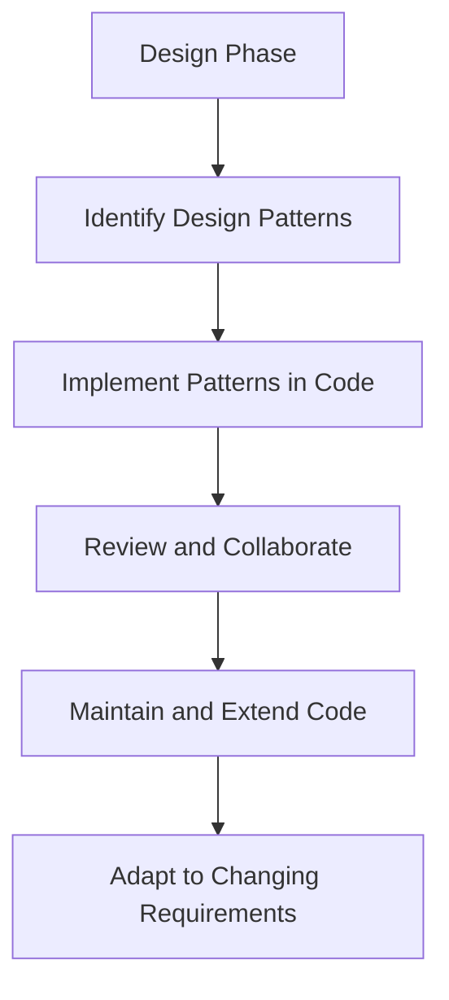

## 1.1. What Are Design Patterns?

In the realm of software engineering, design patterns stand as a cornerstone of effective and efficient software development. They provide a structured approach to solving common design problems, enabling developers to create robust and maintainable systems. In this section, we delve into the definition, purpose, and benefits of design patterns, exploring their pivotal role in modern software development.

### Definition and Purpose of Design Patterns

Design patterns are reusable solutions to common problems in software design. They represent best practices that have evolved over time, capturing the collective wisdom of experienced developers. By abstracting recurring design challenges, design patterns offer a template for solving problems in a consistent and efficient manner.

#### Key Characteristics of Design Patterns

1. **Reusability**: Design patterns encapsulate solutions that can be applied across different projects and contexts. This reusability reduces the need to reinvent the wheel, saving time and effort.

2. **Abstraction**: Patterns abstract the underlying complexity of a problem, allowing developers to focus on higher-level design considerations.

3. **Documentation**: Each pattern is well-documented, providing a clear description of the problem it addresses, the solution it offers, and the consequences of its application.

4. **Language-Agnostic**: Design patterns transcend specific programming languages, making them applicable across various paradigms and technologies.

#### The Purpose of Design Patterns

The primary purpose of design patterns is to provide a proven solution to a recurring design problem. They serve as a guide for developers, helping them make informed design decisions and avoid common pitfalls. By leveraging design patterns, developers can:

- **Enhance Code Quality**: Patterns promote clean, well-structured code that is easier to understand, maintain, and extend.

- **Facilitate Communication**: Patterns provide a common vocabulary for developers, enabling them to discuss design solutions more effectively.

- **Accelerate Development**: By reusing established solutions, developers can accelerate the design process and focus on unique aspects of their projects.

### The Role of Patterns in Software Development

Design patterns play a crucial role in the software development lifecycle, influencing various stages from design to implementation and maintenance. Let's explore how patterns contribute to each phase:

#### Design Phase

During the design phase, patterns help architects and developers identify the most suitable solutions for specific problems. They provide a framework for organizing code and defining relationships between components. By considering patterns early in the design process, developers can create flexible and scalable architectures.

#### Implementation Phase

In the implementation phase, patterns guide developers in writing code that adheres to best practices. They offer a blueprint for structuring code, ensuring consistency and reducing the likelihood of errors. Patterns also facilitate code reviews and collaboration, as team members can easily understand and contribute to the codebase.

#### Maintenance Phase

Patterns significantly impact the maintenance phase by promoting code that is easy to modify and extend. Well-designed patterns encapsulate changes, minimizing the impact on other parts of the system. This modularity simplifies debugging and enhances the system's adaptability to evolving requirements.

### Benefits of Using Design Patterns

The adoption of design patterns offers numerous benefits, contributing to the overall success of software projects. Here are some key advantages:

#### 1. Improved Code Reusability

Design patterns enable developers to reuse proven solutions, reducing redundancy and promoting consistency across projects. This reusability leads to more efficient development processes and higher-quality software.

#### 2. Enhanced Maintainability

Patterns promote modular and well-organized code, making it easier to understand, modify, and extend. This maintainability is crucial for long-term projects, where requirements may change over time.

#### 3. Streamlined Communication

By providing a common language for discussing design solutions, patterns facilitate communication among team members. This shared vocabulary enhances collaboration and ensures that everyone is on the same page.

#### 4. Increased Flexibility

Patterns offer flexible solutions that can be adapted to different contexts and requirements. This adaptability allows developers to address a wide range of design challenges without starting from scratch.

#### 5. Reduced Development Time

By leveraging existing solutions, developers can accelerate the design and implementation process. This efficiency frees up time for innovation and addressing unique project requirements.

### Visualizing the Role of Design Patterns

To better understand the role of design patterns in software development, let's visualize their impact using a flowchart:



**Figure 1: The Role of Design Patterns in Software Development**

This flowchart illustrates how design patterns guide the development process, from the initial design phase to ongoing maintenance and adaptation.

### Sample Code Snippets

To illustrate the practical application of design patterns, let's explore a simple example using pseudocode. Consider the Singleton pattern, which ensures that a class has only one instance and provides a global point of access to it.

```pseudocode
class Singleton {
    private static instance = null

    private Singleton() {
        // Private constructor to prevent instantiation
    }

    public static getInstance() {
        if (instance == null) {
            instance = new Singleton()
        }
        return instance
    }
}

// Usage
singletonInstance = Singleton.getInstance()
```

**Explanation**: In this pseudocode example, the `Singleton` class has a private static variable `instance` that holds the single instance of the class. The constructor is private to prevent direct instantiation. The `getInstance` method checks if the instance is `null` and creates a new instance if necessary. This ensures that only one instance of the class exists.

### Try It Yourself

To deepen your understanding of the Singleton pattern, try modifying the pseudocode example:

- **Add a method** to the `Singleton` class that performs a specific action, such as logging a message.
- **Experiment with creating multiple instances** of the class and observe how the pattern prevents this.

### Design Considerations

When using design patterns, it's important to consider the following:

- **Applicability**: Ensure that the chosen pattern is suitable for the problem at hand. Misapplying patterns can lead to unnecessary complexity.

- **Trade-offs**: Be aware of the trade-offs associated with each pattern. For example, the Singleton pattern can introduce global state, which may complicate testing.

- **Evolution**: Patterns should evolve with the system. As requirements change, be prepared to adapt or replace patterns to meet new needs.

### Differences and Similarities

Design patterns are often compared and contrasted with one another. For example, the Singleton and Factory patterns both involve object creation, but they serve different purposes. While the Singleton pattern ensures a single instance, the Factory pattern provides a way to create objects without specifying the exact class.

### Conclusion

Design patterns are a powerful tool in the software developer's toolkit, offering reusable solutions to common design challenges. By understanding their definition, purpose, and benefits, developers can leverage patterns to create robust, maintainable, and efficient software systems. As you continue your journey through this guide, you'll explore a wide range of patterns and learn how to apply them across different programming paradigms.

### Key Takeaways

- **Design patterns** provide reusable solutions to common design problems.
- **Patterns enhance code quality** by promoting clean, well-structured code.
- **Patterns facilitate communication** among developers through a shared vocabulary.
- **Patterns improve maintainability** and flexibility, making code easier to modify and extend.

## Quiz Time!



### What is the primary purpose of design patterns?

- [x] To provide a proven solution to a recurring design problem
- [ ] To create new programming languages
- [ ] To replace all existing code
- [ ] To eliminate the need for testing

> **Explanation:** The primary purpose of design patterns is to offer a proven solution to recurring design problems, enabling developers to create robust and maintainable systems.

### Which of the following is a key characteristic of design patterns?

- [x] Reusability
- [ ] Complexity
- [ ] Language-specificity
- [ ] Obfuscation

> **Explanation:** Design patterns are characterized by their reusability, allowing developers to apply them across different projects and contexts.

### How do design patterns facilitate communication among developers?

- [x] By providing a common vocabulary for discussing design solutions
- [ ] By eliminating the need for documentation
- [ ] By enforcing strict coding standards
- [ ] By automating code reviews

> **Explanation:** Design patterns facilitate communication by providing a common vocabulary that enables developers to discuss design solutions more effectively.

### What is the role of design patterns in the maintenance phase?

- [x] They promote code that is easy to modify and extend
- [ ] They eliminate the need for debugging
- [ ] They prevent all future changes to the code
- [ ] They increase the complexity of the code

> **Explanation:** In the maintenance phase, design patterns promote code that is easy to modify and extend, simplifying debugging and enhancing adaptability.

### Which design pattern ensures that a class has only one instance?

- [x] Singleton
- [ ] Factory
- [ ] Observer
- [ ] Decorator

> **Explanation:** The Singleton pattern ensures that a class has only one instance and provides a global point of access to it.

### What is a potential trade-off of using the Singleton pattern?

- [x] It can introduce global state, complicating testing
- [ ] It eliminates the need for constructors
- [ ] It requires multiple instances of the class
- [ ] It simplifies all design problems

> **Explanation:** A potential trade-off of using the Singleton pattern is that it can introduce global state, which may complicate testing.

### How do design patterns impact the implementation phase?

- [x] They guide developers in writing code that adheres to best practices
- [ ] They eliminate the need for code reviews
- [ ] They automate the coding process
- [ ] They prevent collaboration among team members

> **Explanation:** In the implementation phase, design patterns guide developers in writing code that adheres to best practices, ensuring consistency and reducing errors.

### What is a benefit of using design patterns in software development?

- [x] Increased flexibility
- [ ] Guaranteed bug-free code
- [ ] Elimination of all design challenges
- [ ] Complete automation of the development process

> **Explanation:** One benefit of using design patterns is increased flexibility, allowing developers to adapt solutions to different contexts and requirements.

### Which phase of the software development lifecycle do design patterns influence?

- [x] Design, Implementation, and Maintenance
- [ ] Only Design
- [ ] Only Implementation
- [ ] Only Maintenance

> **Explanation:** Design patterns influence the design, implementation, and maintenance phases of the software development lifecycle.

### True or False: Design patterns are language-specific solutions.

- [ ] True
- [x] False

> **Explanation:** False. Design patterns are language-agnostic solutions, making them applicable across various programming paradigms and technologies.



Remember, this is just the beginning. As you progress through this guide, you'll build a deeper understanding of design patterns and how they can be applied across different programming paradigms. Keep experimenting, stay curious, and enjoy the journey!
