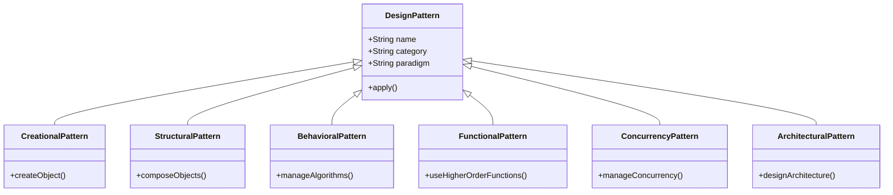

## 1.2. History and Evolution of Design Patterns

### Introduction

Design patterns have become an integral part of software engineering, providing time-tested solutions to common problems in software design. They serve as a bridge between theoretical concepts and practical implementations, allowing developers to create robust, maintainable, and scalable software systems. In this section, we will delve into the history and evolution of design patterns, exploring their origins, the pivotal role of the Gang of Four (GoF), and how patterns have adapted across various programming paradigms.

### The Origins of Design Patterns

The concept of design patterns originated outside the realm of software engineering. It was first introduced by architect Christopher Alexander in his seminal work, "A Pattern Language: Towns, Buildings, Construction," published in 1977. Alexander's patterns were a collection of design solutions for common architectural problems, aimed at creating harmonious and aesthetically pleasing environments. His work emphasized the importance of context and the relationships between patterns, laying the groundwork for their application in software development.

In the late 1980s and early 1990s, software engineers began to recognize the potential of applying Alexander's pattern-based approach to software design. The idea was to capture best practices and solutions to recurring problems in software development, making them accessible and reusable across different projects. This led to the formalization of design patterns in the context of software engineering.

### The Gang of Four (GoF) and Classic Design Patterns

The term "design patterns" became widely recognized in the software industry with the publication of the book "Design Patterns: Elements of Reusable Object-Oriented Software" in 1994. Authored by Erich Gamma, Richard Helm, Ralph Johnson, and John Vlissides, collectively known as the Gang of Four (GoF), this book introduced 23 foundational design patterns that addressed common challenges in object-oriented software design.

#### Key Contributions of the Gang of Four

1. **Cataloging Patterns**: The GoF book systematically cataloged 23 design patterns, categorizing them into three main types: Creational, Structural, and Behavioral patterns. This classification helped developers understand the purpose and applicability of each pattern.

2. **Pattern Structure**: Each pattern in the GoF book was presented with a consistent structure, including sections on intent, motivation, applicability, structure, participants, collaborations, consequences, implementation, and sample code. This format provided a comprehensive understanding of each pattern.

3. **Language-Agnostic Approach**: Although the examples in the GoF book were primarily written in C++, the patterns themselves were described in a language-agnostic manner. This allowed developers to apply the patterns in various programming languages and environments.

4. **Emphasis on Object-Oriented Design**: The GoF patterns emphasized object-oriented principles, such as encapsulation, inheritance, and polymorphism, highlighting the benefits of using patterns to create flexible and reusable software components.

#### Classic Design Patterns

The 23 design patterns introduced by the GoF are considered classic patterns and have become a cornerstone of object-oriented design. Let's briefly explore each category:

- **Creational Patterns**: These patterns focus on object creation mechanisms, aiming to create objects in a manner suitable to the situation. Examples include the Singleton, Factory Method, and Abstract Factory patterns.

- **Structural Patterns**: These patterns deal with object composition, helping to ensure that if one part of a system changes, the entire system doesn't need to change. Examples include the Adapter, Composite, and Decorator patterns.

- **Behavioral Patterns**: These patterns are concerned with algorithms and the assignment of responsibilities between objects. Examples include the Observer, Strategy, and Command patterns.

### Evolution of Patterns Across Paradigms

As software development has evolved, so too have design patterns. The rise of new programming paradigms, such as Functional Programming (FP) and concurrent programming, has led to the adaptation and creation of new patterns that address the unique challenges of these paradigms.

#### Object-Oriented Programming (OOP)

In the realm of OOP, design patterns have continued to play a crucial role in promoting best practices and improving code quality. The principles of encapsulation, inheritance, and polymorphism remain central to the application of design patterns in OOP.

#### Functional Programming (FP)

With the growing popularity of FP, developers have begun to explore how traditional design patterns can be adapted to fit the functional paradigm. FP emphasizes immutability, higher-order functions, and pure functions, which can lead to different implementations of classic patterns.

For example, the Strategy pattern in OOP, which relies on polymorphism, can be implemented in FP using higher-order functions. Similarly, the Observer pattern can be adapted using reactive programming techniques.

#### Concurrency and Parallelism

The increasing need for concurrent and parallel processing has also influenced the evolution of design patterns. Patterns such as the Producer-Consumer and the Future pattern have emerged to address the challenges of concurrent programming, providing solutions for managing shared resources and synchronizing tasks.

#### Architectural Patterns

Beyond individual software components, design patterns have also evolved to address architectural concerns. Patterns such as Model-View-Controller (MVC), Microservices, and Event-Driven Architecture have become essential in designing scalable and maintainable software systems.

### Visualizing the Evolution of Design Patterns

To better understand the evolution of design patterns, let's visualize the relationships between different patterns and their adaptation across paradigms using a class diagram.

**Figure 1**: This class diagram illustrates the categorization of design patterns and their adaptation across different programming paradigms.

### Key Takeaways

- **Historical Roots**: Design patterns originated from architecture and were adapted to software engineering to provide reusable solutions to common design problems.

- **Gang of Four's Contribution**: The GoF book formalized the concept of design patterns in software engineering, introducing 23 classic patterns that remain relevant today.

- **Adaptation Across Paradigms**: As programming paradigms have evolved, so too have design patterns, with adaptations for Functional Programming, concurrency, and architectural design.

- **Continued Relevance**: Design patterns continue to be a valuable tool for software engineers, promoting best practices and improving software design across various paradigms.

### Embrace the Journey

Remember, this exploration of the history and evolution of design patterns is just the beginning. As you progress through this guide, you'll gain a deeper understanding of how to apply these patterns in your own projects. Keep experimenting, stay curious, and enjoy the journey!

## Quiz Time!



### Who introduced the concept of design patterns in architecture?

- [x] Christopher Alexander
- [ ] Erich Gamma
- [ ] Richard Helm
- [ ] Ralph Johnson

> **Explanation:** Christopher Alexander introduced the concept of design patterns in architecture, which later influenced software engineering.

### What book popularized design patterns in software engineering?

- [x] "Design Patterns: Elements of Reusable Object-Oriented Software"
- [ ] "A Pattern Language: Towns, Buildings, Construction"
- [ ] "The Pragmatic Programmer"
- [ ] "Clean Code"

> **Explanation:** The book "Design Patterns: Elements of Reusable Object-Oriented Software" by the Gang of Four popularized design patterns in software engineering.

### How many classic design patterns were introduced by the Gang of Four?

- [x] 23
- [ ] 10
- [ ] 15
- [ ] 30

> **Explanation:** The Gang of Four introduced 23 classic design patterns in their book.

### Which paradigm emphasizes immutability and higher-order functions?

- [ ] Object-Oriented Programming
- [x] Functional Programming
- [ ] Procedural Programming
- [ ] Concurrent Programming

> **Explanation:** Functional Programming emphasizes immutability and higher-order functions.

### Which pattern is concerned with object creation mechanisms?

- [x] Creational Pattern
- [ ] Structural Pattern
- [ ] Behavioral Pattern
- [ ] Architectural Pattern

> **Explanation:** Creational patterns focus on object creation mechanisms.

### Which pattern deals with object composition?

- [ ] Creational Pattern
- [x] Structural Pattern
- [ ] Behavioral Pattern
- [ ] Architectural Pattern

> **Explanation:** Structural patterns deal with object composition.

### What is a key feature of the Strategy pattern in Functional Programming?

- [ ] Inheritance
- [x] Higher-order functions
- [ ] Polymorphism
- [ ] Encapsulation

> **Explanation:** In Functional Programming, the Strategy pattern can be implemented using higher-order functions.

### Which pattern addresses architectural concerns?

- [ ] Creational Pattern
- [ ] Structural Pattern
- [ ] Behavioral Pattern
- [x] Architectural Pattern

> **Explanation:** Architectural patterns address concerns related to the overall software architecture.

### True or False: The GoF patterns are only applicable to Object-Oriented Programming.

- [ ] True
- [x] False

> **Explanation:** While the GoF patterns were initially designed for Object-Oriented Programming, they can be adapted for other paradigms, such as Functional Programming.

### Which pattern is used to manage concurrency?

- [ ] Creational Pattern
- [ ] Structural Pattern
- [ ] Behavioral Pattern
- [x] Concurrency Pattern

> **Explanation:** Concurrency patterns are used to manage concurrency and parallelism in software systems.


