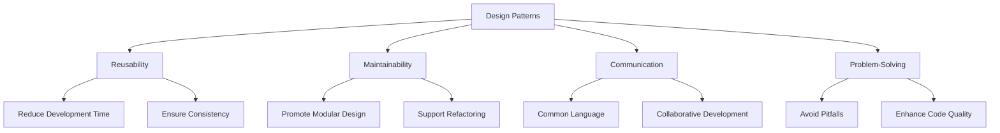

## 1.3. Importance of Design Patterns in Modern Programming

In the ever-evolving landscape of software development, design patterns have emerged as a cornerstone of effective programming. They offer a structured approach to solving common design problems, enhancing code reusability, maintainability, and facilitating communication among developers. In this section, we will delve into the significance of design patterns, exploring how they contribute to modern programming practices and why they are indispensable tools for expert developers and architects.

### Reusability and Maintainability

#### Enhancing Code Reusability

Design patterns provide a blueprint for solving recurring design problems, enabling developers to reuse proven solutions rather than reinventing the wheel. This reusability is crucial in software development, where time and resources are often limited. By applying design patterns, developers can:

- **Reduce Development Time**: Leveraging existing patterns allows for faster implementation of solutions, as developers can focus on customizing the pattern to fit specific needs rather than designing from scratch.
- **Ensure Consistency**: Using standardized patterns across projects ensures a consistent approach to solving similar problems, making it easier for teams to collaborate and maintain codebases.
- **Facilitate Knowledge Transfer**: New team members can quickly understand and contribute to projects by recognizing familiar patterns, reducing the learning curve.

To illustrate the concept of reusability, consider the Singleton pattern, which ensures a class has only one instance and provides a global point of access to it. This pattern is widely used in scenarios where a single instance is required, such as logging, configuration settings, or database connections.

```pseudocode
// Singleton Pattern Pseudocode
class Singleton {
    private static instance = null;

    // Private constructor to prevent instantiation
    private Singleton() {}

    // Static method to access the single instance
    public static getInstance() {
        if (instance == null) {
            instance = new Singleton();
        }
        return instance;
    }
}
```

#### Improving Maintainability

Maintainability is a critical aspect of software development, as it determines how easily a system can be modified or extended over time. Design patterns contribute to maintainability by:

- **Promoting Modular Design**: Patterns encourage the separation of concerns, leading to modular code that is easier to understand, test, and modify.
- **Supporting Code Refactoring**: Patterns provide a clear structure that facilitates refactoring, allowing developers to improve code quality without altering its functionality.
- **Enhancing Scalability**: Well-designed patterns can accommodate changes in requirements, making it easier to scale systems as needed.

For example, the Observer pattern is commonly used to implement event-driven systems where multiple objects need to be notified of state changes. This pattern decouples the subject from its observers, allowing for flexible and maintainable code.

```pseudocode
// Observer Pattern Pseudocode
class Subject {
    private observers = [];

    public attach(observer) {
        observers.push(observer);
    }

    public detach(observer) {
        observers.remove(observer);
    }

    public notify() {
        for each observer in observers {
            observer.update();
        }
    }
}

class ConcreteObserver {
    public update() {
        // Handle update
    }
}
```

### Communication Among Developers

#### Establishing a Common Language

Design patterns serve as a common language among developers, enabling them to communicate complex ideas succinctly and effectively. By referencing well-known patterns, developers can convey design concepts without needing to explain every detail, fostering better collaboration and understanding within teams.

- **Facilitating Design Discussions**: Patterns provide a shared vocabulary that simplifies discussions about system architecture and design decisions.
- **Bridging Knowledge Gaps**: Patterns help bridge the gap between experienced and less experienced developers, as they offer a framework for understanding and implementing best practices.

Consider a scenario where a team is discussing the implementation of a new feature. By referencing the Factory Method pattern, team members can quickly align on the approach to creating objects without delving into the specifics of each implementation.

```pseudocode
// Factory Method Pattern Pseudocode
abstract class Creator {
    public abstract factoryMethod();

    public operation() {
        product = factoryMethod();
        // Use the product
    }
}

class ConcreteCreator extends Creator {
    public factoryMethod() {
        return new ConcreteProduct();
    }
}
```

#### Enabling Collaborative Development

In collaborative development environments, design patterns play a vital role in ensuring that team members are on the same page. They provide a framework for organizing code, making it easier for multiple developers to work on different parts of a system simultaneously.

- **Standardizing Code Structure**: Patterns offer a standardized way of organizing code, reducing the likelihood of conflicts and inconsistencies.
- **Facilitating Code Reviews**: Patterns make it easier to conduct code reviews, as reviewers can focus on the implementation details rather than the overall design.

### Patterns as a Tool for Problem-Solving

#### Addressing Common Design Challenges

Design patterns are powerful tools for addressing common design challenges, providing developers with a set of best practices for solving specific problems. By applying patterns, developers can:

- **Avoid Common Pitfalls**: Patterns help developers avoid common design pitfalls, such as tight coupling and lack of flexibility, by offering proven solutions.
- **Enhance Code Quality**: Patterns promote high-quality code by encouraging the use of best practices and design principles.

For instance, the Strategy pattern is used to define a family of algorithms, encapsulate each one, and make them interchangeable. This pattern is ideal for situations where a system needs to support multiple algorithms that can be selected at runtime.

```pseudocode
// Strategy Pattern Pseudocode
class Context {
    private strategy;

    public setStrategy(strategy) {
        this.strategy = strategy;
    }

    public executeStrategy() {
        strategy.execute();
    }
}

class ConcreteStrategyA {
    public execute() {
        // Implementation of algorithm A
    }
}

class ConcreteStrategyB {
    public execute() {
        // Implementation of algorithm B
    }
}
```

#### Encouraging Innovation and Creativity

While design patterns provide a structured approach to problem-solving, they also encourage innovation and creativity. By understanding and mastering patterns, developers can:

- **Adapt Patterns to New Contexts**: Patterns are not rigid; they can be adapted to fit new contexts and requirements, fostering creative solutions.
- **Combine Patterns for Complex Solutions**: Developers can combine multiple patterns to address complex design challenges, leading to innovative and efficient solutions.

For example, a developer might combine the Composite and Decorator patterns to create a flexible and extensible user interface framework.

### Visualizing the Role of Design Patterns

To better understand the role of design patterns in modern programming, let's visualize their impact on software development processes.



**Diagram Description**: This flowchart illustrates how design patterns contribute to key aspects of software development, including reusability, maintainability, communication, and problem-solving.

### Try It Yourself

To deepen your understanding of design patterns, try modifying the pseudocode examples provided in this section. Experiment with:

- **Extending the Singleton Pattern**: Add a method to reset the instance and observe how it affects the pattern's behavior.
- **Implementing a New Observer**: Create a new observer class and attach it to the subject, then trigger notifications to see how the new observer responds.
- **Customizing the Factory Method**: Implement a different product class and modify the factory method to create instances of this new class.

### Knowledge Check

Before moving on, let's reinforce what we've learned about the importance of design patterns in modern programming.

- **What are the benefits of using design patterns for code reusability?**
- **How do design patterns facilitate communication among developers?**
- **In what ways do design patterns enhance problem-solving capabilities?**

### Embrace the Journey

Remember, mastering design patterns is a journey. As you continue to explore and apply these patterns, you'll gain deeper insights into their power and versatility. Keep experimenting, stay curious, and enjoy the process of becoming a more skilled and effective developer.

## Quiz Time!



### What is one of the primary benefits of using design patterns in software development?

- [x] They enhance code reusability and maintainability.
- [ ] They make code execution faster.
- [ ] They eliminate the need for testing.
- [ ] They simplify user interfaces.

> **Explanation:** Design patterns enhance code reusability and maintainability by providing proven solutions to common design problems.

### How do design patterns facilitate communication among developers?

- [x] By providing a common language and framework for discussing design concepts.
- [ ] By reducing the need for documentation.
- [ ] By automating code generation.
- [ ] By enforcing strict coding standards.

> **Explanation:** Design patterns provide a common language that simplifies discussions about system architecture and design decisions.

### Which design pattern is commonly used to ensure a class has only one instance?

- [x] Singleton Pattern
- [ ] Observer Pattern
- [ ] Factory Method Pattern
- [ ] Strategy Pattern

> **Explanation:** The Singleton pattern ensures a class has only one instance and provides a global point of access to it.

### What role do design patterns play in problem-solving?

- [x] They provide structured solutions to common design challenges.
- [ ] They eliminate the need for debugging.
- [ ] They automatically optimize code performance.
- [ ] They simplify user interface design.

> **Explanation:** Design patterns offer structured solutions to common design challenges, enhancing problem-solving capabilities.

### How can design patterns encourage innovation and creativity?

- [x] By allowing developers to adapt and combine patterns for new contexts and complex solutions.
- [ ] By restricting developers to predefined solutions.
- [ ] By automating the coding process.
- [ ] By enforcing strict coding standards.

> **Explanation:** Design patterns encourage innovation by allowing developers to adapt and combine patterns for new contexts and complex solutions.

### What is a key advantage of using the Observer pattern?

- [x] It decouples the subject from its observers, allowing for flexible and maintainable code.
- [ ] It ensures a class has only one instance.
- [ ] It encapsulates a family of algorithms.
- [ ] It provides a global point of access to an object.

> **Explanation:** The Observer pattern decouples the subject from its observers, allowing for flexible and maintainable code.

### Which pattern is ideal for situations where a system needs to support multiple algorithms that can be selected at runtime?

- [x] Strategy Pattern
- [ ] Singleton Pattern
- [ ] Observer Pattern
- [ ] Factory Method Pattern

> **Explanation:** The Strategy pattern is used to define a family of algorithms, encapsulate each one, and make them interchangeable.

### What is one way design patterns improve maintainability?

- [x] By promoting modular design and supporting code refactoring.
- [ ] By eliminating the need for testing.
- [ ] By automating code generation.
- [ ] By enforcing strict coding standards.

> **Explanation:** Design patterns improve maintainability by promoting modular design and supporting code refactoring.

### True or False: Design patterns are rigid and cannot be adapted to new contexts.

- [ ] True
- [x] False

> **Explanation:** Design patterns are not rigid; they can be adapted to fit new contexts and requirements, fostering creative solutions.

### How do design patterns contribute to reducing development time?

- [x] By providing reusable solutions that eliminate the need to design from scratch.
- [ ] By automating the coding process.
- [ ] By eliminating the need for testing.
- [ ] By enforcing strict coding standards.

> **Explanation:** Design patterns reduce development time by providing reusable solutions, allowing developers to focus on customization rather than designing from scratch.




