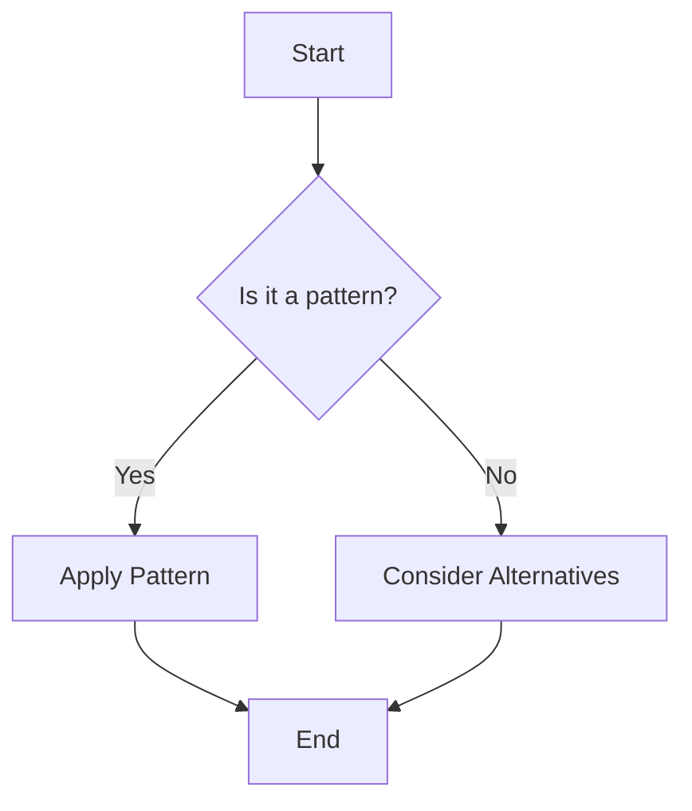
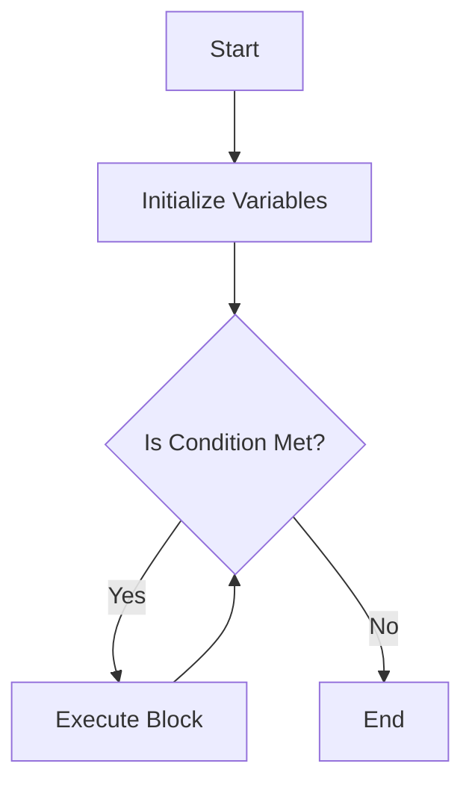

## 1.4. How to Use This Guide

Welcome to the "Mastering Design Patterns: A Comprehensive Guide Using Pseudocode Across Programming Paradigms." This guide is meticulously crafted to empower expert software engineers and architects with the knowledge and tools to master design patterns, improve software designs, and enhance problem-solving skills across various programming paradigms. In this section, we will explore how to effectively use this guide, focusing on its structure, conventions, and pseudocode syntax.

### Structure of the Guide

Understanding the structure of this guide is crucial for navigating through the wealth of information it offers. Let's break down the key components:

#### 1. **Introduction to Design Patterns**

This initial section sets the stage for your journey into design patterns. It covers the definition, purpose, history, and evolution of design patterns, emphasizing their importance in modern programming. By understanding the foundational concepts, you'll be better equipped to grasp the more complex patterns discussed later.

#### 2. **Principles of Software Design**

Before diving into specific patterns, it's essential to understand the underlying principles of good software design. This section covers SOLID principles, DRY, KISS, and YAGNI, and contrasts design patterns with anti-patterns. It also introduces UML diagrams and pseudocode conventions, which are used throughout the guide.

#### 3. **Creational Design Patterns**

This section explores patterns that deal with object creation mechanisms, providing flexibility and reuse. Patterns like Singleton, Factory Method, and Builder are discussed with detailed pseudocode examples.

#### 4. **Structural Design Patterns**

Structural patterns focus on how classes and objects are composed to form larger structures. This section includes patterns like Adapter, Bridge, and Composite, with practical examples and diagrams.

#### 5. **Behavioral Design Patterns**

Behavioral patterns are concerned with algorithms and the assignment of responsibilities between objects. This section covers patterns such as Chain of Responsibility, Command, and Observer, providing insights into their implementation and use cases.

#### 6. **Concurrency Patterns**

Concurrency patterns address the challenges of concurrent programming. This section discusses patterns like Active Object, Future, and Producer-Consumer, with pseudocode examples illustrating their application.

#### 7. **Functional Programming Patterns**

Functional programming offers a different approach to problem-solving. This section explores patterns like Immutability, Higher-Order Functions, and Monads, highlighting their benefits and use in functional paradigms.

#### 8. **Architectural Patterns**

Architectural patterns provide solutions for organizing code at a higher level. This section covers MVC, Microservices, and Event-Driven Architecture, among others, with diagrams and examples.

#### 9. **Distributed Systems Patterns**

Distributed systems require unique patterns to handle their complexity. This section discusses Leader Election, Consensus Algorithms, and Circuit Breaker patterns, providing strategies for building robust distributed systems.

#### 10. **Enterprise Integration Patterns**

Enterprise integration patterns facilitate communication between different systems. This section includes patterns like Message Channel, Content-Based Router, and Scatter-Gather, with pseudocode examples.

#### 11. **Security Design Patterns**

Security is a critical aspect of software design. This section covers patterns like Authentication and Authorization, Security Proxy, and Input Validation, ensuring secure and resilient systems.

#### 12. **Anti-Patterns and Code Smells**

Recognizing and avoiding anti-patterns is crucial for maintaining clean code. This section discusses common pitfalls like Spaghetti Code and God Object, offering strategies for refactoring.

#### 13. **Refactoring Patterns**

Refactoring is essential for improving code quality. This section covers techniques for composing methods, moving features, and simplifying conditional expressions, with practical examples.

#### 14. **Domain-Driven Design (DDD) Patterns**

DDD patterns help tackle complexity in the heart of software. This section explores Entities, Aggregates, and Bounded Contexts, providing a framework for building robust domain models.

#### 15. **Event-Driven Patterns**

Event-driven patterns enable reactive systems. This section covers Event Sourcing, Publish-Subscribe, and Reactive Programming, with pseudocode examples.

#### 16. **Test-Driven Development (TDD) and Design Patterns**

TDD enhances code quality and design. This section discusses writing unit tests, applying design patterns in TDD, and refactoring with TDD, providing a comprehensive approach to testing.

#### 17. **Applying Design Patterns Across Paradigms**

This section explores how design patterns can be adapted across different paradigms, offering insights into combining patterns for robust solutions and selecting the right pattern for the task.

#### 18. **Best Practices and Principles**

Understanding best practices is crucial for effective software design. This section covers principles like Design by Contract, Separation of Concerns, and Dependency Injection, providing guidelines for writing maintainable code.

#### 19. **Conclusion**

The conclusion summarizes key concepts and emphasizes the role of design patterns in modern software development, encouraging continuous learning and practice.

#### 20. **Appendices**

The appendices provide valuable resources, including a glossary of terms, a design pattern reference guide, UML notation reference, additional reading, and common interview questions.

### Conventions and Notations Used

To ensure clarity and consistency throughout the guide, we adhere to specific conventions and notations:

#### 1. **Terminology**

- **Design Pattern**: A general reusable solution to a commonly occurring problem within a given context in software design.
- **Pseudocode**: A high-level description of an algorithm or pattern that uses the structural conventions of programming languages but is intended for human reading rather than machine reading.

#### 2. **Formatting**

- **Bold Text**: Used to emphasize important terms or concepts.
- **Italic Text**: Used for emphasis or to denote technical terms upon their first introduction.
- **Code Blocks**: Used for pseudocode examples, enclosed in fenced code blocks labeled as `plaintext`.

#### 3. **Diagrams**

We use Hugo-compatible Mermaid.js diagrams to visually represent concepts, architectures, workflows, and processes. These diagrams are embedded within fenced code blocks labeled as `mermaid`.

Example:



**Description**: This flowchart illustrates the decision-making process for applying a design pattern.

#### 4. **Pseudocode Syntax**

Pseudocode is used extensively throughout the guide to illustrate design patterns in a language-agnostic manner. Understanding the pseudocode syntax is crucial for following the examples:

- **Variables**: Use descriptive names to represent data.
- **Control Structures**: Use common constructs like `if`, `else`, `for`, and `while` to represent logic flow.
- **Functions**: Defined using `function` keyword, with parameters enclosed in parentheses.
- **Comments**: Use comments to explain each step or important line within the code.

Example:

```pseudocode
// Function to calculate factorial
function factorial(n)
    if n <= 1
        return 1
    else
        return n * factorial(n - 1)
```

### Understanding the Pseudocode Syntax

To effectively utilize the pseudocode examples in this guide, it's important to understand the syntax and conventions used. Let's break down the key elements:

#### 1. **Variables and Data Types**

In pseudocode, variables are used to store data. While specific data types are not explicitly defined, it's important to use descriptive names to convey the purpose of each variable.

Example:

```pseudocode
// Variable to store the result
result = 0
```

#### 2. **Control Structures**

Control structures are used to dictate the flow of the program. Common constructs include:

- **If-Else Statements**: Used for conditional logic.

```pseudocode
if condition
    // Execute if condition is true
else
    // Execute if condition is false
```

- **Loops**: Used for iterative processes.

```pseudocode
for i = 1 to 10
    // Execute block of code
```

#### 3. **Functions and Procedures**

Functions are defined using the `function` keyword, with parameters enclosed in parentheses. They encapsulate logic and can return values.

Example:

```pseudocode
// Function to add two numbers
function add(a, b)
    return a + b
```

#### 4. **Comments**

Comments are used to explain each step or important line within the code. They are denoted by `//` and are crucial for understanding the logic and purpose of the code.

Example:

```pseudocode
// Calculate the sum of two numbers
sum = add(5, 10)
```

### Try It Yourself

To reinforce your understanding of pseudocode syntax, try modifying the following example:

```pseudocode
// Function to calculate the sum of an array
function sumArray(arr)
    total = 0
    for each element in arr
        total = total + element
    return total
```

**Challenge**: Modify the function to calculate the product of the array elements instead of the sum.

### Visualizing Pseudocode Execution

To enhance your understanding of pseudocode execution, let's visualize the flow of a simple program using a flowchart:



**Description**: This flowchart represents the execution flow of a loop, illustrating the initialization, condition check, and execution of the loop block.

### References and Links

For further reading and deeper dives into specific topics, consider exploring the following resources:

- [Design Patterns: Elements of Reusable Object-Oriented Software](https://en.wikipedia.org/wiki/Design_Patterns) - The seminal book by the Gang of Four.
- [Refactoring: Improving the Design of Existing Code](https://martinfowler.com/books/refactoring.html) - A comprehensive guide to refactoring techniques.
- [UML Diagrams](https://www.uml-diagrams.org/) - A resource for understanding UML diagrams and notations.

### Knowledge Check

To test your understanding of the concepts covered in this section, consider the following questions:

1. What is the primary purpose of pseudocode in this guide?
2. How are control structures represented in pseudocode?
3. What is the significance of comments in pseudocode examples?
4. How can diagrams enhance your understanding of design patterns?

### Embrace the Journey

Remember, this guide is just the beginning of your journey into mastering design patterns. As you progress, you'll encounter more complex patterns and scenarios. Keep experimenting, stay curious, and enjoy the journey!

### Formatting and Structure

To ensure clarity and ease of navigation, the guide is organized with clear headings and subheadings. Bullet points are used to break down complex information, and important terms or concepts are highlighted using bold or italic text sparingly.

### Writing Style

The guide is written in a collaborative tone, using first-person plural (we, let's) to create a sense of partnership in learning. Gender-specific pronouns are avoided, and acronyms and abbreviations are defined upon first use to ensure inclusivity and clarity.

## Quiz Time!



### What is the primary purpose of pseudocode in this guide?

- [x] To illustrate design patterns in a language-agnostic manner
- [ ] To provide executable code for all examples
- [ ] To replace UML diagrams
- [ ] To simplify complex algorithms

> **Explanation:** Pseudocode is used to illustrate design patterns in a language-agnostic manner, making the concepts accessible to developers regardless of their preferred programming language.

### How are control structures represented in pseudocode?

- [x] Using common constructs like `if`, `else`, `for`, and `while`
- [ ] Using specific programming language syntax
- [ ] Using flowchart symbols
- [ ] Using natural language descriptions

> **Explanation:** Control structures in pseudocode are represented using common constructs like `if`, `else`, `for`, and `while` to dictate the flow of the program.

### What is the significance of comments in pseudocode examples?

- [x] To explain each step or important line within the code
- [ ] To provide alternative solutions
- [ ] To replace variable names
- [ ] To simplify the code

> **Explanation:** Comments are used to explain each step or important line within the code, providing clarity and understanding of the logic and purpose.

### How can diagrams enhance your understanding of design patterns?

- [x] By visually representing concepts, architectures, and workflows
- [ ] By providing executable code
- [ ] By replacing pseudocode examples
- [ ] By simplifying complex algorithms

> **Explanation:** Diagrams enhance understanding by visually representing concepts, architectures, and workflows, making complex ideas more accessible.

### What is the role of the appendices in this guide?

- [x] To provide additional resources and reference materials
- [ ] To summarize each chapter
- [ ] To replace the main content
- [ ] To provide executable code examples

> **Explanation:** The appendices provide additional resources and reference materials, including glossaries, quick reference guides, and preparation materials for interviews.

### What is the benefit of using a collaborative tone in the guide?

- [x] To create a sense of partnership in learning
- [ ] To simplify the content
- [ ] To replace technical terms
- [ ] To provide executable code

> **Explanation:** A collaborative tone creates a sense of partnership in learning, making the content more engaging and relatable.

### How are important terms or concepts highlighted in the guide?

- [x] Using bold or italic text sparingly
- [ ] Using different font sizes
- [ ] Using color coding
- [ ] Using underlining

> **Explanation:** Important terms or concepts are highlighted using bold or italic text sparingly to emphasize their significance.

### What is the significance of defining acronyms and abbreviations upon first use?

- [x] To ensure inclusivity and clarity
- [ ] To simplify the content
- [ ] To provide alternative solutions
- [ ] To replace technical terms

> **Explanation:** Defining acronyms and abbreviations upon first use ensures inclusivity and clarity, making the content accessible to all readers.

### What is the primary focus of the "Principles of Software Design" section?

- [x] To cover the underlying principles of good software design
- [ ] To provide executable code examples
- [ ] To replace design patterns
- [ ] To simplify complex algorithms

> **Explanation:** The "Principles of Software Design" section focuses on covering the underlying principles of good software design, providing a foundation for understanding design patterns.

### True or False: The guide uses gender-specific pronouns to ensure clarity.

- [ ] True
- [x] False

> **Explanation:** The guide avoids gender-specific pronouns to ensure inclusivity and clarity, using they/them or rewriting sentences to be inclusive.


