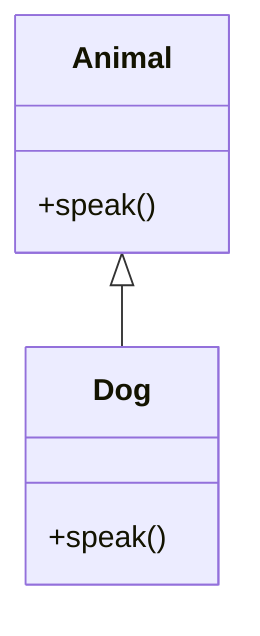
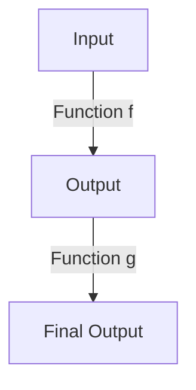
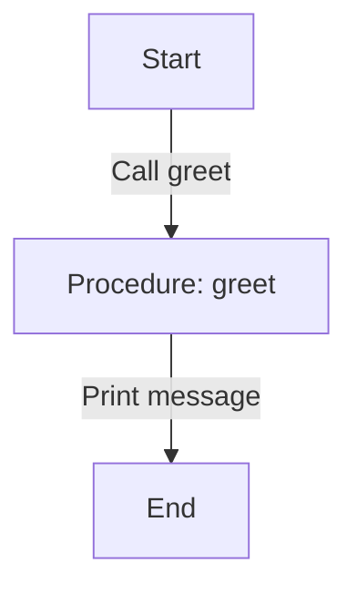
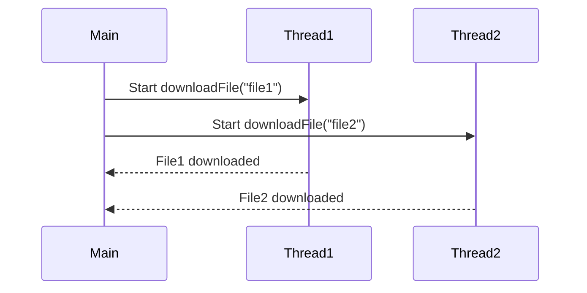

## 1.5. Overview of Programming Paradigms

In the vast landscape of software development, understanding the various programming paradigms is crucial for mastering design patterns. Each paradigm offers unique perspectives and methodologies for solving problems, and they often influence the design patterns we choose to implement. In this section, we will delve into the four primary programming paradigms: Object-Oriented Programming (OOP), Functional Programming (FP), Procedural Programming, and Concurrent and Parallel Programming. By the end of this overview, you will have a comprehensive understanding of these paradigms, their principles, and how they relate to design patterns.

### Object-Oriented Programming (OOP)

Object-Oriented Programming is a paradigm centered around the concept of "objects," which are instances of classes. These objects encapsulate data and behavior, promoting modularity and reusability in software design.

#### Key Concepts of OOP

1. **Encapsulation**: Encapsulation involves bundling the data (attributes) and the methods (functions) that operate on the data into a single unit, or class. This hides the internal state of the object from the outside world, exposing only what is necessary.

2. **Abstraction**: Abstraction focuses on exposing only the relevant attributes and behaviors of an object while hiding the unnecessary details. This simplifies complex systems by modeling classes based on real-world entities.

3. **Inheritance**: Inheritance allows a new class, known as a subclass, to inherit attributes and methods from an existing class, known as a superclass. This promotes code reuse and establishes a hierarchical relationship between classes.

4. **Polymorphism**: Polymorphism enables objects to be treated as instances of their parent class, allowing for dynamic method binding. This means that a single function can operate on different types of objects.

#### Sample Code Snippet

Below is a pseudocode example demonstrating the key concepts of OOP:

```pseudocode
// Define a base class
class Animal {
    method speak() {
        print "Animal speaks"
    }
}

// Define a subclass that inherits from Animal
class Dog extends Animal {
    method speak() {
        print "Woof!"
    }
}

// Instantiate objects
animal = new Animal()
dog = new Dog()

// Demonstrate polymorphism
animal.speak() // Output: Animal speaks
dog.speak()    // Output: Woof!
```

#### Design Patterns in OOP

OOP is the foundation for many design patterns, such as the Singleton, Factory, and Observer patterns. These patterns leverage OOP principles to solve common design problems.

#### Visualizing OOP Concepts



**Caption**: A simple class diagram illustrating inheritance in OOP, where `Dog` inherits from `Animal`.

### Functional Programming (FP)

Functional Programming is a paradigm that treats computation as the evaluation of mathematical functions and avoids changing state and mutable data.

#### Key Concepts of FP

1. **Immutability**: In FP, data is immutable, meaning once a data structure is created, it cannot be changed. This leads to safer and more predictable code.

2. **Pure Functions**: Pure functions are functions where the output value is determined only by its input values, without observable side effects.

3. **First-Class and Higher-Order Functions**: Functions are first-class citizens in FP, meaning they can be passed as arguments, returned from other functions, and assigned to variables. Higher-order functions are functions that take other functions as arguments or return them as results.

4. **Function Composition**: Function composition involves combining simple functions to build more complex ones, promoting code reuse and modularity.

#### Sample Code Snippet

Here's a pseudocode example illustrating functional programming concepts:

```pseudocode
// Define a pure function
function add(a, b) {
    return a + b
}

// Define a higher-order function
function applyFunction(func, value) {
    return func(value)
}

// Use function composition
result = applyFunction(add, 5)(3)
print result // Output: 8
```

#### Design Patterns in FP

FP influences patterns like the Strategy and Command patterns, which can be implemented using higher-order functions and immutability.

#### Visualizing FP Concepts



**Caption**: A flowchart demonstrating function composition, where the output of function `f` becomes the input to function `g`.

### Procedural Programming

Procedural Programming is a paradigm derived from structured programming, based on the concept of procedure calls, where statements are structured into procedures or functions.

#### Key Concepts of Procedural Programming

1. **Procedures**: Also known as routines, subroutines, or functions, procedures are blocks of code that perform a specific task and can be reused throughout the program.

2. **Modularity**: Code is organized into procedures, promoting modularity and making it easier to understand and maintain.

3. **Control Structures**: Procedural programming relies heavily on control structures like loops and conditionals to direct the flow of the program.

4. **State and Variables**: Unlike FP, procedural programming often involves mutable state and variables that change over time.

#### Sample Code Snippet

Below is a pseudocode example demonstrating procedural programming:

```pseudocode
// Define a procedure
procedure greet(name) {
    print "Hello, " + name
}

// Call the procedure
greet("Alice") // Output: Hello, Alice
```

#### Design Patterns in Procedural Programming

While procedural programming is less associated with design patterns, it still influences patterns like the Template Method and Strategy patterns, which can be implemented using procedures.

#### Visualizing Procedural Concepts



**Caption**: A flowchart illustrating a simple procedural program flow, where the `greet` procedure is called to print a message.

### Concurrent and Parallel Programming

Concurrent and Parallel Programming are paradigms that deal with executing multiple computations simultaneously, improving performance and responsiveness.

#### Key Concepts of Concurrent and Parallel Programming

1. **Concurrency**: Concurrency involves multiple tasks making progress at the same time, potentially interacting with each other.

2. **Parallelism**: Parallelism involves executing multiple tasks simultaneously, often on multiple processors or cores, to increase computational speed.

3. **Synchronization**: Synchronization is crucial in concurrent programming to manage access to shared resources and prevent race conditions.

4. **Threads and Processes**: Concurrency is often implemented using threads and processes, which are independent sequences of execution.

#### Sample Code Snippet

Here's a pseudocode example illustrating basic concurrency:

```pseudocode
// Define a concurrent task
task downloadFile(url) {
    // Simulate file download
    print "Downloading from " + url
}

// Create threads for concurrent execution
thread1 = new Thread(downloadFile, "http://example.com/file1")
thread2 = new Thread(downloadFile, "http://example.com/file2")

// Start threads
thread1.start()
thread2.start()
```

#### Design Patterns in Concurrent and Parallel Programming

Patterns like the Producer-Consumer, Future, and Thread Pool patterns are specifically designed to address challenges in concurrent and parallel programming.

#### Visualizing Concurrent Concepts



**Caption**: A sequence diagram showing concurrent execution of two threads downloading files.

### Try It Yourself

To deepen your understanding, try modifying the pseudocode examples provided. For instance, in the OOP example, add a new class `Cat` that also inherits from `Animal` and implements its own `speak` method. In the FP example, create a new higher-order function that applies two functions in sequence. Experiment with creating more complex procedures in the procedural programming example, and try adding synchronization mechanisms in the concurrent programming example.

### References and Further Reading

- [MDN Web Docs: Object-Oriented Programming](https://developer.mozilla.org/en-US/docs/Learn/JavaScript/Objects/Object-oriented_JS)
- [Functional Programming Concepts](https://www.freecodecamp.org/news/functional-programming-concepts/)
- [Procedural Programming](https://www.geeksforgeeks.org/procedural-programming/)
- [Concurrency in Programming](https://www.tutorialspoint.com/concurrency_in_programming/index.htm)

### Knowledge Check

- What are the four main principles of OOP?
- How does immutability benefit functional programming?
- What is the difference between concurrency and parallelism?
- How can procedures enhance modularity in procedural programming?

### Embrace the Journey

Remember, understanding programming paradigms is just the beginning. As you progress, you'll be able to apply these concepts to design patterns, enhancing your problem-solving skills and software design expertise. Keep experimenting, stay curious, and enjoy the journey!

## Quiz Time!



### What is encapsulation in OOP?

- [x] Bundling data and methods into a single unit
- [ ] Inheriting attributes from another class
- [ ] Allowing objects to be treated as instances of their parent class
- [ ] Exposing only relevant attributes and behaviors

> **Explanation:** Encapsulation involves bundling data and methods into a single unit, or class, hiding the internal state from the outside world.

### Which of the following is a pure function?

- [x] A function that returns the same output for the same input without side effects
- [ ] A function that modifies global variables
- [ ] A function that reads from a file
- [ ] A function that prints to the console

> **Explanation:** A pure function returns the same output for the same input and does not produce side effects like modifying global variables or I/O operations.

### What is the primary focus of procedural programming?

- [x] Organizing code into procedures or functions
- [ ] Treating computation as the evaluation of mathematical functions
- [ ] Executing multiple tasks simultaneously
- [ ] Bundling data and methods into objects

> **Explanation:** Procedural programming focuses on organizing code into procedures or functions, promoting modularity and reuse.

### What is the difference between concurrency and parallelism?

- [x] Concurrency involves multiple tasks making progress simultaneously, while parallelism involves executing tasks simultaneously
- [ ] Concurrency is faster than parallelism
- [ ] Parallelism involves multiple tasks making progress simultaneously, while concurrency involves executing tasks simultaneously
- [ ] There is no difference

> **Explanation:** Concurrency involves multiple tasks making progress at the same time, while parallelism involves executing tasks simultaneously, often on multiple processors.

### Which paradigm treats functions as first-class citizens?

- [x] Functional Programming
- [ ] Object-Oriented Programming
- [ ] Procedural Programming
- [ ] Concurrent Programming

> **Explanation:** Functional Programming treats functions as first-class citizens, allowing them to be passed as arguments, returned from other functions, and assigned to variables.

### What is polymorphism in OOP?

- [x] Allowing objects to be treated as instances of their parent class
- [ ] Bundling data and methods into a single unit
- [ ] Inheriting attributes from another class
- [ ] Exposing only relevant attributes and behaviors

> **Explanation:** Polymorphism allows objects to be treated as instances of their parent class, enabling dynamic method binding.

### What is a higher-order function?

- [x] A function that takes other functions as arguments or returns them as results
- [ ] A function that modifies global variables
- [ ] A function that reads from a file
- [ ] A function that prints to the console

> **Explanation:** A higher-order function is a function that takes other functions as arguments or returns them as results, promoting code reuse and modularity.

### How does immutability benefit functional programming?

- [x] It leads to safer and more predictable code
- [ ] It allows functions to modify global variables
- [ ] It enables dynamic method binding
- [ ] It promotes code reuse through inheritance

> **Explanation:** Immutability leads to safer and more predictable code by ensuring that data structures cannot be changed once created.

### What is the role of synchronization in concurrent programming?

- [x] To manage access to shared resources and prevent race conditions
- [ ] To execute tasks simultaneously
- [ ] To organize code into procedures
- [ ] To bundle data and methods into objects

> **Explanation:** Synchronization is crucial in concurrent programming to manage access to shared resources and prevent race conditions.

### True or False: In procedural programming, data is often immutable.

- [ ] True
- [x] False

> **Explanation:** False. In procedural programming, data is often mutable, meaning it can change over time.


