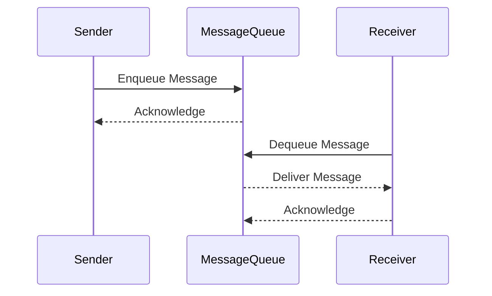

## 10.1. Messaging Systems Overview

In the realm of enterprise software development, messaging systems play a pivotal role in enabling seamless communication between disparate systems. This section will delve into the intricacies of messaging systems, focusing on asynchronous communication and message-oriented middleware (MOM). By the end of this chapter, you'll have a comprehensive understanding of how these systems work, their benefits, and how they can be effectively implemented using design patterns.

### Introduction to Messaging Systems

Messaging systems are integral to modern software architecture, facilitating communication between different components, services, or applications. They enable the exchange of information in a decoupled manner, allowing systems to communicate without being directly connected. This decoupling is crucial for building scalable, maintainable, and flexible software systems.

#### Key Concepts

- **Asynchronous Communication**: This is a communication method where the sender and receiver do not need to interact with the message at the same time. The sender can send a message and continue its process without waiting for the receiver to process the message.
- **Message-Oriented Middleware (MOM)**: MOM is a software infrastructure that supports sending and receiving messages between distributed systems. It acts as an intermediary, managing the message flow and ensuring reliable communication.

### Asynchronous Communication

Asynchronous communication is a cornerstone of messaging systems, providing numerous advantages over synchronous communication. It allows systems to operate independently, improving performance and scalability.

#### Benefits of Asynchronous Communication

1. **Decoupling**: Asynchronous communication decouples the sender and receiver, allowing them to operate independently. This reduces dependencies and increases system flexibility.
2. **Scalability**: By decoupling components, asynchronous communication enables systems to scale more easily. Components can be added or removed without affecting the overall system.
3. **Reliability**: Asynchronous systems can be designed to handle failures gracefully. Messages can be queued and retried, ensuring that they are eventually delivered.
4. **Performance**: Asynchronous communication allows systems to continue processing other tasks while waiting for a response, improving overall performance.

#### Implementing Asynchronous Communication

To implement asynchronous communication, we typically use message queues. A message queue is a form of asynchronous service-to-service communication used in serverless and microservices architectures. It allows messages to be sent between services without requiring both services to be up and running simultaneously.

**Pseudocode Example: Asynchronous Message Queue**

```pseudocode
// Define a message queue
class MessageQueue {
    queue = []

    // Add a message to the queue
    function enqueue(message) {
        queue.push(message)
    }

    // Remove a message from the queue
    function dequeue() {
        if (queue.isEmpty()) {
            return null
        }
        return queue.shift()
    }
}

// Sender sends a message
function sendMessage(queue, message) {
    queue.enqueue(message)
    print("Message sent: " + message)
}

// Receiver processes a message
function receiveMessage(queue) {
    message = queue.dequeue()
    if (message != null) {
        print("Message received: " + message)
    } else {
        print("No messages to process")
    }
}

// Example usage
queue = new MessageQueue()
sendMessage(queue, "Hello, World!")
receiveMessage(queue)
```

### Message-Oriented Middleware (MOM)

Message-Oriented Middleware (MOM) is a critical component in enterprise integration patterns, providing a robust infrastructure for message exchange. MOM facilitates communication by providing a message queue or topic-based system where messages can be published and consumed by different applications.

#### Key Features of MOM

1. **Message Queuing**: MOM provides a queuing mechanism to store messages until they are processed by the receiver. This ensures that messages are not lost and can be processed at a later time.
2. **Message Routing**: MOM can route messages to the appropriate receiver based on predefined rules or patterns.
3. **Message Transformation**: MOM can transform messages from one format to another, enabling interoperability between different systems.
4. **Message Security**: MOM provides security features such as encryption and authentication to ensure that messages are securely transmitted.

#### Types of Message-Oriented Middleware

- **Point-to-Point (P2P)**: In a P2P model, messages are sent from one sender to one receiver. This model is useful for tasks that require guaranteed delivery.
- **Publish-Subscribe (Pub-Sub)**: In a Pub-Sub model, messages are published to a topic and can be consumed by multiple subscribers. This model is useful for broadcasting messages to multiple receivers.

**Pseudocode Example: Publish-Subscribe Model**

```pseudocode
// Define a topic
class Topic {
    subscribers = []

    // Add a subscriber
    function subscribe(subscriber) {
        subscribers.push(subscriber)
    }

    // Notify all subscribers
    function publish(message) {
        for each subscriber in subscribers {
            subscriber.notify(message)
        }
    }
}

// Define a subscriber
class Subscriber {
    function notify(message) {
        print("Received message: " + message)
    }
}

// Example usage
topic = new Topic()
subscriber1 = new Subscriber()
subscriber2 = new Subscriber()

topic.subscribe(subscriber1)
topic.subscribe(subscriber2)

topic.publish("New message available!")
```

### Visualizing Messaging Systems

To better understand the flow of messages in a messaging system, let's visualize the process using a sequence diagram. This diagram illustrates the interaction between a sender, a message queue, and a receiver in an asynchronous messaging system.



### Design Considerations for Messaging Systems

When designing messaging systems, it's essential to consider several factors to ensure efficient and reliable communication.

#### Message Durability

Ensure that messages are durable and can survive system failures. This can be achieved by persisting messages to disk or using a reliable message broker.

#### Message Ordering

Consider whether message ordering is important for your application. Some messaging systems provide guarantees about the order in which messages are delivered.

#### Scalability

Design your messaging system to scale with your application's needs. This may involve using distributed message brokers or partitioning messages across multiple queues.

#### Security

Implement security measures to protect messages from unauthorized access. This includes encrypting messages and authenticating senders and receivers.

### Differences and Similarities with Other Patterns

Messaging systems share similarities with other communication patterns, such as Remote Procedure Call (RPC) and Event-Driven Architecture (EDA). However, they differ in several key aspects:

- **RPC**: Unlike messaging systems, RPC is synchronous and requires the sender and receiver to be available simultaneously.
- **EDA**: Messaging systems can be a part of EDA, where events are communicated via messages. However, EDA focuses more on the event-driven nature of the system.

### Practical Applications of Messaging Systems

Messaging systems are widely used in various industries and applications. Here are a few examples:

- **E-commerce**: Messaging systems are used to process orders, manage inventory, and handle customer notifications.
- **Financial Services**: Banks and financial institutions use messaging systems for transaction processing and fraud detection.
- **Healthcare**: Messaging systems facilitate communication between different healthcare systems, enabling seamless data exchange.

### Try It Yourself

To deepen your understanding of messaging systems, try modifying the pseudocode examples provided. Experiment with different message queue implementations, or create a more complex publish-subscribe system with multiple topics and subscribers.

### Knowledge Check

- What are the main benefits of asynchronous communication?
- How does message-oriented middleware facilitate communication between distributed systems?
- What are the key differences between point-to-point and publish-subscribe models?

### Summary

In this section, we've explored the fundamentals of messaging systems, focusing on asynchronous communication and message-oriented middleware. We've discussed the benefits of asynchronous communication, the features of MOM, and provided pseudocode examples to illustrate these concepts. Remember, mastering messaging systems is a crucial step in building robust and scalable enterprise applications. Keep experimenting, stay curious, and enjoy the journey!

## Quiz Time!



### What is the primary benefit of asynchronous communication in messaging systems?

- [x] Decoupling sender and receiver
- [ ] Ensuring message order
- [ ] Reducing message size
- [ ] Increasing message speed

> **Explanation:** Asynchronous communication decouples the sender and receiver, allowing them to operate independently.

### Which of the following is a feature of message-oriented middleware?

- [x] Message queuing
- [ ] Direct database access
- [ ] File system management
- [ ] User authentication

> **Explanation:** Message-oriented middleware provides message queuing to store messages until they are processed.

### In a publish-subscribe model, messages are:

- [x] Published to a topic and consumed by multiple subscribers
- [ ] Sent directly to a single receiver
- [ ] Stored in a database
- [ ] Encrypted before sending

> **Explanation:** In a publish-subscribe model, messages are published to a topic and can be consumed by multiple subscribers.

### What is a key difference between RPC and messaging systems?

- [x] RPC is synchronous, while messaging systems are asynchronous
- [ ] RPC is asynchronous, while messaging systems are synchronous
- [ ] RPC uses message queues
- [ ] Messaging systems require direct connections

> **Explanation:** RPC is synchronous and requires the sender and receiver to be available simultaneously, unlike messaging systems.

### Which of the following is NOT a type of message-oriented middleware?

- [ ] Point-to-Point
- [x] Client-Server
- [ ] Publish-Subscribe
- [ ] Message Queue

> **Explanation:** Client-Server is not a type of message-oriented middleware; it is a different architectural pattern.

### What is a common use case for messaging systems in healthcare?

- [x] Facilitating communication between healthcare systems
- [ ] Managing patient appointments
- [ ] Storing medical records
- [ ] Performing surgeries

> **Explanation:** Messaging systems facilitate communication between different healthcare systems, enabling seamless data exchange.

### How can message durability be ensured in a messaging system?

- [x] Persisting messages to disk
- [ ] Encrypting messages
- [ ] Using synchronous communication
- [ ] Limiting message size

> **Explanation:** Message durability can be ensured by persisting messages to disk or using a reliable message broker.

### What is a benefit of using a publish-subscribe model?

- [x] Broadcasting messages to multiple receivers
- [ ] Ensuring message order
- [ ] Reducing message size
- [ ] Increasing message speed

> **Explanation:** The publish-subscribe model is useful for broadcasting messages to multiple receivers.

### Which of the following is a design consideration for messaging systems?

- [x] Message ordering
- [ ] Direct database access
- [ ] File system management
- [ ] User authentication

> **Explanation:** Message ordering is an important design consideration for messaging systems.

### True or False: Message-oriented middleware can transform messages from one format to another.

- [x] True
- [ ] False

> **Explanation:** Message-oriented middleware can transform messages from one format to another, enabling interoperability between different systems.


