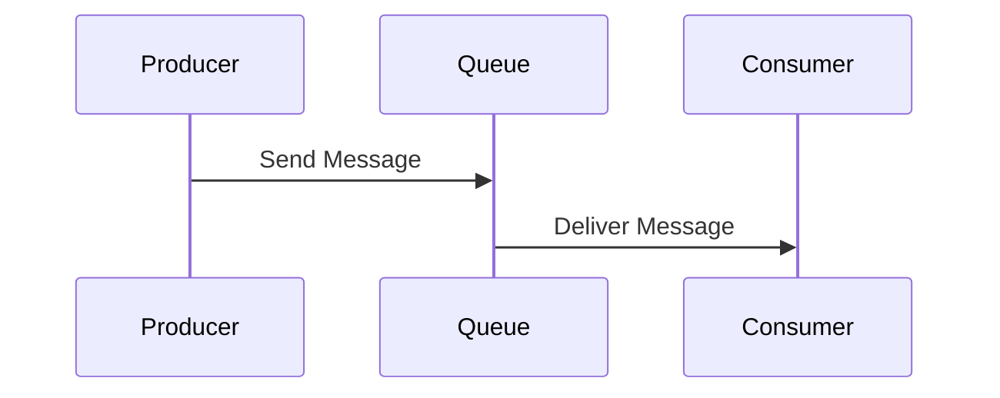
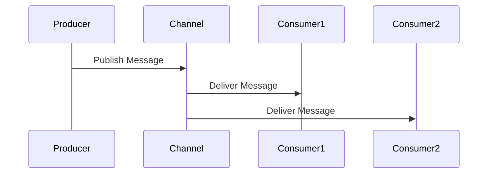

## 10.2. Message Channel

In the realm of enterprise integration, the Message Channel design pattern plays a pivotal role in facilitating communication between disparate systems. This pattern provides a structured way to transport messages, ensuring that data flows seamlessly across various components of a distributed system. In this section, we will delve into the intricacies of the Message Channel pattern, exploring its two primary models: Point-to-Point and Publish-Subscribe. We will provide detailed explanations, pseudocode examples, and visual diagrams to aid your understanding.

### Introduction to Message Channels

A Message Channel is a conduit through which messages are sent from one system to another. It acts as a virtual pipeline that connects the sender and receiver, allowing them to exchange information asynchronously. This decoupling of sender and receiver is crucial in distributed systems, where components may operate independently and at different speeds.

#### Key Concepts

- **Message**: A unit of data that is transmitted through the channel. It can contain various types of information, such as commands, events, or data payloads.
- **Channel**: The medium through which messages are transported. It abstracts the underlying communication mechanism, providing a consistent interface for message exchange.
- **Producer**: The entity that sends messages into the channel.
- **Consumer**: The entity that receives messages from the channel.

### Types of Message Channels

Message Channels can be categorized into two primary types based on their communication model: Point-to-Point and Publish-Subscribe.

#### Point-to-Point Channel

The Point-to-Point (P2P) channel is designed for one-to-one communication. In this model, a message sent by a producer is consumed by exactly one consumer. This ensures that each message is processed once and only once, making it ideal for scenarios where message processing must be guaranteed.

##### Characteristics of Point-to-Point Channels

- **Exclusive Consumption**: Each message is delivered to a single consumer.
- **Guaranteed Delivery**: Messages are typically stored in a queue until they are successfully processed by a consumer.
- **Load Balancing**: Multiple consumers can be attached to the same channel, allowing for load balancing and fault tolerance.

##### Pseudocode Example: Point-to-Point Channel

```pseudocode
// Define a message structure
class Message {
    data: String
    timestamp: DateTime
}

// Define a point-to-point channel
class PointToPointChannel {
    queue: Queue<Message>

    // Send a message to the channel
    function send(message: Message) {
        queue.enqueue(message)
    }

    // Receive a message from the channel
    function receive(): Message {
        return queue.dequeue()
    }
}

// Producer sends a message
producerChannel = new PointToPointChannel()
message = new Message("Hello, World!", currentDateTime())
producerChannel.send(message)

// Consumer receives the message
consumerChannel = producerChannel
receivedMessage = consumerChannel.receive()
print("Received Message: " + receivedMessage.data)
```

##### Visualizing Point-to-Point Channel



In the diagram above, the producer sends a message to a queue, and the consumer retrieves it from the queue, ensuring exclusive consumption.

#### Publish-Subscribe Channel

The Publish-Subscribe (Pub-Sub) channel supports one-to-many communication. In this model, a message sent by a producer is broadcast to all interested consumers. This is ideal for scenarios where multiple components need to react to the same event or data change.

##### Characteristics of Publish-Subscribe Channels

- **Broadcast Delivery**: Messages are delivered to all subscribed consumers.
- **Decoupled Components**: Producers and consumers are loosely coupled, allowing for flexible system architecture.
- **Dynamic Subscription**: Consumers can subscribe or unsubscribe from the channel at runtime.

##### Pseudocode Example: Publish-Subscribe Channel

```pseudocode
// Define a publish-subscribe channel
class PublishSubscribeChannel {
    subscribers: List<Consumer>

    // Publish a message to all subscribers
    function publish(message: Message) {
        for each subscriber in subscribers {
            subscriber.receive(message)
        }
    }

    // Subscribe a consumer to the channel
    function subscribe(consumer: Consumer) {
        subscribers.add(consumer)
    }

    // Unsubscribe a consumer from the channel
    function unsubscribe(consumer: Consumer) {
        subscribers.remove(consumer)
    }
}

// Define a consumer
class Consumer {
    function receive(message: Message) {
        print("Received Message: " + message.data)
    }
}

// Producer publishes a message
pubSubChannel = new PublishSubscribeChannel()
consumer1 = new Consumer()
consumer2 = new Consumer()
pubSubChannel.subscribe(consumer1)
pubSubChannel.subscribe(consumer2)

message = new Message("Breaking News!", currentDateTime())
pubSubChannel.publish(message)
```

##### Visualizing Publish-Subscribe Channel



In the diagram above, the producer publishes a message to the channel, which is then delivered to all subscribed consumers.

### Design Considerations

When implementing Message Channels, consider the following:

- **Reliability**: Ensure that messages are reliably delivered, even in the event of system failures.
- **Scalability**: Design channels to handle varying loads and scale horizontally as needed.
- **Security**: Protect message integrity and confidentiality, especially in public or sensitive environments.
- **Latency**: Minimize delays in message delivery to ensure timely processing.

### Differences and Similarities

- **Point-to-Point vs. Publish-Subscribe**: The primary difference lies in the delivery model—exclusive vs. broadcast. Both models abstract the communication mechanism, providing a consistent interface for message exchange.
- **Commonalities**: Both types of channels decouple producers and consumers, enhancing system flexibility and scalability.

### Try It Yourself

Experiment with the provided pseudocode examples by modifying the message content, adding more consumers, or implementing additional features like message filtering or prioritization. This hands-on approach will deepen your understanding of Message Channels and their application in real-world scenarios.

### Knowledge Check

- **What are the key differences between Point-to-Point and Publish-Subscribe channels?**
- **How does a Message Channel enhance system decoupling?**
- **What are some potential pitfalls when implementing Message Channels?**

### Conclusion

The Message Channel design pattern is a fundamental building block in enterprise integration, enabling seamless communication between distributed components. By understanding and applying the Point-to-Point and Publish-Subscribe models, you can design systems that are both flexible and robust, capable of handling complex integration scenarios.

Remember, mastering Message Channels is just one step in your journey toward becoming an expert in enterprise integration patterns. Keep exploring, experimenting, and learning to unlock the full potential of these powerful design patterns.

## Quiz Time!



### What is a Message Channel?

- [x] A conduit for transporting messages between systems.
- [ ] A database for storing messages.
- [ ] A file system for saving messages.
- [ ] A user interface for displaying messages.

> **Explanation:** A Message Channel is a conduit that facilitates the transport of messages between systems, decoupling the sender and receiver.

### Which model is designed for one-to-one communication?

- [x] Point-to-Point
- [ ] Publish-Subscribe
- [ ] Broadcast
- [ ] Multicast

> **Explanation:** The Point-to-Point model is designed for one-to-one communication, ensuring each message is consumed by a single consumer.

### What is a key characteristic of Publish-Subscribe channels?

- [x] Broadcast delivery to all subscribed consumers.
- [ ] Exclusive delivery to one consumer.
- [ ] Delivery based on message priority.
- [ ] Delivery based on message size.

> **Explanation:** Publish-Subscribe channels deliver messages to all subscribed consumers, supporting one-to-many communication.

### What role does a Producer play in a Message Channel?

- [x] Sends messages into the channel.
- [ ] Receives messages from the channel.
- [ ] Filters messages in the channel.
- [ ] Encrypts messages in the channel.

> **Explanation:** A Producer is responsible for sending messages into the channel for consumption by one or more consumers.

### How can Message Channels enhance system scalability?

- [x] By decoupling producers and consumers.
- [ ] By increasing message size.
- [ ] By reducing message frequency.
- [ ] By limiting the number of consumers.

> **Explanation:** Message Channels enhance scalability by decoupling producers and consumers, allowing each to scale independently.

### What is a potential pitfall of using Message Channels?

- [x] Increased complexity in message handling.
- [ ] Decreased message throughput.
- [ ] Reduced system reliability.
- [ ] Increased latency in message delivery.

> **Explanation:** Message Channels can introduce complexity in message handling, especially in systems with numerous producers and consumers.

### In a Point-to-Point channel, what happens if there are multiple consumers?

- [x] Messages are load-balanced among consumers.
- [ ] Messages are delivered to all consumers.
- [ ] Messages are ignored by consumers.
- [ ] Messages are stored indefinitely.

> **Explanation:** In a Point-to-Point channel, messages can be load-balanced among multiple consumers to enhance processing efficiency.

### What is a commonality between Point-to-Point and Publish-Subscribe channels?

- [x] Both decouple producers and consumers.
- [ ] Both deliver messages exclusively to one consumer.
- [ ] Both require synchronous communication.
- [ ] Both use the same underlying protocol.

> **Explanation:** Both Point-to-Point and Publish-Subscribe channels decouple producers and consumers, enhancing system flexibility.

### What is the primary benefit of decoupling producers and consumers?

- [x] Increased system flexibility and scalability.
- [ ] Decreased message reliability.
- [ ] Increased message latency.
- [ ] Decreased system security.

> **Explanation:** Decoupling producers and consumers increases system flexibility and scalability, allowing each to evolve independently.

### True or False: Publish-Subscribe channels can dynamically add or remove consumers at runtime.

- [x] True
- [ ] False

> **Explanation:** Publish-Subscribe channels support dynamic subscription, allowing consumers to be added or removed at runtime.


