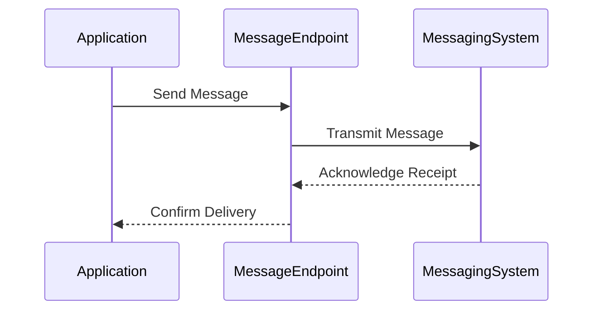

## 10.3. Message Endpoint

In the realm of enterprise integration, the **Message Endpoint** pattern stands as a pivotal concept. It serves as the bridge connecting applications to messaging systems, ensuring seamless communication and data exchange across distributed systems. In this section, we will delve into the intricacies of designing message endpoints, their role in enterprise integration, and how they facilitate robust and scalable communication architectures.

### Introduction to Message Endpoints

A **Message Endpoint** acts as a conduit between an application and a messaging system. It is responsible for sending and receiving messages, translating them into a format understandable by the application, and ensuring that the communication adheres to the protocols and standards of the messaging system. This pattern is essential in decoupling the application logic from the intricacies of the messaging infrastructure, allowing developers to focus on business logic rather than communication details.

#### Key Concepts

- **Decoupling**: Message endpoints abstract the communication layer, allowing applications to remain agnostic of the messaging system's specifics.
- **Translation**: They often handle the conversion of messages into formats suitable for the application or the messaging system.
- **Reliability**: Endpoints ensure messages are delivered reliably, handling retries and acknowledgments as necessary.
- **Scalability**: By offloading communication tasks to endpoints, applications can scale independently of the messaging infrastructure.

### Designing Message Endpoints

Designing an effective message endpoint involves understanding the requirements of both the application and the messaging system. Let's explore the key considerations and steps involved in designing robust message endpoints.

#### Understanding Application Requirements

1. **Message Format**: Determine the format in which the application expects to send and receive messages. This could be JSON, XML, or a custom binary format.
2. **Communication Protocol**: Identify the protocol used by the application, such as HTTP, AMQP, or MQTT.
3. **Performance Needs**: Assess the application's performance requirements, including latency, throughput, and concurrency.

#### Understanding Messaging System Requirements

1. **Protocol Support**: Ensure the endpoint supports the protocols used by the messaging system.
2. **Message Patterns**: Identify the messaging patterns employed, such as publish-subscribe, request-reply, or point-to-point.
3. **Security**: Consider the security requirements for message transmission, including encryption and authentication.

#### Endpoint Design Considerations

- **Message Transformation**: Implement logic to transform messages between application and messaging system formats.
- **Error Handling**: Design robust error handling mechanisms to manage message failures and retries.
- **Scalability**: Architect endpoints to handle varying loads, possibly using load balancers or message brokers.
- **Monitoring and Logging**: Integrate monitoring tools to track message flow and diagnose issues.

### Sample Code Snippets

Let's explore some pseudocode examples to illustrate how message endpoints can be implemented.

#### Sending Messages

```pseudocode
function sendMessage(endpoint, message) {
    // Transform message to the required format
    transformedMessage = transformMessageToSystemFormat(message)
    
    // Send the message to the endpoint
    endpoint.send(transformedMessage)
    
    // Log the message sending event
    logEvent("Message sent to endpoint", endpoint)
}

function transformMessageToSystemFormat(message) {
    // Convert message to JSON format
    return JSON.stringify(message)
}
```

#### Receiving Messages

```pseudocode
function receiveMessage(endpoint) {
    // Receive a message from the endpoint
    rawMessage = endpoint.receive()
    
    // Transform message to application format
    message = transformMessageToAppFormat(rawMessage)
    
    // Process the message
    processMessage(message)
    
    // Log the message receiving event
    logEvent("Message received from endpoint", endpoint)
}

function transformMessageToAppFormat(rawMessage) {
    // Convert JSON message to application object
    return JSON.parse(rawMessage)
}
```

### Visualizing Message Endpoint Architecture

To better understand the role of message endpoints, let's visualize their architecture using a sequence diagram.



**Diagram Description**: This sequence diagram illustrates the flow of a message from an application to a messaging system via a message endpoint. The endpoint handles the transmission and acknowledgment processes, ensuring reliable communication.

### Key Participants

- **Application**: The source or destination of messages, containing business logic.
- **Message Endpoint**: The intermediary that facilitates communication between the application and the messaging system.
- **Messaging System**: The infrastructure responsible for message delivery, such as a message broker or queue.

### Applicability

Message endpoints are applicable in scenarios where:

- Applications need to communicate with external systems via messaging protocols.
- There is a need to decouple application logic from messaging infrastructure.
- Reliable and scalable message delivery is required.

### Design Considerations

When designing message endpoints, consider the following:

- **Protocol Compatibility**: Ensure endpoints support the necessary protocols for both the application and messaging system.
- **Message Transformation**: Implement transformations to convert messages to and from the required formats.
- **Error Handling**: Design mechanisms to handle message failures, retries, and acknowledgments.
- **Security**: Incorporate security measures to protect message integrity and confidentiality.

### Differences and Similarities

Message endpoints are often compared with other integration patterns, such as:

- **Message Channel**: While message channels focus on transporting messages, endpoints handle the interaction between applications and channels.
- **Message Translator**: Endpoints may include translation logic, similar to message translators, but also manage communication protocols and reliability.

### Try It Yourself

To deepen your understanding of message endpoints, try modifying the pseudocode examples:

- Implement additional message transformations, such as XML to JSON conversion.
- Add error handling logic to manage message retries and failures.
- Experiment with different communication protocols, such as AMQP or MQTT.

### References and Further Reading

For more information on message endpoints and related patterns, consider exploring the following resources:

- [Enterprise Integration Patterns](https://www.enterpriseintegrationpatterns.com/)
- [Apache Camel Documentation](https://camel.apache.org/manual/latest/index.html)
- [RabbitMQ Tutorials](https://www.rabbitmq.com/getstarted.html)

### Knowledge Check

Let's reinforce your understanding with some questions and exercises:

- What are the primary responsibilities of a message endpoint?
- How do message endpoints contribute to decoupling application logic from messaging infrastructure?
- Design a message endpoint that supports both JSON and XML message formats.

### Embrace the Journey

Remember, mastering message endpoints is just one step in your journey to becoming an expert in enterprise integration patterns. As you continue to explore and experiment, you'll gain a deeper understanding of how these patterns can enhance your software architecture. Keep learning, stay curious, and enjoy the process!

## Quiz Time!



### What is the primary role of a Message Endpoint in enterprise integration?

- [x] To connect applications to messaging systems
- [ ] To store messages in a database
- [ ] To encrypt messages for security
- [ ] To generate reports from message data

> **Explanation:** The primary role of a Message Endpoint is to connect applications to messaging systems, facilitating communication and data exchange.

### Which of the following is NOT a responsibility of a Message Endpoint?

- [ ] Message transformation
- [ ] Error handling
- [x] Message storage
- [ ] Protocol translation

> **Explanation:** Message storage is not a responsibility of a Message Endpoint. Endpoints handle transformation, error handling, and protocol translation.

### What is the benefit of decoupling application logic from messaging infrastructure?

- [x] It allows applications to change without affecting the messaging system
- [ ] It increases the complexity of the system
- [ ] It reduces the need for message transformation
- [ ] It eliminates the need for error handling

> **Explanation:** Decoupling application logic from messaging infrastructure allows applications to evolve independently, enhancing flexibility and maintainability.

### In the context of Message Endpoints, what does "scalability" refer to?

- [ ] The ability to encrypt messages
- [x] The ability to handle varying loads
- [ ] The ability to store messages
- [ ] The ability to transform messages

> **Explanation:** Scalability refers to the ability of Message Endpoints to handle varying loads, ensuring reliable communication under different conditions.

### Which protocol is commonly used by Message Endpoints for communication?

- [x] AMQP
- [ ] FTP
- [ ] SMTP
- [ ] POP3

> **Explanation:** AMQP (Advanced Message Queuing Protocol) is commonly used by Message Endpoints for communication in messaging systems.

### How do Message Endpoints contribute to system reliability?

- [x] By handling retries and acknowledgments
- [ ] By storing messages permanently
- [ ] By encrypting all messages
- [ ] By generating message logs

> **Explanation:** Message Endpoints contribute to system reliability by handling retries and acknowledgments, ensuring messages are delivered successfully.

### What is a common security consideration for Message Endpoints?

- [ ] Message storage
- [x] Message encryption
- [ ] Message logging
- [ ] Message formatting

> **Explanation:** Message encryption is a common security consideration for Message Endpoints to protect data integrity and confidentiality.

### Which of the following is a key participant in the Message Endpoint pattern?

- [x] Application
- [ ] Database
- [ ] File System
- [ ] User Interface

> **Explanation:** The Application is a key participant in the Message Endpoint pattern, as it interacts with the endpoint for communication.

### True or False: Message Endpoints can only handle JSON message formats.

- [ ] True
- [x] False

> **Explanation:** False. Message Endpoints can handle various message formats, including JSON, XML, and custom binary formats.

### What is the purpose of message transformation in a Message Endpoint?

- [x] To convert messages between application and messaging system formats
- [ ] To store messages in a database
- [ ] To encrypt messages for security
- [ ] To generate message logs

> **Explanation:** The purpose of message transformation in a Message Endpoint is to convert messages between application and messaging system formats, ensuring compatibility.


