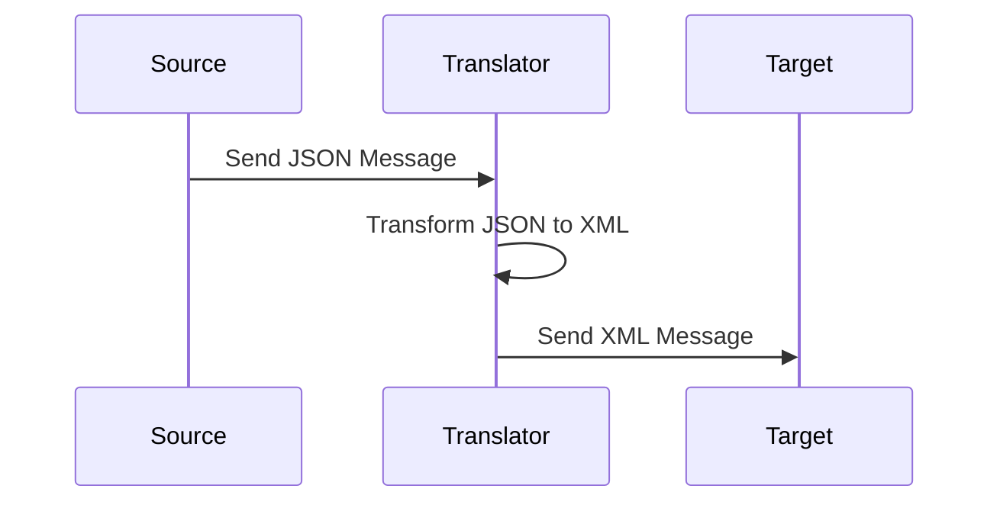

## 10.4. Message Translator: Adapting Message Formats for Seamless Integration

In the realm of enterprise integration, the Message Translator pattern plays a crucial role in ensuring seamless communication between disparate systems. As organizations grow and evolve, they often find themselves using a variety of software applications, each with its own unique data format. The Message Translator pattern addresses this challenge by transforming messages from one format to another, enabling interoperability between systems that would otherwise be incompatible.

### Intent

The primary intent of the Message Translator pattern is to facilitate communication between systems with different data formats by transforming messages as they pass through an integration layer. This pattern is essential for ensuring that information is accurately and efficiently exchanged across diverse systems, thereby enhancing the overall functionality and efficiency of enterprise applications.

### Key Participants

1. **Source System**: The system that generates the original message in its native format.
2. **Message Translator**: The component responsible for transforming the message from the source format to the target format.
3. **Target System**: The system that receives the transformed message in the format it can understand.

### Applicability

The Message Translator pattern is applicable in scenarios where:

- Systems within an enterprise use different data formats and need to communicate with each other.
- Data needs to be transformed to comply with specific business rules or standards.
- Integration with external partners or third-party services requires data format conversion.

### Sample Code Snippets

Let's explore a pseudocode example to illustrate how the Message Translator pattern can be implemented. In this example, we will transform a JSON message to an XML format.

```pseudocode
// Define the source message in JSON format
sourceMessage = {
    "name": "John Doe",
    "age": 30,
    "email": "john.doe@example.com"
}

// Define the Message Translator function
function translateMessage(sourceMessage) {
    // Initialize an empty XML string
    xmlMessage = "<Person>"

    // Transform JSON fields to XML elements
    xmlMessage += "<Name>" + sourceMessage.name + "</Name>"
    xmlMessage += "<Age>" + sourceMessage.age + "</Age>"
    xmlMessage += "<Email>" + sourceMessage.email + "</Email>"

    // Close the XML root element
    xmlMessage += "</Person>"

    return xmlMessage
}

// Use the Message Translator to transform the message
translatedMessage = translateMessage(sourceMessage)

// Output the transformed message
print(translatedMessage)
```

In this example, the `translateMessage` function takes a JSON object as input and converts it into an XML string. This transformation enables the target system, which understands XML, to process the message.

### Design Considerations

When implementing the Message Translator pattern, consider the following:

- **Data Integrity**: Ensure that the transformation process preserves the integrity and accuracy of the data.
- **Performance**: Optimize the transformation process to minimize latency, especially in high-throughput environments.
- **Scalability**: Design the translator to handle varying message sizes and formats efficiently.
- **Error Handling**: Implement robust error handling to manage transformation failures gracefully.

### Differences and Similarities

The Message Translator pattern is often compared to other integration patterns, such as the Adapter pattern. While both patterns aim to facilitate communication between incompatible systems, the Adapter pattern focuses on interface compatibility, whereas the Message Translator pattern deals with data format transformation.

### Visualizing the Message Translator Pattern

To better understand the Message Translator pattern, let's visualize the process using a sequence diagram.



**Diagram Description**: This sequence diagram illustrates the flow of a message from the source system to the target system via the Message Translator. The source sends a JSON message to the translator, which transforms it into XML before forwarding it to the target.

### Real-World Applications

The Message Translator pattern is widely used in various industries, including finance, healthcare, and e-commerce. For instance, in a healthcare setting, patient data might be stored in different formats across multiple systems. A Message Translator can convert these formats into a standardized format for seamless data exchange and integration.

### Try It Yourself

To deepen your understanding of the Message Translator pattern, try modifying the pseudocode example to handle additional data formats, such as CSV or YAML. Experiment with different transformation rules and observe how they affect the output.

### Knowledge Check

1. **What is the primary purpose of the Message Translator pattern?**
   - To transform messages between different data formats for seamless integration.

2. **What are the key participants in the Message Translator pattern?**
   - Source System, Message Translator, Target System.

3. **How does the Message Translator pattern differ from the Adapter pattern?**
   - The Message Translator focuses on data format transformation, while the Adapter focuses on interface compatibility.

### Conclusion

The Message Translator pattern is an essential tool in the arsenal of enterprise integration patterns. By enabling seamless communication between systems with different data formats, it enhances the interoperability and efficiency of enterprise applications. As you continue to explore design patterns, remember that the key to mastering them lies in understanding their intent, applicability, and implementation nuances.

## Quiz Time!



### What is the primary purpose of the Message Translator pattern?

- [x] To transform messages between different data formats for seamless integration.
- [ ] To adapt interfaces for compatibility.
- [ ] To encrypt messages for security.
- [ ] To compress messages for faster transmission.

> **Explanation:** The Message Translator pattern is designed to transform messages from one data format to another, enabling seamless integration between systems with different data formats.

### Which of the following is NOT a key participant in the Message Translator pattern?

- [ ] Source System
- [ ] Message Translator
- [x] Database
- [ ] Target System

> **Explanation:** The key participants in the Message Translator pattern are the Source System, Message Translator, and Target System. A Database is not a direct participant in this pattern.

### How does the Message Translator pattern differ from the Adapter pattern?

- [x] The Message Translator focuses on data format transformation, while the Adapter focuses on interface compatibility.
- [ ] The Message Translator encrypts messages, while the Adapter compresses them.
- [ ] The Message Translator is used for security, while the Adapter is used for performance.
- [ ] The Message Translator is a structural pattern, while the Adapter is a behavioral pattern.

> **Explanation:** The Message Translator pattern deals with transforming data formats, whereas the Adapter pattern is concerned with making interfaces compatible.

### In the provided pseudocode example, what is the output format of the transformed message?

- [ ] JSON
- [x] XML
- [ ] CSV
- [ ] YAML

> **Explanation:** The pseudocode example transforms a JSON message into an XML format.

### What should be considered when implementing the Message Translator pattern?

- [x] Data Integrity
- [x] Performance
- [x] Scalability
- [ ] Encryption

> **Explanation:** When implementing the Message Translator pattern, it's important to consider data integrity, performance, and scalability. Encryption is not a primary concern of this pattern.

### Which industry could benefit from using the Message Translator pattern?

- [x] Healthcare
- [x] Finance
- [x] E-commerce
- [ ] Agriculture

> **Explanation:** Industries like healthcare, finance, and e-commerce, which often deal with disparate systems and data formats, can benefit from using the Message Translator pattern.

### What is a potential challenge when using the Message Translator pattern?

- [x] Handling transformation failures
- [ ] Ensuring interface compatibility
- [ ] Encrypting data
- [ ] Compressing data

> **Explanation:** A potential challenge when using the Message Translator pattern is handling transformation failures and ensuring data integrity.

### What is the role of the Message Translator in the pattern?

- [x] To transform the message from the source format to the target format.
- [ ] To store the message in a database.
- [ ] To encrypt the message for security.
- [ ] To compress the message for faster transmission.

> **Explanation:** The Message Translator's role is to transform the message from the source format to the target format, enabling communication between disparate systems.

### True or False: The Message Translator pattern is only applicable in software development.

- [ ] True
- [x] False

> **Explanation:** The Message Translator pattern is applicable in various industries and scenarios where data format transformation is needed, not just in software development.

### Which of the following is a benefit of using the Message Translator pattern?

- [x] Enhances interoperability between systems
- [ ] Increases data encryption
- [ ] Reduces message size
- [ ] Improves user interface design

> **Explanation:** The Message Translator pattern enhances interoperability between systems by transforming messages into compatible formats.



Remember, this is just the beginning. As you progress, you'll build more complex and interactive systems. Keep experimenting, stay curious, and enjoy the journey!
