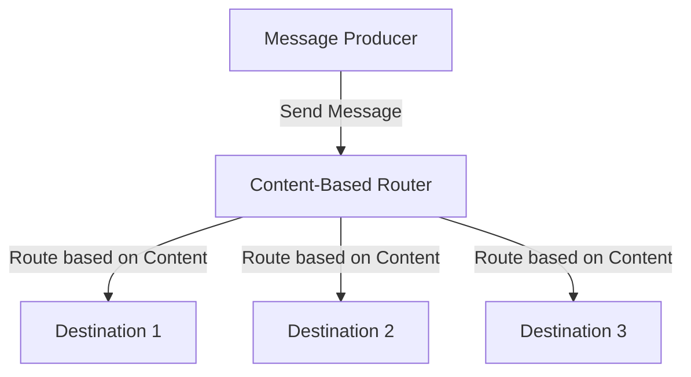
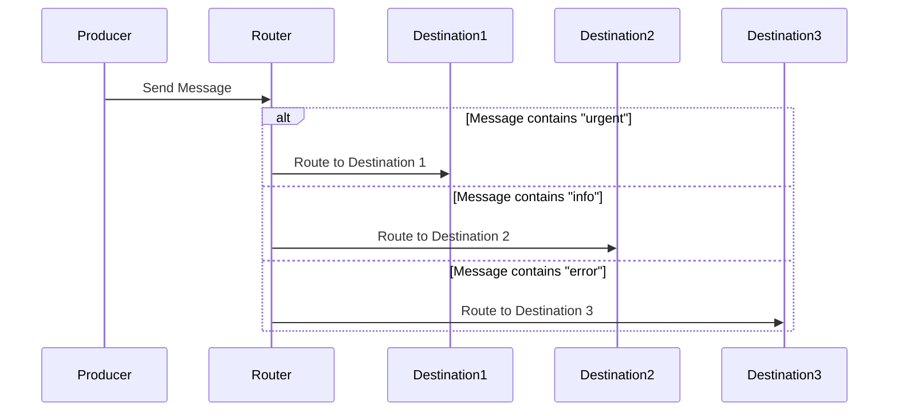

## 10.5. Content-Based Router

In the realm of enterprise integration patterns, the **Content-Based Router** plays a pivotal role in directing messages to different destinations based on their content. This pattern is essential for systems that require dynamic message routing, allowing for flexible and scalable integration solutions. In this section, we will delve into the intricacies of the Content-Based Router, exploring its intent, applicability, and implementation through pseudocode examples.

### Intent

The primary intent of the Content-Based Router is to route messages to different channels or destinations based on the content of the message itself. This pattern is particularly useful in scenarios where messages need to be processed differently depending on their type, source, or other attributes.

### Key Participants

1. **Message**: The data or information that needs to be routed.
2. **Router**: The component that examines the message content and determines the appropriate destination.
3. **Destination Channels**: The various endpoints or channels where messages can be sent.

### Applicability

The Content-Based Router is applicable in situations where:

- Messages need to be processed differently based on their content.
- The system architecture requires flexibility to add or change routing logic without significant modifications.
- There is a need to decouple message producers from message consumers, allowing for independent evolution.

### Diagrams

To better understand the flow of a Content-Based Router, consider the following diagram:



**Diagram Description**: The diagram illustrates a message producer sending a message to the Content-Based Router. The router examines the message content and routes it to one of several destinations based on predefined criteria.

### Pseudocode Implementation

Let's explore a pseudocode implementation of a Content-Based Router. This example will demonstrate how to dynamically route messages based on their content.

```pseudocode
// Define a Message class
class Message:
    def __init__(self, content):
        self.content = content

// Define a Router class
class ContentBasedRouter:
    def __init__(self):
        self.routes = []

    // Method to add a route with a condition and a destination
    def add_route(self, condition, destination):
        self.routes.append((condition, destination))

    // Method to route a message based on its content
    def route_message(self, message):
        for condition, destination in self.routes:
            if condition(message.content):
                destination.receive(message)
                break

// Define a Destination class
class Destination:
    def __init__(self, name):
        self.name = name

    def receive(self, message):
        print(f"Message received at {self.name}: {message.content}")

// Example usage
def main():
    # Create destinations
    destination1 = Destination("Destination 1")
    destination2 = Destination("Destination 2")
    destination3 = Destination("Destination 3")

    # Create a content-based router
    router = ContentBasedRouter()

    # Add routes with conditions
    router.add_route(lambda content: "urgent" in content, destination1)
    router.add_route(lambda content: "info" in content, destination2)
    router.add_route(lambda content: "error" in content, destination3)

    # Create messages
    message1 = Message("urgent: server down")
    message2 = Message("info: daily report")
    message3 = Message("error: disk full")

    # Route messages
    router.route_message(message1)
    router.route_message(message2)
    router.route_message(message3)

main()
```

**Pseudocode Explanation**: In this pseudocode, we define a `Message` class to encapsulate the message content. The `ContentBasedRouter` class manages routing logic, allowing routes to be added with specific conditions and destinations. The `Destination` class represents endpoints that can receive messages. The example demonstrates routing messages based on keywords in their content.

### Design Considerations

When implementing a Content-Based Router, consider the following:

- **Performance**: Evaluate the performance impact of routing logic, especially if conditions are complex or numerous.
- **Scalability**: Ensure the router can handle an increasing number of routes and messages efficiently.
- **Flexibility**: Design the router to accommodate changes in routing logic without significant refactoring.
- **Error Handling**: Implement robust error handling to manage routing failures or invalid message content.

### Differences and Similarities

The Content-Based Router is often compared to the **Message Filter** pattern. While both deal with message content, the Message Filter pattern is primarily concerned with filtering out unwanted messages, whereas the Content-Based Router focuses on directing messages to appropriate destinations.

### Try It Yourself

To deepen your understanding of the Content-Based Router, try modifying the pseudocode example:

- Add additional conditions and destinations to the router.
- Implement a fallback destination for messages that don't match any condition.
- Experiment with more complex conditions, such as regular expressions or content parsing.

### Visualizing Dynamic Message Routing

To further illustrate the concept of dynamic message routing, consider the following sequence diagram:



**Diagram Description**: This sequence diagram shows the interaction between a message producer, a content-based router, and multiple destinations. The router evaluates the message content and routes it to the appropriate destination based on predefined conditions.

### Knowledge Check

Let's reinforce your understanding with a few questions:

- What is the primary purpose of a Content-Based Router?
- How does the Content-Based Router differ from the Message Filter pattern?
- What are some key considerations when implementing a Content-Based Router?

### Embrace the Journey

Remember, mastering design patterns is a journey. As you continue to explore and implement patterns like the Content-Based Router, you'll gain valuable insights into building flexible and scalable systems. Keep experimenting, stay curious, and enjoy the process!

### References and Links

For further reading on the Content-Based Router and related patterns, consider exploring the following resources:

- [Enterprise Integration Patterns](https://www.enterpriseintegrationpatterns.com/)
- [Message Routing in Software Architecture](https://www.softwarearchitecturepatterns.com/)

## Quiz Time!



### What is the primary purpose of a Content-Based Router?

- [x] To route messages to different destinations based on their content.
- [ ] To filter out unwanted messages.
- [ ] To encrypt messages for secure transmission.
- [ ] To compress messages for efficient storage.

> **Explanation:** The Content-Based Router is designed to direct messages to various endpoints based on the content of the message itself.

### Which component examines the message content in a Content-Based Router pattern?

- [x] Router
- [ ] Message
- [ ] Destination
- [ ] Producer

> **Explanation:** The Router is responsible for examining the message content and determining the appropriate destination.

### What is a key difference between a Content-Based Router and a Message Filter?

- [x] The Content-Based Router directs messages to destinations, while the Message Filter removes unwanted messages.
- [ ] The Content-Based Router encrypts messages, while the Message Filter compresses them.
- [ ] The Content-Based Router is used for secure transmission, while the Message Filter is for efficient storage.
- [ ] The Content-Based Router is for message compression, while the Message Filter is for message encryption.

> **Explanation:** The Content-Based Router focuses on routing messages based on content, whereas the Message Filter is concerned with filtering out messages.

### What is an important consideration when implementing a Content-Based Router?

- [x] Performance impact of routing logic
- [ ] Message encryption methods
- [ ] Message compression techniques
- [ ] Message storage solutions

> **Explanation:** It's crucial to evaluate the performance impact of routing logic, especially if conditions are complex or numerous.

### How can the flexibility of a Content-Based Router be enhanced?

- [x] By designing it to accommodate changes in routing logic without significant refactoring.
- [ ] By implementing message encryption.
- [ ] By compressing messages for efficient storage.
- [ ] By filtering out unwanted messages.

> **Explanation:** Flexibility is enhanced by allowing the router to adapt to changes in routing logic easily.

### What is the role of the Destination component in the Content-Based Router pattern?

- [x] To receive messages routed by the Router.
- [ ] To examine message content.
- [ ] To filter out unwanted messages.
- [ ] To produce messages.

> **Explanation:** The Destination component is where messages are sent after being routed by the Router.

### Which of the following is NOT a key participant in the Content-Based Router pattern?

- [ ] Message
- [x] Filter
- [ ] Router
- [ ] Destination

> **Explanation:** The Filter is not a key participant in the Content-Based Router pattern; it is part of the Message Filter pattern.

### What is a potential challenge when implementing a Content-Based Router?

- [x] Managing complex routing logic efficiently.
- [ ] Encrypting messages for secure transmission.
- [ ] Compressing messages for storage.
- [ ] Filtering out unwanted messages.

> **Explanation:** Managing complex routing logic efficiently is a potential challenge when implementing a Content-Based Router.

### What is a benefit of using a Content-Based Router?

- [x] It allows for flexible and scalable integration solutions.
- [ ] It encrypts messages for secure transmission.
- [ ] It compresses messages for efficient storage.
- [ ] It filters out unwanted messages.

> **Explanation:** The Content-Based Router provides flexibility and scalability in integration solutions.

### True or False: A Content-Based Router can only route messages to a single destination.

- [ ] True
- [x] False

> **Explanation:** A Content-Based Router can route messages to multiple destinations based on the content of the message.


