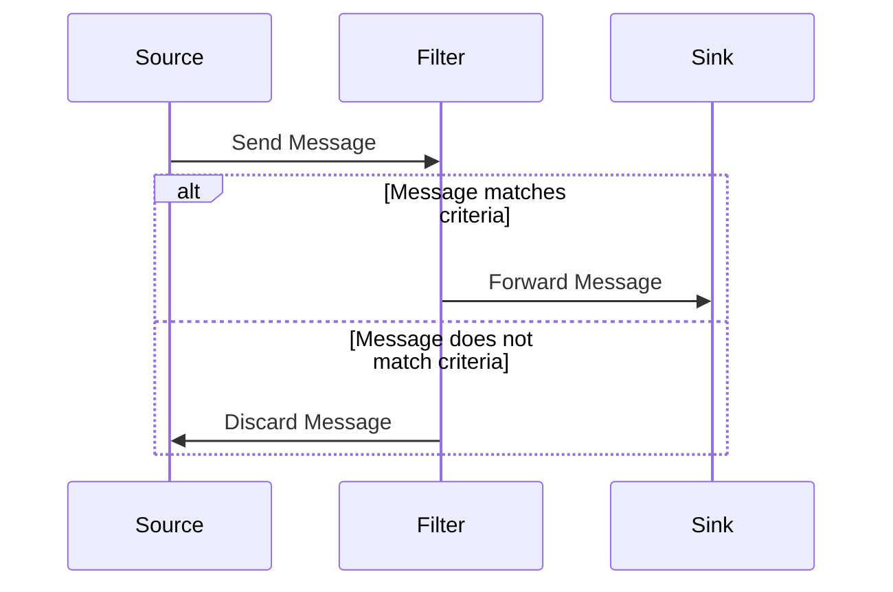
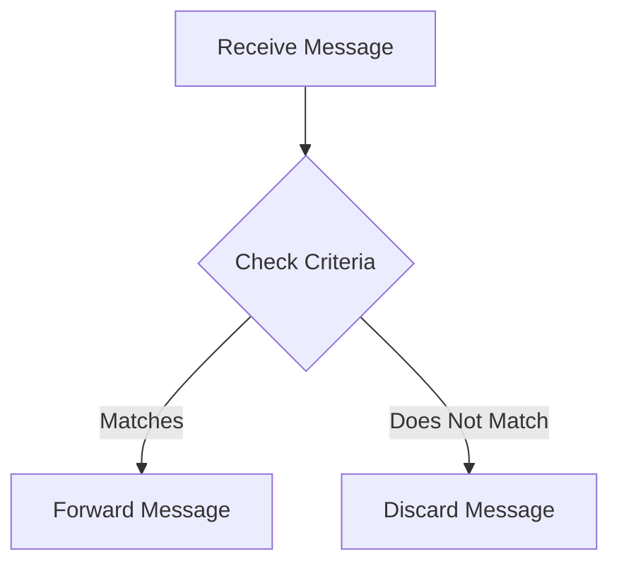

## 10.6. Message Filter

In the realm of enterprise integration, the **Message Filter** design pattern plays a pivotal role in ensuring that only relevant messages are processed by a system. This pattern is essential for managing the flow of information between disparate systems, especially in environments where message traffic is high and not all messages are pertinent to every component. By implementing a Message Filter, we can effectively filter out unwanted messages, thereby optimizing system performance and ensuring that resources are allocated efficiently.

### Intent

The primary intent of the Message Filter pattern is to intercept and examine messages as they flow through a system, allowing only those messages that meet specific criteria to proceed. This pattern is particularly useful in scenarios where systems are integrated using a message-oriented middleware (MOM) or similar communication infrastructure.

### Key Participants

- **Message Source**: The origin of the messages that need filtering.
- **Message Filter**: The component responsible for evaluating messages against predefined criteria and determining which messages should be allowed through.
- **Message Sink**: The destination for messages that pass the filter.

### Applicability

The Message Filter pattern is applicable in the following scenarios:

- **High Message Volume**: When a system receives a large volume of messages, and only a subset is relevant.
- **Selective Processing**: When different components of a system need to process different types of messages.
- **Resource Optimization**: To prevent unnecessary processing and conserve computational resources by discarding irrelevant messages.

### Diagrams

Below is a sequence diagram illustrating the flow of messages through a Message Filter:



### Sample Code Snippets

Let's explore how to implement the Message Filter pattern using pseudocode. We'll start by defining a basic structure for a message and then implement a filter that processes these messages based on specific criteria.

#### Message Structure

```pseudocode
class Message
    attribute content
    attribute type
    attribute priority
```

#### Message Filter Implementation

```pseudocode
class MessageFilter
    method filterMessages(messages, criteria)
        filteredMessages = []
        for each message in messages
            if criteria.isSatisfiedBy(message)
                filteredMessages.add(message)
        return filteredMessages
```

#### Criteria Definition

```pseudocode
class Criteria
    attribute type
    attribute priority

    method isSatisfiedBy(message)
        return (message.type == this.type) and (message.priority >= this.priority)
```

#### Usage Example

```pseudocode
// Create messages
message1 = new Message("Order", "TypeA", 5)
message2 = new Message("Invoice", "TypeB", 3)
message3 = new Message("Order", "TypeA", 7)

// Define criteria
criteria = new Criteria("TypeA", 5)

// Filter messages
filter = new MessageFilter()
filteredMessages = filter.filterMessages([message1, message2, message3], criteria)

// Output filtered messages
for each message in filteredMessages
    print(message.content)
```

### Design Considerations

When implementing the Message Filter pattern, consider the following:

- **Performance**: Ensure that the filtering logic is efficient, especially if the system processes a high volume of messages.
- **Scalability**: Design the filter to handle an increasing number of messages and criteria without significant performance degradation.
- **Flexibility**: Allow for dynamic updates to the filtering criteria to accommodate changing business requirements.

### Differences and Similarities

The Message Filter pattern is often compared to the **Content-Based Router** pattern. While both patterns involve evaluating messages based on content, the Message Filter pattern focuses on discarding unwanted messages, whereas the Content-Based Router redirects messages to different destinations based on their content.

### Implementing Subscription Criteria

Implementing subscription criteria involves defining the conditions under which a message should be processed. This can include attributes such as message type, priority, sender, or any other relevant metadata. By encapsulating these conditions within a criteria class, we can easily modify and extend the filtering logic.

### Try It Yourself

To gain a deeper understanding of the Message Filter pattern, try modifying the pseudocode examples provided:

- **Experiment with Different Criteria**: Change the criteria to filter messages based on different attributes, such as sender or timestamp.
- **Implement Complex Logic**: Introduce more complex filtering logic, such as combining multiple criteria using logical operators (AND, OR).
- **Simulate High Volume**: Generate a large number of messages and test the performance of your filter implementation.

### Visualizing Message Flow

To further illustrate the concept, let's visualize the flow of messages through a Message Filter using a flowchart:



This flowchart demonstrates the decision-making process within a Message Filter, highlighting the critical role of criteria evaluation in determining message flow.

### Knowledge Check

To reinforce your understanding of the Message Filter pattern, consider the following questions:

- What are the key benefits of using a Message Filter in an enterprise integration scenario?
- How does the Message Filter pattern differ from the Content-Based Router pattern?
- What are some potential challenges in implementing a Message Filter, and how can they be addressed?

### Summary

The Message Filter design pattern is a powerful tool for managing message flow in enterprise integration environments. By filtering out unwanted messages, this pattern helps optimize system performance and ensure that resources are used efficiently. Through careful implementation and consideration of design factors, the Message Filter can be a valuable component in any message-oriented architecture.

### Further Reading

For more information on enterprise integration patterns and their applications, consider exploring the following resources:

- [Enterprise Integration Patterns: Designing, Building, and Deploying Messaging Solutions](https://www.enterpriseintegrationpatterns.com/)
- [Message-Oriented Middleware (MOM) on Wikipedia](https://en.wikipedia.org/wiki/Message-oriented_middleware)

## Quiz Time!



### What is the primary intent of the Message Filter pattern?

- [x] To intercept and examine messages, allowing only those that meet specific criteria to proceed.
- [ ] To route messages to different destinations based on content.
- [ ] To aggregate messages from multiple sources into a single message.
- [ ] To transform message formats between different systems.

> **Explanation:** The Message Filter pattern is designed to filter out unwanted messages by evaluating them against predefined criteria.

### Which component is responsible for evaluating messages in the Message Filter pattern?

- [ ] Message Source
- [x] Message Filter
- [ ] Message Sink
- [ ] Message Router

> **Explanation:** The Message Filter component evaluates messages against criteria to determine which messages should be allowed through.

### In what scenario is the Message Filter pattern most applicable?

- [x] When a system receives a large volume of messages, and only a subset is relevant.
- [ ] When messages need to be transformed between different formats.
- [ ] When messages need to be aggregated into a single message.
- [ ] When messages need to be routed to different destinations.

> **Explanation:** The Message Filter pattern is used to manage high message volumes by filtering out irrelevant messages.

### What is a key difference between the Message Filter and Content-Based Router patterns?

- [x] The Message Filter discards unwanted messages, while the Content-Based Router redirects messages.
- [ ] The Message Filter transforms messages, while the Content-Based Router aggregates messages.
- [ ] The Message Filter routes messages, while the Content-Based Router filters messages.
- [ ] The Message Filter aggregates messages, while the Content-Based Router transforms messages.

> **Explanation:** The Message Filter pattern focuses on discarding messages, whereas the Content-Based Router redirects them.

### What should be considered when designing a Message Filter?

- [x] Performance and scalability
- [x] Flexibility of criteria
- [ ] Message transformation capabilities
- [ ] Message aggregation logic

> **Explanation:** Performance, scalability, and flexibility are key considerations for an effective Message Filter design.

### How can subscription criteria be implemented in a Message Filter?

- [x] By defining conditions based on message attributes such as type and priority.
- [ ] By routing messages to different destinations based on content.
- [ ] By aggregating messages from multiple sources into a single message.
- [ ] By transforming message formats between different systems.

> **Explanation:** Subscription criteria involve defining conditions for message processing based on attributes.

### What is a potential challenge in implementing a Message Filter?

- [x] Ensuring efficient filtering logic for high message volumes.
- [ ] Aggregating messages from multiple sources.
- [ ] Transforming message formats between systems.
- [ ] Routing messages to different destinations.

> **Explanation:** Efficient filtering logic is crucial for handling high message volumes without degrading performance.

### What role does the Message Sink play in the Message Filter pattern?

- [ ] Evaluates messages against criteria.
- [ ] Originates messages for filtering.
- [x] Receives messages that pass the filter.
- [ ] Transforms messages between different formats.

> **Explanation:** The Message Sink is the destination for messages that pass through the filter.

### What is the benefit of using a Message Filter in a high-volume messaging environment?

- [x] Optimizing system performance by discarding irrelevant messages.
- [ ] Aggregating messages into a single message.
- [ ] Transforming message formats between different systems.
- [ ] Routing messages to different destinations.

> **Explanation:** The Message Filter optimizes performance by reducing the processing of irrelevant messages.

### True or False: The Message Filter pattern is used to transform message formats between different systems.

- [ ] True
- [x] False

> **Explanation:** The Message Filter pattern is not used for transforming message formats; it is used for filtering messages based on criteria.



Remember, mastering design patterns is an ongoing journey. Keep exploring, experimenting, and applying these patterns to enhance your software design skills. Happy coding!
